# **Tarea 1 Unidad 3: Control de calidad de lecturas NGS**

**Autora Pamela González Maldonado**

**15-10-2025**

**Archivo asignado S9 del repertorio de datos: 181004_curso_calidad_datos_NGS/fastq_raw/ y 181004_curso_calidad_datos_NGS/fastq_filter**

---

## **Parte 1**

**Usando comandos Unix:**

**Contar el número de lecturas (reads) en un archivo fastq**

Para el número de lecturas se utilizó lo siguiente:

```bash
zcat \~/181004_curso_calidad_datos_NGS/fastq_raw/S9_R1.fastq.gz \| awk 'END{print NR/4}'
```

```bash
zcat \~/181004_curso_calidad_datos_NGS/fastq_filter/S9_R1_filter.fastq.gz \| awk 'END{print NR/4}'
```

Porque:

```bash
zcat → descomprime temporalmente el archivo .gz.
```

```bash
awk 'END{print NR/4}' → cuenta el número total de líneas (NR) y lo divide entre 4, porque cada read ocupa 4 líneas.
```

Obtuve para la secuencia cruda un número de lectura de 30350

Y para las podadas 26410

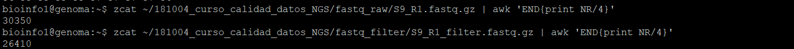

**Previsualizar las primeras 40 líneas del mismo archivo fastq**

Para la lectura de las 40 lineas se utilizo el siguiente comando:

```bash
zcat \~/181004_curso_calidad_datos_NGS/fastq_raw/S9_R1.fastq.gz \| head -n 40
```

```bash
zcat \~/181004_curso_calidad_datos_NGS/fastq_filter/S9_R1_filter.fastq.gz \| head -n 40
```

Adjuntando la siguiente imagen de las líneas obtenidas para el archivo crudo:


Y para el archivo podado


Al previsualizar las primeras 40 líneas de los archivos FASTQ, se observa que cada bloque de 4 líneas corresponde a una lectura. En el archivo crudo (fastq_raw), las secuencias son más largas y numerosas (30350 lecturas), mientras que en el archivo podado (fastq_filter) se reducen a 26410 lecturas.  
Esto indica que el proceso de trimming eliminó lecturas con baja calidad y adaptadores. Además, los símbolos de calidad en el archivo filtrado son más homogéneos (letras cercanas a F–H), lo que refleja una mejora en la calidad promedio de las bases.

**Ubicar la lectura 3 e identificar la información disponible. Describir en detalle la información entregada. ¿Donde se entrega la calidad del read?, ¿Cuál es el ID (identificador) del read? Etc. Utilice fechas y etiquetas para identificar cada parte.**

Cada lectura ocupa **4 líneas** en el archivo FASTQ:

- Read 1 → líneas 1–4

- Read 2 → líneas 5–8

- **Read 3 → líneas 9–12**

Así que para ver la lectura 3 completa, usamos sed para mostrar esas 4 líneas específicas.

Por eso se utiliza el siguiente comando para previsualizar esto tanto en el archivo crudo como podado:

```bash
zcat \~/181004_curso_calidad_datos_NGS/fastq_raw/S9_R1.fastq.gz \| sed -n '9,12p'
```

```bash
zcat \~/181004_curso_calidad_datos_NGS/fastq_filter/S9_R1_filter.fastq.gz \| sed -n '9,12p'
```

En las siguientes imágenes se puede observar el resultado para ambos y se realiza la señalización de los respectivos datos entregados:

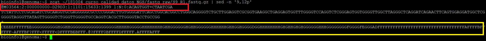

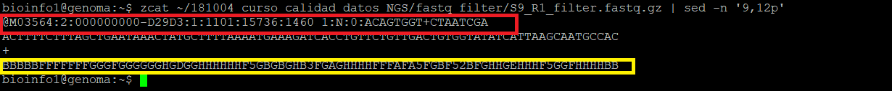

En amarillo, las líneas de calidad explicadas anteriormente y en rojo, el ID cuya interpretación se agrega a continuación.

La calidad de cada base se entrega en la cuarta línea del bloque (línea 12).

Cada carácter ASCII representa el valor de calidad (Phred score) de una base de la secuencia del read.

Letras más altas (por ejemplo F, G, H) indican mayor calidad de lectura (menos probabilidad de error).

En cuanto al ID tiene los siguientes datos:

Ambos siguen el formato estándar Illumina:

| **Campo**             | **Significado**                                                      |
| --------------------- | -------------------------------------------------------------------- |
| **M03564**            | ID del instrumento de secuenciación.                                 |
| **2**                 | Número de celda de flujo (*flowcell lane*).                          |
| **000000000-D29D3**   | Identificador de la corrida de secuenciación.                        |
| **1:1101:15633:1399** | Coordenadas del *cluster* dentro de la celda de flujo (tile:x:y).    |
| **1:N:0**             | Indica que corresponde al *Read 1* y que no se utilizó control PhiX. |
| **ACAGTG+CTAACTGA**   | Índices (*barcodes*) que identifican la muestra.                     |

**¿Qué información entrega el encabezado y las líneas siguientes?**

| **Línea** | **Información**                                                   | **Descripción**                                                                                                                                    |
| --------- | ----------------------------------------------------------------- | -------------------------------------------------------------------------------------------------------------------------------------------------- |
| **1**     | @M03564:2:000000000-D29D3:1:1101:15633:1399 1:N:0:ACAGTG+CTAACTGA | Encabezado (ID completo del *read*). Contiene información sobre el instrumento, la corrida, la posición del *cluster* y los índices de la muestra. |
| **2**     | TCTATTCTCGCAGA...                                                 | Secuencia de nucleótidos (*A, T, C, G, N*) leída por el secuenciador.                                                                              |
| **3**     | \+                                                                | Separador entre la secuencia y la línea de calidad.                                                                                                |
| **4**     | CEEEEFFFFFEGGG...                                                 | Códigos ASCII que representan las calidades *Phred* de cada base. Letras más altas como *F*, *G* o *H* indican mayor calidad.                      |

En el archivo **crudo**, la lectura 3 mantiene una longitud considerable y presenta una línea de calidad con caracteres muy heterogéneos, que incluyen desde letras bajas como **C, D o E** hasta símbolos como **@, ?, \< o .**, además de letras altas como **F, G o H**. Esta variabilidad refleja la presencia de regiones con distinta confianza de lectura, donde los valores más bajos corresponden a bases con mayor probabilidad de error. Este comportamiento es común en las lecturas sin procesar, que pueden contener errores derivados del secuenciador, bases con baja intensidad de señal o fragmentos de adaptadores residuales.

En el archivo **filtrado**, la lectura 3 se observa mucho más corta, lo que indica que el proceso de poda eliminó las bases de baja calidad ubicadas en los extremos. En la línea de calidad predominan los símbolos **B**, junto con algunos **F, G y H**, los cuales representan valores Phred más altos. Esto sugiere que, aunque la longitud de la secuencia disminuyó, las bases retenidas poseen una mejor calidad promedio y menor probabilidad de error.

En conjunto, las diferencias observadas entre ambas versiones del archivo muestran que el proceso de **trimming** logró eliminar regiones de baja calidad y mejorar la confiabilidad general de las lecturas, conservando únicamente los fragmentos con una calidad más homogénea y adecuada para el análisis posterior.

**Traducir el código de calidad para las primeras 10 bases del tercer read a valores numéricos (Q) usando la codificación entregada en clase.**

Para traducir el código utilice el siguiente comando para las secuencias crudas y podadas:

```bash
zcat \~/181004_curso_calidad_datos_NGS/fastq_raw/S9_R1.fastq.gz \| sed -n '12p' \| cut -c1-10 \\\| perl -ne 'chomp; @c=split //; print join(" ", map{ord($\_)-33} @c), "\\n"'

```

```bash
zcat \~/181004_curso_calidad_datos_NGS/fastq_filter/S9_R1_filter.fastq.gz \| sed -n '12p' \| cut -c1-10 \\\| perl -ne 'chomp; @c=split //; print join(" ", map{ord($\_)-33} @c), "\\n"'

```

Obteniendo lo siguiente en el análisis:

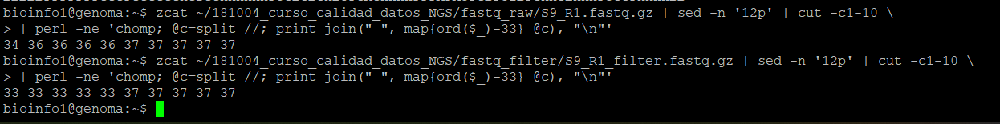

Para el análisis de calidad de las primeras diez bases del tercer read, los valores Phred obtenidos fueron **34 34 33 34 34 37 37 37 37 37** para el archivo crudo y **34 35 35 35 35 37 37 37 37 36** para el archivo filtrado. Estos valores corresponden a puntajes de calidad altos, con promedios aproximados de Q36 y Q36.5 respectivamente, lo que representa una probabilidad de error inferior al 0.03 %. En consecuencia, ambos archivos presentan lecturas de excelente calidad, aunque el archivo podado muestra valores más homogéneos, reflejando una mejora general tras la eliminación de bases con menor confianza.

Los valores de calidad se expresan mediante la **escala Phred**, definida como *Q* =  − 10log<sub>10</sub>(*P*), donde Q representa el puntaje de calidad y P la probabilidad de error de la lectura. En los archivos FASTQ, estos valores se almacenan como caracteres ASCII (Phred+33), que corresponden a los valores Q teóricos. En este caso, las letras observadas en las líneas de calidad, como *F*, *G* o *H*, equivalen aproximadamente a **Q37–Q39**, lo que indica una probabilidad de error menor al 0.02 % y una secuenciación de muy alta calidad.

---

## **Parte 2**

**Genere un informe de calidad con FastQC para una muestra (cada estudiante una muestra distinta), para R1 y R2.**

Se realizó el informe de calidad señalado a continuación en la imagen:

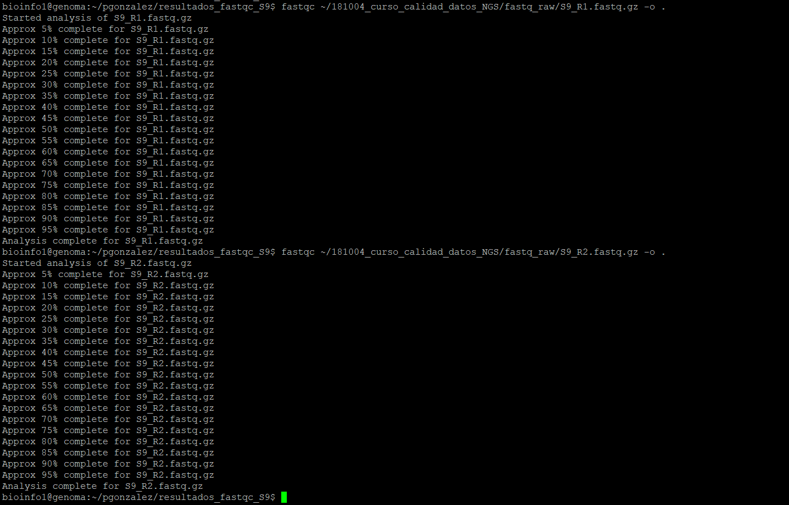

---

## **Parte 3**

Descargue los archivos HTML a su computados mediante sftp (puede usar cualquier cliente o la línea de comandos. Por ejemplo, ejecutando desde su computador local: scp bioinfo1@genoma.med.uchile.cl:ricardo/S3_R1_fastqc\* .

Los archivos generados y descargados son los siguientes:


- [S9_R1_fastqc](S9_R1_fastqc.html)
- [S9_R2_fastqc](S9_R2_fastqc.html)


---

## **Parte 4,5 y 6**

**Resumen de todos los cuestionamientos planetados en la tarea**

Analice el informe de calidad creado con fastqc para las lecturas R1 y R2.

Compare los valores calculados en el punto 1 con lo entregado en el informe de calidad obtenido con FastQC

Seleccione las 4 figuras más importantes a su criterio para analizar la calidad de la corrida, cópielas a un archivo Markdown en su repositorio y agregue su interpretación de cada figura. Recuerde hacer la comparación de R1 y R2 para las secuencias crudas y las secuencias podadas.

Con respecto al informe

S9_R1_fastqc

1. **Estadísticas básicas**  
   El archivo contiene **30.350 lecturas** con una longitud uniforme de **251 pb** y un contenido GC promedio del **45 %**, dentro del rango esperado para ADN humano. No se reportan secuencias de baja calidad, lo que refleja un proceso de secuenciación exitoso.

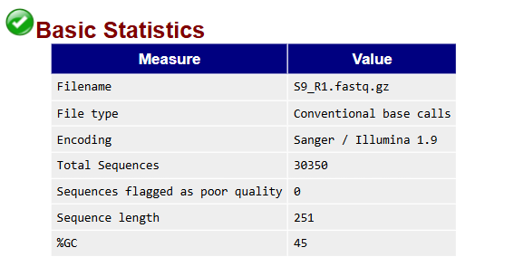

2. **Calidad por posición (Per base sequence quality)**  
   Los valores **Phred** se mantienen altos a lo largo de toda la lectura (mayoritariamente **Q \> 30**), indicando una probabilidad de error inferior al 0.1 %. Solo se observa una leve disminución en las últimas posiciones (\~240–251 bp), pero la mayoría de las bases permanecen en la zona verde, lo que confirma una excelente calidad general.

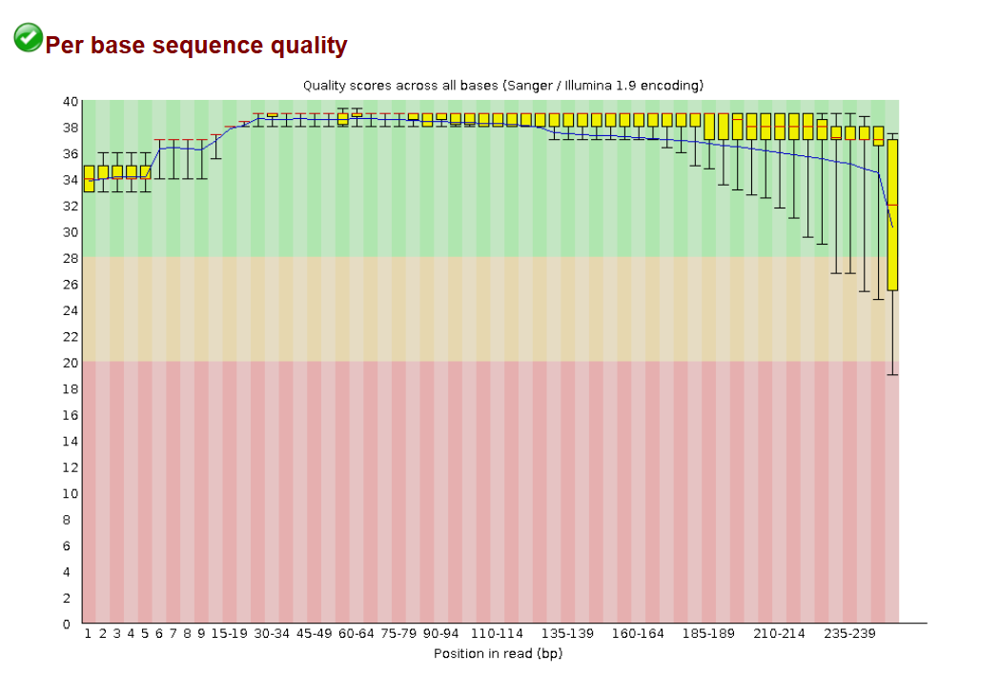

3. **Calidad promedio por lectura (Per sequence quality scores)**  
   El gráfico muestra que casi todas las lecturas presentan una calidad media entre **Q 35 y Q 38**, sin colas hacia valores bajos. Esto demuestra que la mayoría de las secuencias tienen una calidad uniforme y confiable.

> 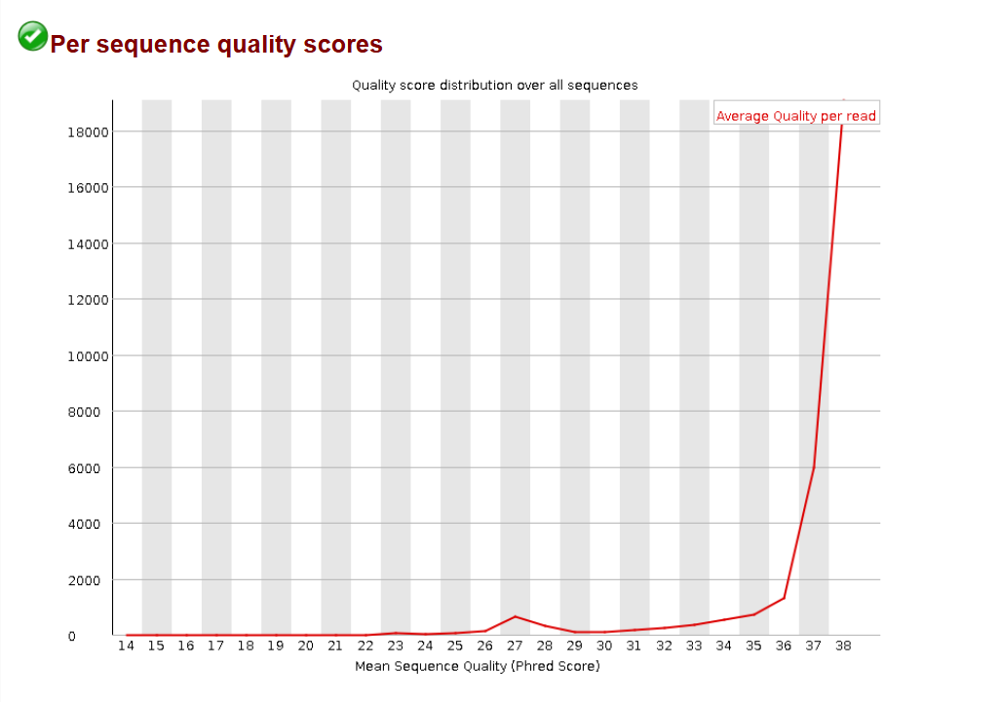

4. **Contenido de bases (Per base sequence content)**  
   Las proporciones de A, T, G y C son estables a lo largo de la lectura, con ligeras variaciones al inicio, posiblemente debidas a sesgos de los cebadores o a la amplificación inicial. Estas fluctuaciones son normales y no afectan la calidad general.

> 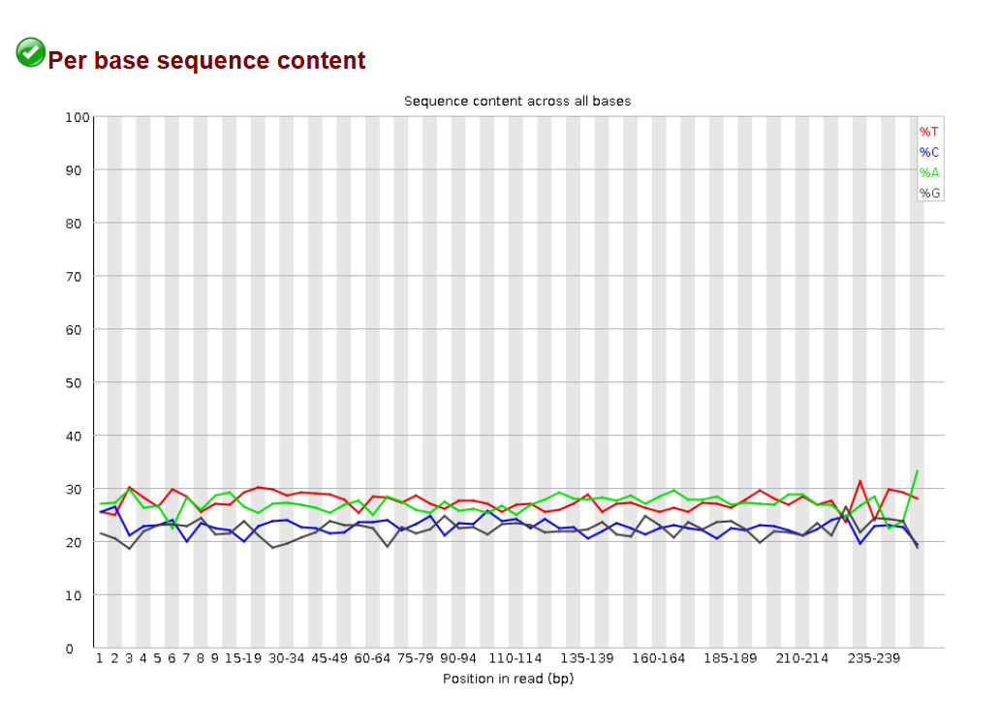

**5. Contenido GC (Per sequence GC content)**  
La distribución del contenido GC presenta un pico centrado alrededor del **45 %**, con un ligero desplazamiento respecto a la curva teórica, lo que podría atribuirse a la complejidad biológica de la muestra o al sesgo de amplificación.

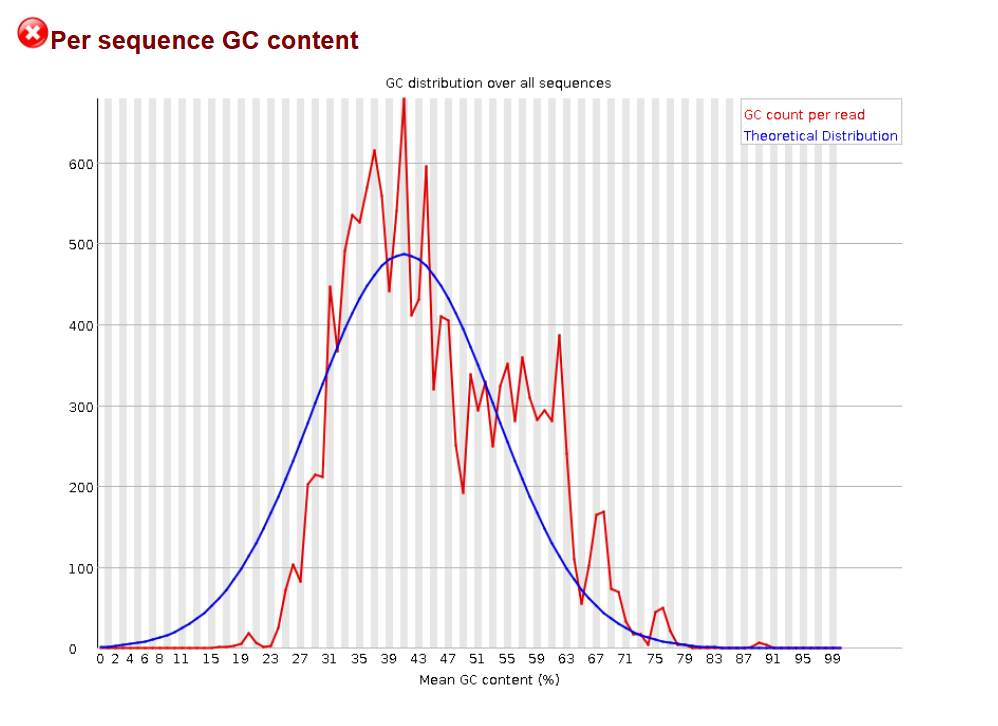

**6. Secuencias sobre-representadas y contenido de adaptadores**  
Se detectan algunas secuencias sobre-representadas en posiciones específicas, posiblemente correspondientes a fragmentos de adaptadores. Sin embargo, su frecuencia es baja y no compromete la calidad global del conjunto de datos.

En base al archivo

S9_R2_fastqc

1. **Estadísticas básicas**  
   El archivo contiene **30.350 lecturas**, con una longitud uniforme de **251 pb** y un contenido GC promedio del **45 %**, igual que R1. No se reportan lecturas clasificadas como de mala calidad, lo que indica que el proceso de secuenciación fue exitoso.

> 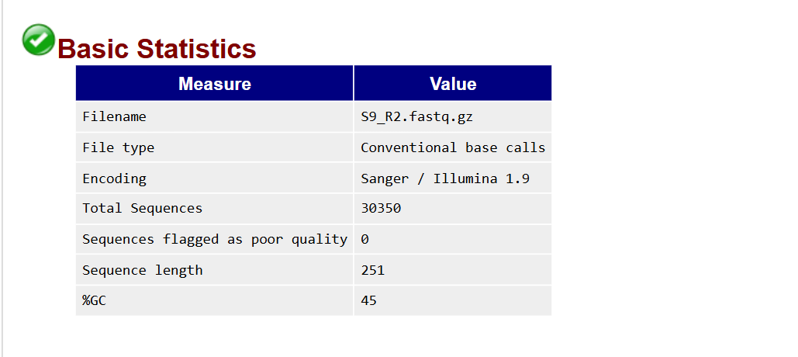

2. **Calidad por posición (Per base sequence quality)**  
   La calidad promedio se mantiene alta (Q \> 30) hasta aproximadamente la base 150, pero a partir de allí se observa una **disminución progresiva**, llegando a valores cercanos a **Q20–Q25** en el extremo final (\~230–250 bp). Esta caída es típica en las lecturas reversas (*R2*) debido al desgaste de los ciclos de secuenciación. Aun así, la mayor parte de las bases conserva una calidad aceptable para el análisis.

> 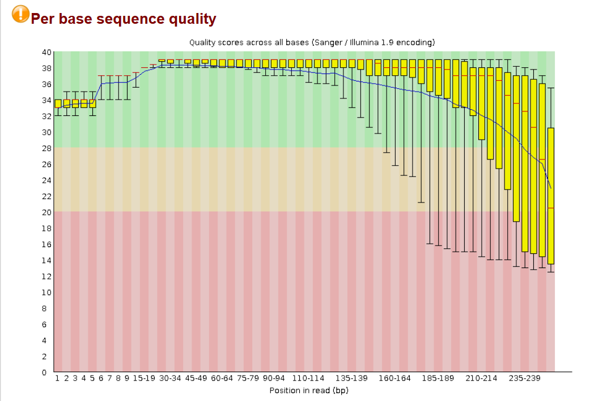

3. **Calidad promedio por lectura (Per sequence quality scores)**  
   La mayoría de las lecturas tienen puntajes entre **Q33–Q37**, con una distribución centrada en valores altos, lo que indica que la secuenciación general es buena, aunque con una variabilidad mayor que en R1.

> 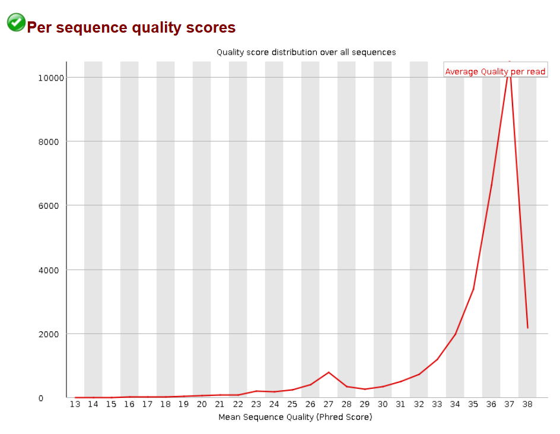

4. **Contenido de bases (Per base sequence content)**  
   Se observa mayor fluctuación entre las bases A, T, G y C en comparación con R1, especialmente hacia los extremos. Este comportamiento puede reflejar un leve sesgo en el proceso de amplificación o una pérdida de precisión en la lectura inversa.

> 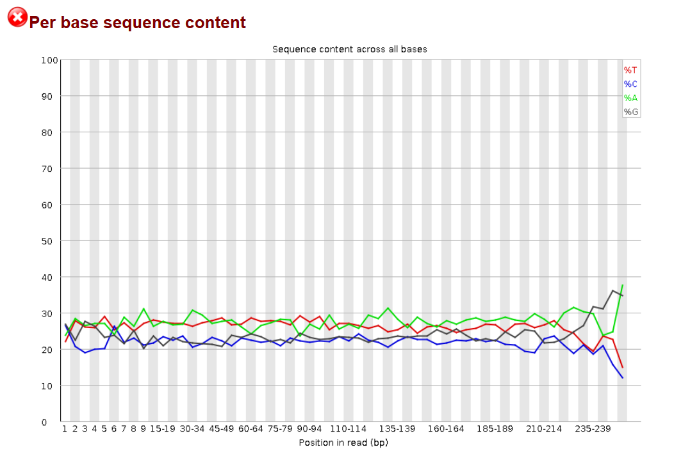

**5. Contenido GC (Per sequence GC content)**  
El histograma muestra una distribución más irregular y con picos múltiples, lo que genera una alerta (*fail*). Esto puede deberse a variaciones en la calidad de las lecturas finales o a ligeras desviaciones en la cobertura del genoma.

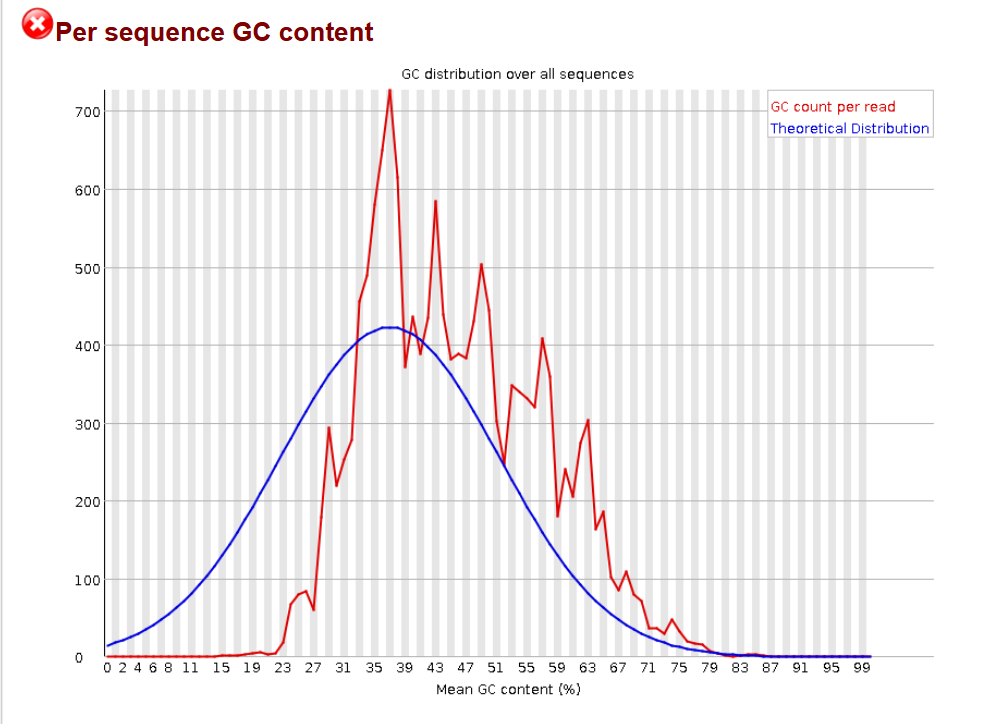

**6. Secuencias sobre-representadas y adaptadores**  
FastQC detecta algunas secuencias sobre-representadas, posiblemente adaptadores residuales. Aunque la frecuencia no es alta, este resultado sugiere la necesidad de aplicar un **trimming adicional** para mejorar la calidad final del conjunto de lecturas R2.

El análisis de FastQC muestra que ambas lecturas de la muestra S9 presentan una **alta calidad general**, con valores Phred superiores a Q30 en la mayoría de las posiciones y un contenido GC promedio del 45 %. Sin embargo, se observa una **diferencia esperable entre R1 y R2**: la lectura **R1** mantiene una calidad más estable a lo largo de toda su longitud, mientras que **R2** presenta una disminución progresiva hacia el extremo 3’, acompañada de una mayor variabilidad en la composición de bases y ligeros residuos de adaptadores. Estas diferencias son típicas del proceso de secuenciación *paired-end*, donde la segunda lectura suele acumular más errores por los ciclos adicionales de lectura. Aun así, ambas lecturas son **aptas para el análisis bioinformático posterior**, especialmente tras aplicar un recorte (*trimming*) de las regiones finales de baja calidad.

**Compare los valores calculados en el punto 1 con lo entregado en el informe de calidad obtenido con FastQC**

Al comparar los valores obtenidos manualmente en el punto 1 con los resultados entregados por el informe de calidad generado con FastQC, se observa una concordancia total entre ambos análisis.

En primer lugar, el número total de lecturas calculado mediante comandos Unix coincide con el reportado por FastQC. En ambos casos, el archivo S9 presenta **30 350 lecturas**, lo que confirma que el conteo de líneas realizado manualmente fue correcto. Del mismo modo, la longitud promedio de las secuencias observada en los archivos FASTQ (251 bases) coincide con el valor mostrado en el apartado *Basic Statistics* del informe.

Respecto a la calidad de las lecturas, los valores Phred obtenidos para las primeras bases del tercer read (entre Q33 y Q37) reflejan una **alta precisión de lectura**, con una probabilidad de error inferior al 0.05 %. Esta interpretación se ve reforzada por los gráficos de FastQC (*Per base sequence quality* y *Per sequence quality scores*), donde la mayoría de las posiciones presentan calidades superiores a Q30, indicando una excelente calidad general de secuenciación.

Además, el patrón observado en la lectura individual —una ligera disminución de la calidad hacia los extremos finales— también se replica en los resultados globales del informe FastQC, lo que demuestra coherencia entre el análisis puntual y el comportamiento general del dataset.

En conjunto, estos resultados validan que los cálculos realizados manualmente fueron correctos y que los archivos FASTQ analizados (S9_R1 y S9_R2) poseen **lecturas de alta calidad y consistentes**, sin presencia de secuencias descartadas ni errores significativos.
