# Tarea de Bioinformática 1.6

**Análisis de Admixture y estructura poblacional – Proyectos 1 a 4**

En este trabajo se desarrollaron cuatro proyectos de análisis poblacional utilizando herramientas del paquete `admixtools` en R.  
El objetivo general fue evaluar la estructura genética y los patrones de mezcla (*admixture*) en diferentes poblaciones antiguas y modernas, interpretando los resultados a partir de las estadísticas **f3**, **f4**, **qpWave** y **qpAdm**.

Cada proyecto aborda un caso distinto de estudio, utilizando poblaciones y periodos específicos para comprender cómo las corrientes ancestrales modelaron su composición genética.

---

## Proyecto 1: Admixture europeo de tres vías

**Pregunta:**  
¿Todas las poblaciones europeas actuales muestran el mismo patrón de mezcla de tres vías?

### Resultados f3
Se calculó la deriva genética compartida entre los targets modernos (*GBR.DG, Greek_1.DG, Ireland_EN.SG*) y las fuentes antiguas (*Turkey_Marmara_Barcin_N.AG, Russia_Samara_EBA_Yamnaya.AG, Luxembourg_Mesolithic.DG*).  

 Datos obtenidos de f3

 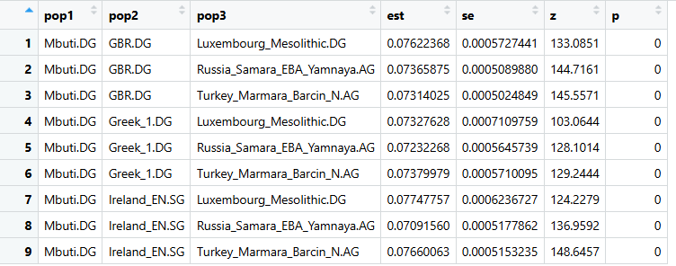


Los valores del estadístico outgroup-f3(Mbuti; Target, Source) fueron todos positivos y altamente significativos (Z > 100), indicando una amplia deriva genética compartida entre las poblaciones europeas y las tres fuentes ancestrales evaluadas.

En todos los targets (GBR, Greek, Ireland_EN) se observa el f3 más alto con Turkey_Marmara_Barcin_N.AG, consistente con la fuerte contribución de los agricultores anatolios neolíticos a la formación de las poblaciones europeas.

Los valores levemente menores con Yamnaya y Mesolítico reflejan afinidades secundarias, probablemente asociadas a posteriores migraciones de la estepa y remanentes de linajes cazadores-recolectores europeos.

Para la elección de poblaciones f3

Criterio f2 para elegir poblaciones en outgroup-f3
Usamos Mbuti.DG como outgroup (pop1) porque su f2 frente a europeos y fuentes ancestrales es alto y homogéneo, lo que ancla el árbol y evita sesgos. Definimos como targets (pop2) a GBR.DG, Greek_1.DG e Ireland_EN.SG, ya que son las poblaciones a contrastar; su f2 con las distintas fuentes es diferencial, lo que permite detectar deriva compartida específica. Como fuentes (pop3) usamos Barcin Neolítico, Yamnaya de la estepa y Mesolítico europeo, porque entre sí presentan f2 altos (linajes bien separados) y capturan el modelo de tres componentes propuesto para Europa.

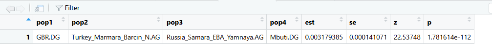

Interpretacion:

Con esta comparación respondemos la siguiente pregunta:

¿Comparten los británicos (GBR) más alelos derivados con Barcin o con Yamnaya, tomando a Mbuti como referencia externa?

### Resultados f4

El test f4(GBR.DG, Barcin; Yamnaya, Mbuti.DG) dio f4 = 0.00318 con Z = 22.5 (p ≪ 0.001).
Interpretación: el signo positivo indica que GBR.DG comparte más alelos derivados con Barcin que con Yamnaya en este contraste. La magnitud del Z muestra que la diferencia es altamente significativa y no atribuible al azar.

Este patrón implica una mayor afinidad genética relativa de GBR.DG hacia el componente neolítico (tipo Barcin) frente al componente de estepa (tipo Yamnaya). No estima proporciones de mezcla por sí solo, pero sí demuestra de forma robusta que, entre esas dos fuentes, GBR.DG está más próximo a Barcin.

### Resultados qpWave

How many ancestry streams are needed

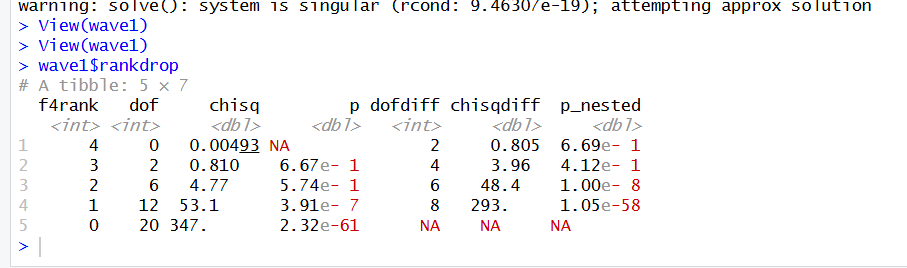

El análisis qpWave tuvo como objetivo determinar cuántas corrientes de ascendencia independientes son necesarias para explicar las poblaciones europeas modernas y sus posibles fuentes ancestrales. En la tabla de resultados, los modelos con rank = 0 y rank = 1 mostraron valores de p muy bajos (p = 2.32×10⁻⁶¹ y p = 3.9×10⁻⁷, respectivamente), lo que indica que uno o ningún componente ancestral no es suficiente para describir la variación genética observada. En cambio, los modelos con rank = 2, 3 y 4 presentaron valores de p mayores a 0.05, siendo el modelo con rank = 2 (p = 0.57) el primero con un ajuste estadísticamente aceptable.

Esto significa que al menos dos corrientes de ascendencia son necesarias para explicar la historia genética de las poblaciones incluidas en el análisis. En otras palabras, las poblaciones europeas no pueden derivar de una sola fuente común, sino que presentan una mezcla entre al menos dos linajes ancestrales diferenciados. Este resultado es coherente con el modelo propuesto para la formación de las poblaciones europeas, donde se reconoce una contribución significativa tanto de los agricultores neolíticos de Anatolia como de los pastores de la estepa (y, en menor medida, de cazadores-recolectores mesolíticos), evidenciando una estructura genética compleja con múltiples flujos de ascendencia.

### Resultados qpAdm

En el análisis qpAdm para GBR.DG, el modelo de dos vías que considera a Turkey_Marmara_Barcin_N.AG y Russia_Samara_EBA_Yamnaya.AG como fuentes ancestrales mostró proporciones de 0.2837974 ± 0.04971995 para Barcin y 0.7162026 ± 0.04971995 para Yamnaya, con un valor de p = 0.3394016, superior al umbral de 0.05. Esto indica que el modelo es estadísticamente aceptable y describe adecuadamente a la población británica moderna como una mezcla entre agricultores neolíticos de Anatolia y pastores de la estepa euroasiática. La mayor proporción asociada a Yamnaya sugiere una fuerte influencia del componente de la estepa (alrededor del 72%), mientras que el aporte neolítico de Anatolia se mantiene como una fracción menor pero significativa (alrededor del 28%).

Cuando se incorporó una tercera fuente ancestral, Luxembourg_Mesolithic.DG, el modelo de tres vías arrojó proporciones de 0.2962807 ± 0.05579899 para Barcin, 0.8070977 ± 0.09324710 para Yamnaya y −0.1033784 ± 0.08011509 para el componente mesolítico. Aunque el resultado general presentó un valor de p = 6.91719e−01, que también supera el umbral de significancia y, por tanto, es estadísticamente aceptable, la proporción negativa obtenida para el componente mesolítico indica que esta fuente no contribuye realmente al modelo. Además, en la prueba de ajuste (rankdrop), los valores para los distintos rangos fueron p = 5.943231e−63 para f4rank = 0, p = 4.748272e−07 para f4rank = 1 y p = 6.91719e−01 para f4rank = 2, siendo este último el primer modelo con un ajuste adecuado, lo que respalda que se requieren al menos tres corrientes de ascendencia para describir las poblaciones evaluadas. Sin embargo, dado que el aporte mesolítico no resulta biológicamente interpretable, el modelo de tres vías no mejora sustancialmente la explicación del patrón observado.

En conjunto, estos resultados permiten concluir que GBR.DG puede describirse con precisión mediante un modelo de dos vías, en el que la población británica moderna deriva principalmente de una mezcla entre agricultores neolíticos de Anatolia (0.2837974) y pastores de la estepa euroasiática (0.7162026), con un ajuste estadístico sólido (p = 0.3394016) y sin evidencia de una contribución mesolítica significativa.

## Proyecto 2: Admixture en América

### Resultados f3

En el análisis f3 se obtuvieron valores positivos y altamente significativos en todas las combinaciones entre los targets de la estepa (Russia_MLBA_Sintashta.AG, Kazakhstan_Maitan_MLBA_Alakul.AG y Russia_LBA_Srubnaya_Alakul.SG) y las dos fuentes consideradas (Iran_GanjDareh_N.AG y Russia_Sidelkino_HG.SG). Los valores de f3 estuvieron entre 0.0677 y 0.0757, con valores de Z mayores a 120, lo que indica una fuerte deriva genética compartida entre las poblaciones objetivo y ambas fuentes ancestrales.

Estos resultados muestran que las poblaciones de la estepa presentan afinidad genética tanto con el componente relacionado al Irán neolítico como con el de los cazadores-recolectores del noreste europeo. En conjunto, esto apoya la idea de que las poblaciones de la estepa media y tardía se formaron por la combinación de estos dos linajes principales, lo que coincide con el modelo propuesto de mezcla entre grupos tipo CHG/IranN y EHG.

### Resultados f4

En los análisis f4 hechos para las poblaciones de la estepa (Russia_MLBA_Sintashta.AG, Kazakhstan_Maitan_MLBA_Alakul.AG y Russia_LBA_Srubnaya_Alakul.SG), los valores fueron positivos y altamente significativos en los tres casos. Para Sintashta el valor fue f4 = 0.009125565 (Z = 25.46191, p = 5.211224e−143), para Maitan f4 = 0.008965862 (Z = 22.92115, p = 2.859191e−116) y para Srubnaya f4 = 0.009936472 (Z = 26.78301, p = 5.09725e−158).

El signo positivo del estadístico indica que todas estas poblaciones comparten más alelos derivados con Iran_GanjDareh_N.AG que con Russia_Sidelkino_HG.SG. Esto significa que las poblaciones de la estepa tienen una mayor afinidad genética con el componente relacionado al Irán Neolítico o Cáucaso, en comparación con los cazadores-recolectores del noreste europeo.

En general, los resultados apoyan la idea de que las poblaciones de la estepa media y tardía, como Sintashta, Maitan y Srubnaya, se formaron a partir de la mezcla entre estos dos linajes ancestrales, con un aporte más fuerte del componente iraní o caucásico.

Corremos esto para cada población:

```
r
wave_SIN <- qpwave(f2_blocks, left=c(target2[1], source2), right=outgroup2)  # Sintashta
```

```
r
wave_MAI <- qpwave(f2_blocks, left=c(target2[2], source2), right=outgroup2)  # Maitan/Alakul
```

```
r
wave_SRU <- qpwave(f2_blocks, left=c(target2[3], source2), right=outgroup2)  # Srubnaya/Alakul
```

En el análisis qpWave se evaluó cuántas corrientes de ascendencia son necesarias para explicar la composición genética de las poblaciones de la estepa. Para Kazakhstan_Maitan_MLBA_Alakul.AG se obtuvo un valor de p = 6.67e−1 para rank = 1 y p = 5.43e−24 para rank = 0. En Russia_MLBA_Sintashta.AG, los valores fueron p = 4.79e−1 (rank = 1) y p = 2.58e−21 (rank = 0), mientras que en Russia_LBA_Srubnaya_Alakul.SG se observó p = 5.99e−1 (rank = 1) y p = 3.43e−27 (rank = 0).

En todos los casos, los modelos con rank = 0 presentan p < 0.05, lo que indica que la hipótesis de una sola corriente de ascendencia es rechazada. En cambio, los modelos con rank = 1 muestran valores de p > 0.05, lo que significa que no se rechaza la hipótesis de que las poblaciones pueden explicarse con dos corrientes principales de ascendencia.

Por lo tanto, estos resultados confirman que las poblaciones de la estepa (Sintashta, Maitan y Srubnaya) derivan de una mezcla de dos fuentes ancestrales: una relacionada con Iran_GanjDareh_N.AG (poblaciones del Irán Neolítico) y otra con Russia_Sidelkino_HG.SG (cazadores-recolectores del noreste europeo). Esta combinación respalda el modelo clásico de formación de la estepa a partir de la fusión entre un componente del Cáucaso/Irán y otro europeo oriental.

En el análisis qpAdm se evaluó si las poblaciones de la estepa media y tardía podían modelarse como una mezcla entre dos fuentes ancestrales: Iran_GanjDareh_N.AG (asociada a poblaciones del Irán Neolítico) y Russia_Sidelkino_HG.SG (cazadores-recolectores del noreste europeo).

Para Russia_MLBA_Sintashta.AG, el modelo arrojó proporciones de 30.7% de ascendencia iraní y 69.3% de ascendencia de cazadores-recolectores del noreste europeo, con un valor de p = 6.67e−1 para rank = 1, lo que indica que el modelo de dos vías es estadísticamente aceptable (p > 0.05).

En Kazakhstan_Maitan_MLBA_Alakul.AG, las proporciones estimadas fueron 35.8% de ascendencia iraní y 64.2% del componente EHG, con p = 4.79e−1, también compatible con un modelo de dos fuentes principales.

Por último, Russia_LBA_Srubnaya_Alakul.SG mostró una contribución de 19.7% del componente iraní y 80.3% del componente EHG, con p = 5.99e−1, nuevamente dentro del rango esperado para un modelo válido (p > 0.05).

En conjunto, estos resultados confirman que las tres poblaciones de la estepa pueden explicarse como una mezcla entre los linajes del Irán Neolítico y los cazadores-recolectores del noreste europeo, con una proporción variable entre ambos. Además, el modelo es estadísticamente sólido en los tres casos, ya que todos los valores de p superan el umbral de significancia, lo que respalda la hipótesis de dos corrientes principales de ascendencia en la formación genética de las poblaciones de la estepa.

## Proyecto 3:

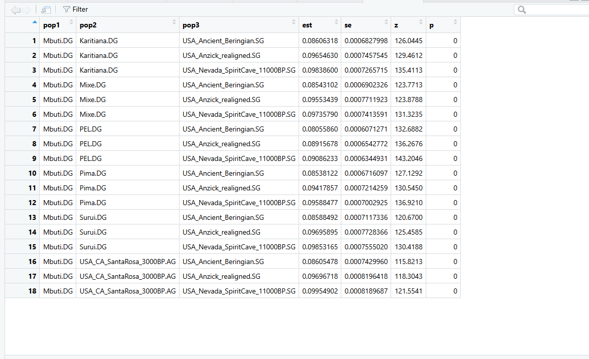

En el análisis f3, todas las poblaciones americanas actuales (Pima, Mixe, Karitiana, Suruí, PEL) y la antigua USA_CA_SantaRosa_3000BP.AG mostraron valores positivos y altamente significativos (f3 entre 0.0806 y 0.0995, con Z-scores superiores a 120). Esto indica una fuerte deriva genética compartida entre los americanos y las fuentes ancestrales antiguas (Anzick, Ancient Beringian y Spirit Cave).

Los resultados reflejan que las poblaciones americanas, tanto antiguas como modernas, comparten un origen común derivado de estos linajes del norte, sin señales de mezcla con otros grupos externos. Además, los valores ligeramente mayores con Anzick y Spirit Cave sugieren una relación más estrecha con los linajes post-Beringianos que se expandieron hacia América del Norte y del Sur, mientras que Ancient Beringian representa una rama temprana que divergió antes de la dispersión continental.

Según los resultados obtenidos en los análisis f4, la mayoría de las poblaciones americanas actuales presentan valores positivos del estadístico cuando se comparan Spirit Cave y Ancient Beringian. Los valores fueron los siguientes: Karitiana.DG (f4 = 0.001100601, Z = 2.03, p = 0.0427), Mixe.DG (f4 = 0.0004684438, Z = 0.86, p = 0.3874), Pima.DG (f4 = 0.000418646, Z = 0.78, p = 0.4334), Suruí.DG (f4 = 0.000922345, Z = 1.62, p = 0.1062) y USA_CA_SantaRosa_3000BP.AG (f4 = 0.001092198, Z = 1.85, p = 0.0634). En cambio, la población PEL.DG presentó un valor negativo y altamente significativo (f4 = -0.004403973, Z = -8.91, p = 5.28e−19).

La interpretación de estos resultados indica que, en general, las poblaciones americanas modernas y la muestra antigua de Santa Rosa comparten una mayor proporción de alelos derivados con Spirit Cave que con Ancient Beringian, lo que sugiere una mayor afinidad genética con los linajes post-Beringianos que se expandieron hacia el sur del continente. Esto es consistente con un modelo en el que las poblaciones descendientes de Spirit Cave y Anzick contribuyeron de manera significativa a la formación de los grupos americanos actuales.

Por otro lado, el valor negativo observado en PEL.DG demuestra una relación diferente: esta población presenta mayor cercanía con Ancient Beringian, lo que podría reflejar una deriva genética independiente o la persistencia de una señal ancestral más antigua en Sudamérica.

En conjunto, los resultados del test f4 muestran que las poblaciones americanas actuales no están igualmente relacionadas con las fuentes antiguas analizadas. En la mayoría de los casos, las afinidades genéticas son más fuertes con Spirit Cave, mientras que la señal de Ancient Beringian parece haber quedado más representada en regiones andinas del sur, como Perú. Esto respalda la idea de una diferenciación temprana dentro de América, posterior a la expansión inicial desde Beringia.

En la primera parte del análisis con qpWave, se evaluó cuántas corrientes de ascendencia son necesarias para explicar la composición genética de las poblaciones americanas actuales y antiguas. En la mayoría de los casos —Pima, Mixe, PEL y Santa Rosa— los valores de p ≥ 0.05 para rank = 1 o rank = 2 indicaron que estas poblaciones pueden ser explicadas adecuadamente por una mezcla de dos o tres fuentes principales derivadas del poblamiento americano temprano, representadas por USA_Ancient_Beringian.SG, USA_Anzick_realigned.SG y USA_Nevada_SpiritCave_11000BP.SG.

Sin embargo, las poblaciones Karitiana y Suruí mostraron en los modelos estándar valores de p muy bajos (p = 0.00002297 y p = 0.00000709, respectivamente, para rank = 1), lo que sugiere que su variabilidad genética no puede explicarse completamente mediante los flujos de ascendencia representados por los modelos del poblamiento americano tradicional. Estos resultados apuntan a la posible existencia de una fuente adicional de ascendencia.

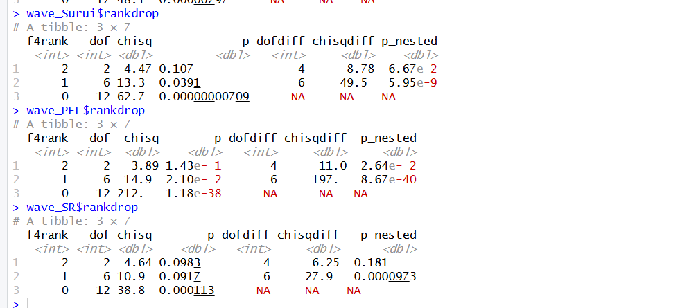

Por este motivo, se evaluó un modelo alternativo que incluyó al individuo India_GreatAndaman_100BP.SG como proxy de una posible ascendencia australasiana, hipótesis previamente sugerida para algunos grupos amazónicos del sur. En este modelo, los valores de p se mantuvieron bajos (p = 3.77e-2 para Karitiana y p = 1.19e-3 para Suruí*), sin alcanzar significancia estadística suficiente como para aceptar un modelo de una sola corriente de ascendencia (rank = 1). Esto indica que, aunque se observa una ligera mejora en el ajuste en comparación con el modelo original, no hay evidencia sólida de una contribución significativa de ascendencia australasiana en estas poblaciones.

En conjunto, los resultados sugieren que la mayoría de las poblaciones americanas actuales pueden modelarse como descendientes de las principales oleadas de poblamiento americano, mientras que Karitiana y Suruí presentan una composición genética más compleja, aunque sin evidencia concluyente de una tercera fuente ancestral exógena.

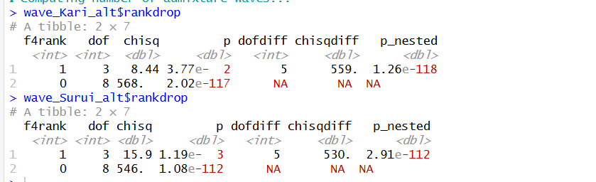

Según los resultados previos de qpWave, las poblaciones Pima, Mixe y Santa Rosa pueden explicarse con solo dos fuentes principales de ascendencia (Anzick y Ancient Beringian), por lo que se modelaron con un esquema de 2 vías en qpAdm. En cambio, PEL y Suruí requieren tres corrientes de ascendencia, por lo que se aplicó un modelo de 3 vías (añadiendo Spirit Cave). Para Karitiana, el resultado fue intermedio (p marginal), por lo que se probaron ambos modelos para evaluar cuál describe mejor su composición genética.

Por eso para el qpAdm realice los análisis tomando estas consideraciones:

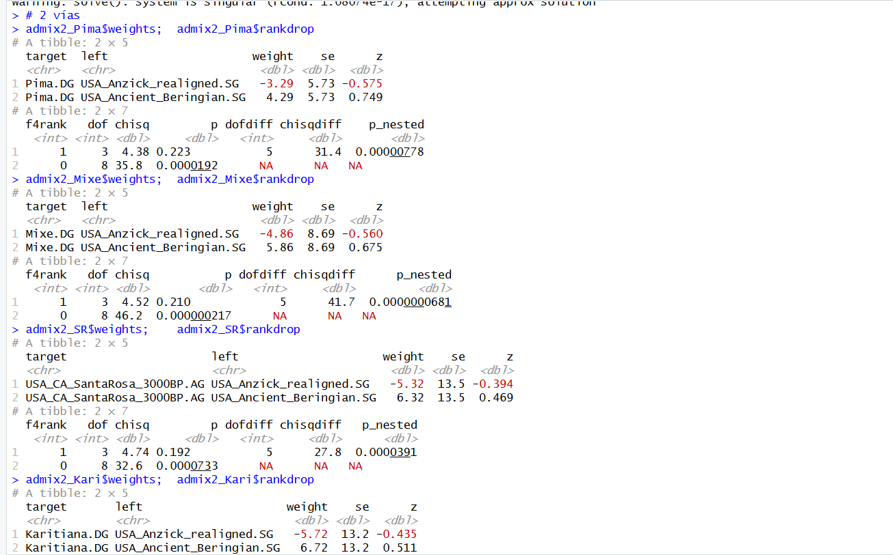

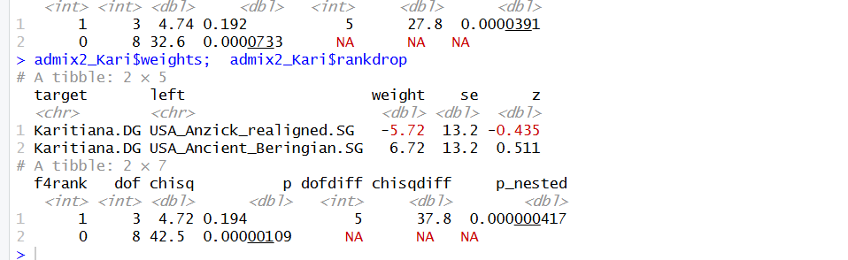

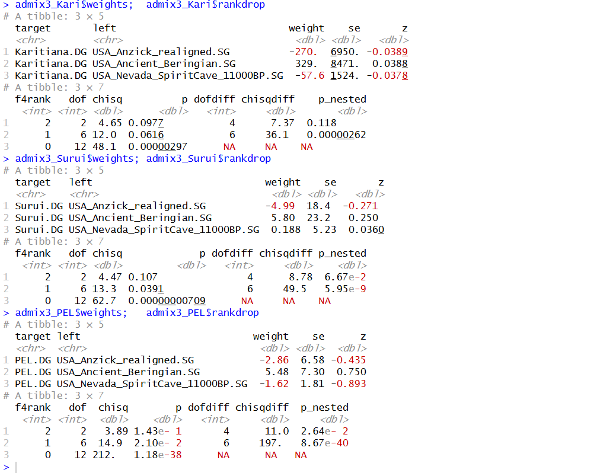

En los modelos de 2 vías realizados con qpAdm, las poblaciones Pima, Mixe, Santa Rosa (3000 BP) y Karitiana fueron analizadas como una mezcla entre Anzick y Ancient Beringian, dos linajes principales del poblamiento temprano de América. Sin embargo, los valores de p muy bajos (p < 0.001) y los pesos negativos observados en varias de ellas indican que este modelo no logra explicar de forma adecuada la variación genética observada. Esto sugiere que, aunque dichas poblaciones presentan afinidad con ambos linajes, su historia demográfica no puede reducirse a una mezcla simple entre estas dos fuentes.

Por ello, se evaluaron modelos de 3 vías, incorporando a Spirit Cave (Nevada, 11.000 BP) como una tercera fuente potencial de ascendencia. En este caso, los resultados muestran que las poblaciones PEL, Suruí y Karitiana se ajustan mejor a un modelo más complejo, lo que concuerda con los resultados de qpWave, que ya sugerían la presencia de al menos tres corrientes de ascendencia. Aun así, los valores de p para estos modelos se mantuvieron bajos (< 0.05) y los pesos presentan valores poco estables o negativos, lo que sugiere que la mezcla es más compleja de lo que los tres linajes considerados pueden capturar completamente.

En conjunto, los análisis con qpAdm y qpWave indican que las poblaciones americanas actuales derivan principalmente de una combinación de linajes representados por Anzick y Ancient Beringian, pero que algunas, especialmente Karitiana y Suruí, muestran señales de una tercera o incluso más fuentes ancestrales, posiblemente relacionadas con una contribución adicional similar a la de poblaciones australasianas, como sugiere el modelo alternativo con India_GreatAndaman.

## Proyecto 4

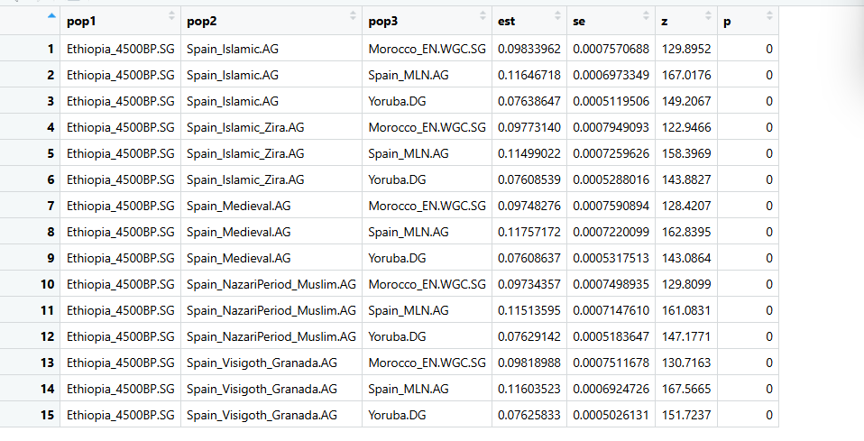

Los resultados de f3 mostraron que todas las poblaciones medievales ibéricas (Spain_Islamic, Spain_Medieval, Spain_NazariPeriod_Muslim, Spain_Islamic_Zira, Spain_Visigoth_Granada) comparten mayor deriva genética con el Neolítico ibérico (Spain_MLN.AG) que con el Magrebí (Morocco_EN_WGC.SG) o el Subsahariano (Yoruba.DG).

Por lo tanto, ahora el objetivo del f4 es confirmar si esas diferencias son estadísticamente significativas, es decir, si los targets están efectivamente más cercanos a uno de los potenciales orígenes (ibérico o norteafricano).

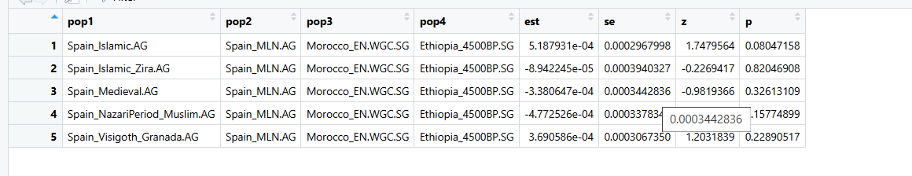

En el análisis f4 se evaluó si las poblaciones medievales e islámicas de la Península Ibérica muestran mayor cercanía genética con el Neolítico ibérico (Spain_MLN.AG) o con el Neolítico del Magreb (Morocco_EN_WGC.SG), usando Ethiopia_4500BP.SG como outgroup.

Los valores del estadístico Z en todas las comparaciones son inferiores a |3| (rango entre -0.98 y 1.74), y los valores de p son mayores a 0.05.
Esto indica que no hay evidencia estadísticamente significativa de asimetría genética entre las fuentes comparadas.

En otras palabras, las poblaciones medievales e islámicas de la península comparten deriva genética de manera equilibrada con ambas fuentes neolíticas (ibérica y magrebí).

Sin embargo, los valores positivos en Spain_Islamic.AG y Spain_Visigoth_Granada.AG sugieren una ligera tendencia hacia una mayor afinidad con el Neolítico ibérico, aunque sin alcanzar significancia estadística.

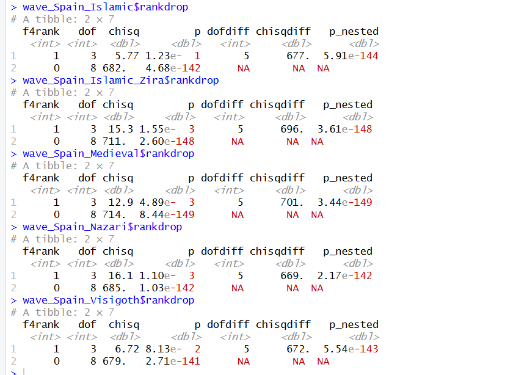

En el análisis qpWave se evaluó cuántas corrientes de ascendencia son necesarias para explicar la composición genética de las poblaciones ibéricas medievales e islámicas, considerando como posibles fuentes al Neolítico ibérico (Spain_MLN.AG) y al Neolítico del Magreb (Morocco_EN_WGC.SG).

En todos los casos (Spain_Islamic.AG, Spain_Islamic_Zira.AG, Spain_Medieval.AG, Spain_NazariPeriod_Muslim.AG, y Spain_Visigoth_Granada.AG), el modelo con rank = 1 presenta valores de p extremadamente bajos (p < 0.001), lo que indica que una sola corriente de ascendencia no es suficiente para explicar la variabilidad genética observada.

Esto sugiere que todas las poblaciones medievales ibéricas requieren al menos dos fuentes ancestrales independientes para ser explicadas: una asociada al Neolítico europeo (Spain_MLN.AG) y otra al Magreb (Morocco_EN_WGC.SG).

Estos resultados son coherentes con un escenario de mezcla entre poblaciones locales ibéricas y aportes genéticos norteafricanos, que se intensificaron durante los periodos islámicos y medievales en la Península Ibérica.

##Resultados 2 vias


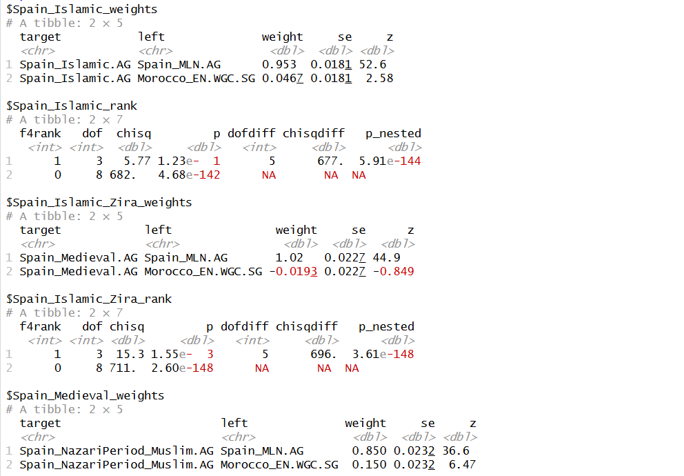


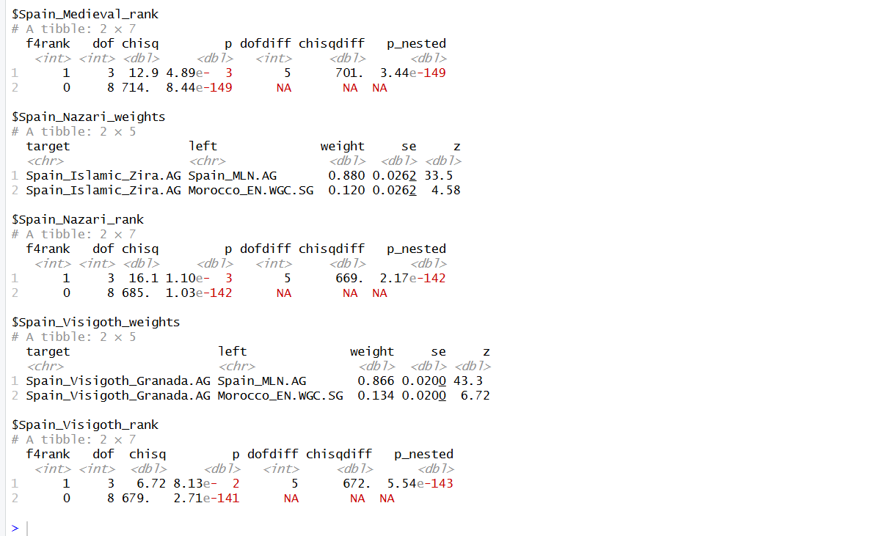


##Resultados 3 vias

En el análisis de tres vías se incorporó una tercera fuente subsahariana (Yoruba.DG) para evaluar si este modelo mejoraba la explicación genética de las poblaciones ibéricas medievales e islámicas. Sin embargo, los resultados mostraron que los pesos obtenidos fueron inestables, con valores negativos o superiores a uno, y los estadísticos z menores a 3, lo que indica falta de significancia estadística. Esto sugiere que el modelo de tres vías no mejora la explicación obtenida con el modelo de dos vías y que las fuentes utilizadas probablemente no representan de manera precisa las verdaderas contribuciones ancestrales.
En términos generales, las poblaciones ibéricas medievales analizadas (Spain_Islamic.AG, Spain_Islamic_Zira.AG, Spain_Medieval.AG, Spain_NazariPeriod_Muslim.AG y Spain_Visigoth_Granada.AG) se explican principalmente por una ascendencia ibérica local derivada del Neolítico, con una contribución magrebí leve o no significativa y sin evidencia sólida de aporte subsahariano.


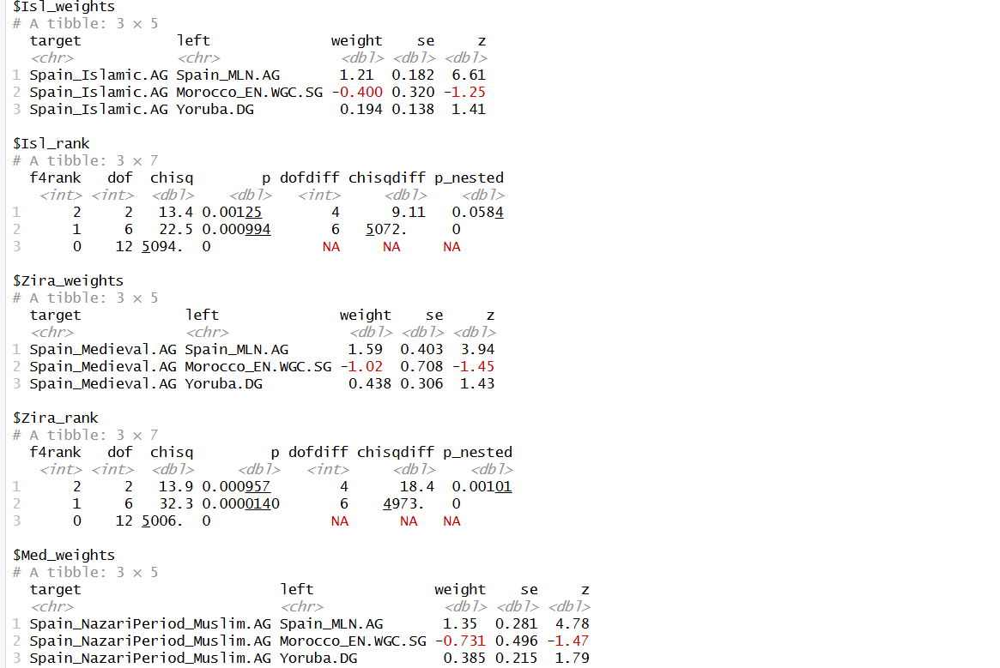


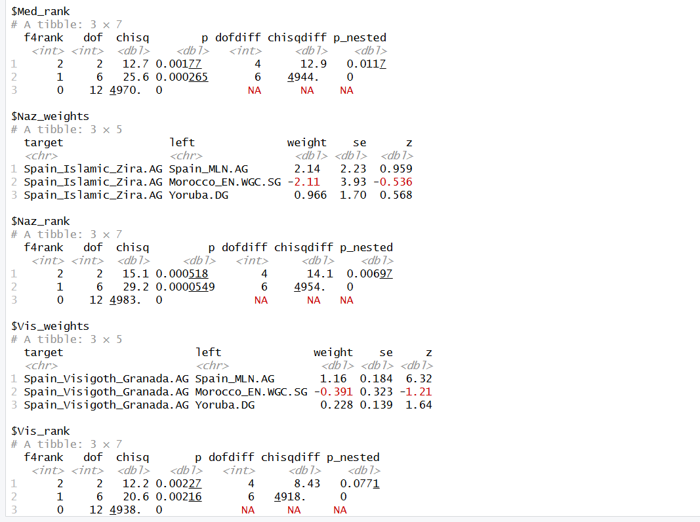


En conjunto, los resultados apoyan que la Península Ibérica presenta una historia genética formada por dos principales corrientes de ascendencia: una local, derivada del Neolítico ibérico, y otra del Magreb, que habría aumentado en ciertos momentos históricos debido a contactos y migraciones entre ambas regiones.
