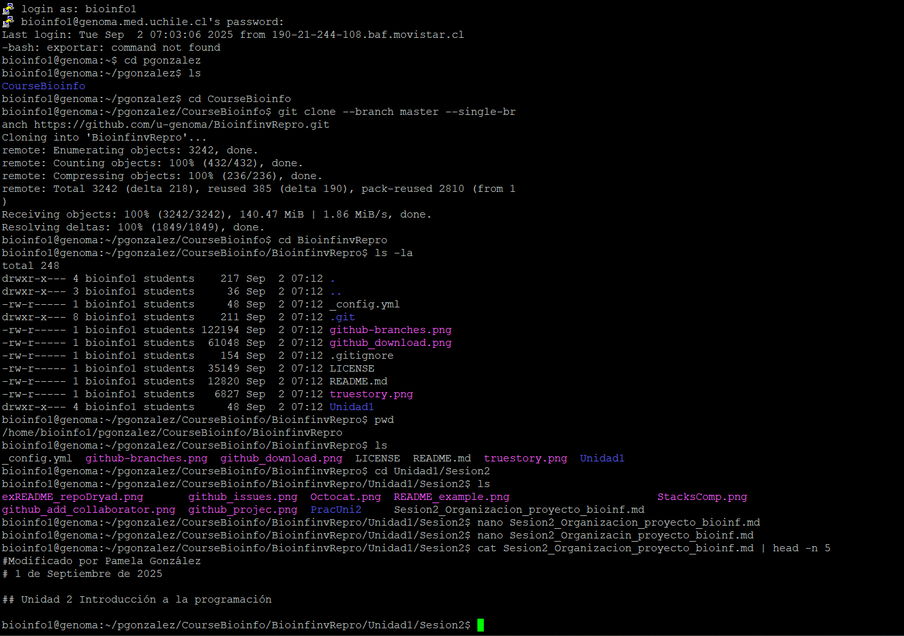
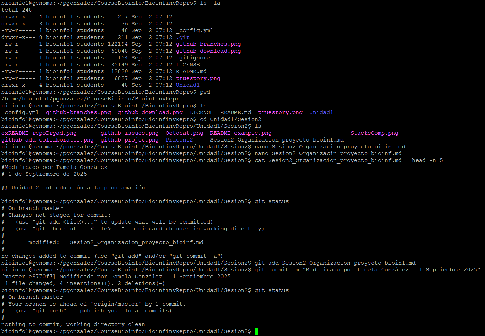

# INFORME UNIDAD 1 SESION 1.2
# Informe Tarea 1.2

Este informe documenta los pasos realizados en la Tarea 1.2 del curso de Bioinformática y Proyecto de Investigación. Incluye la práctica inicial en MarkText, así como las evidencias del uso de Git y la verificación de los cambios realizados.

---

## 0. Archivo de práctica en MarkText

El archivo **`Tarea_Session_2_Prueba_Marktext.md`** corresponde al **primer ejercicio solicitado en la Sesión 2**.  
Este ejercicio consistía en modificar un documento en MarkText y guardar los cambios en formato Markdown.  
Ese archivo se encuentra dentro de la carpeta de la tarea y representa el resultado directo de la práctica inicial.

---

## 1. Clonación del repositorio

En la **Figura 1** se muestra el resultado de la clonación del repositorio del curso en mi carpeta de trabajo.  
Esto confirma que la descarga del repositorio desde GitHub se realizó correctamente.



---

## 2. Commit de los cambios

En la **Figura 2** se observa la ejecución de `git status` después de modificar el archivo.  
La imagen muestra que los cambios fueron detectados y preparados para ser confirmados mediante un **commit**, cumpliendo con la segunda parte del ejercicio.



---

## 3. Visualización en MarkText

En la **Figura 3** se aprecia la visualización del archivo modificado dentro de MarkText.  
Aquí se evidencia que la modificación fue aplicada correctamente.


---

## 4. Ejercicio: Análisis de script (manual de Stacks)

1. **¿Cuántos pasos tiene este script?**  
   El script tiene **6 pasos principales**:  
   1) Alineamiento de lecturas con GSnap y conversión a BAM.  
   2) Procesamiento de cada muestra con *pstacks*.  
   3) Construcción de la lista de archivos para *cstacks*.  
   4) Construcción del catálogo con *cstacks*.  
   5) Asociación de las muestras con el catálogo usando *sstacks*.  
   6) Cálculo de estadísticas poblacionales con *populations*.  

2. **Si quisieras correr este script en tu propio equipo, qué línea deberías cambiar y a qué?**  
   Se debe modificar la línea donde se define la variable `src` para que apunte al directorio de trabajo real.  
   
3. **¿A qué equivale `$HOME`?**  
`$HOME` es una variable de entorno en Linux/Unix que representa el directorio personal del usuario.  
- Para un usuario llamado `pgonzalez` en Linux sería: `/home/pgonzalez`  
- En Mac podría ser: `/Users/pgonzalez`  

4. **¿Qué paso del análisis hace el programa `gsnap`?**  
`gsnap` se encarga de **alinear las lecturas en formato FASTQ contra un genoma de referencia**.  
- La salida inicial es un archivo en formato SAM.  
- Luego el script convierte ese SAM en BAM con `samtools view`.  

5. **¿Qué hacen en términos generales cada uno de los loops?**  
- **Primer loop:** recorre cada muestra (`sample_01`, `sample_02`, etc.), las alinea con `gsnap`, convierte los SAM en BAM y borra los SAM.  
- **Segundo loop:** ejecuta `pstacks` sobre cada BAM, asignando un ID único a cada muestra.  
- **Tercer loop:** construye dinámicamente la lista de parámetros `-s archivo` para usarlos en `cstacks`.  
- **Cuarto loop:** ejecuta `sstacks` para comparar cada muestra contra el catálogo creado por `cstacks`.  
- Finalmente, fuera de los loops, `populations` genera estadísticas de poblaciones y exporta resultados en varios formatos.

6. Ejercicio: División en subscripts y script maestro

El script original puede dividirse en varios *subscripts*, cada uno encargado de un paso específico de la pipeline, y un script maestro que los ejecute todos en orden. Esto permite mantener el código modular y más fácil de mantener.

- **Subscript 1 (`01_align_gsnap.sh`)**: Alinea las lecturas con GSNAP y convierte los archivos SAM a BAM.
- **Subscript 2 (`02_pstacks.sh`)**: Ejecuta *pstacks* para cada muestra, asignando un ID único.
- **Subscript 3 (`03_cstacks.sh`)**: Construye el catálogo con *cstacks* a partir de todas las muestras.
- **Subscript 4 (`04_sstacks.sh`)**: Asocia cada muestra con el catálogo mediante *sstacks*.
- **Subscript 5 (`05_populations.sh`)**: Calcula estadísticas poblacionales y genera archivos de salida.

Finalmente, un **script maestro (`run_pipeline.sh`)** simplemente ejecuta cada subscript en orden:

```bash
#!/bin/bash
bash 01_align_gsnap.sh
bash 02_pstacks.sh
bash 03_cstacks.sh
bash 04_sstacks.sh
bash 05_populations.sh


