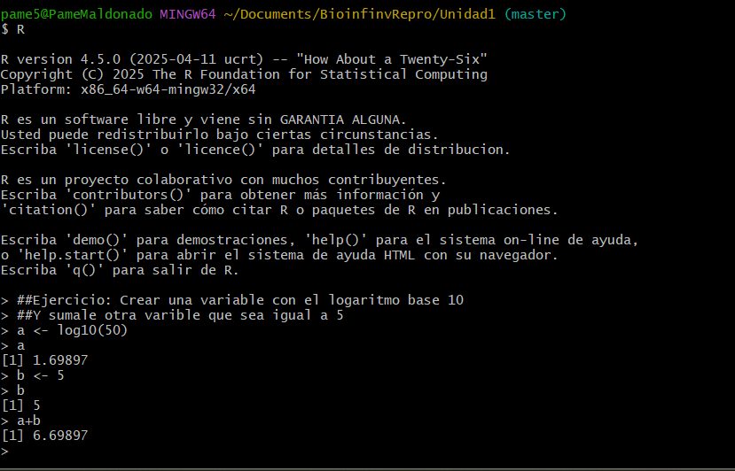
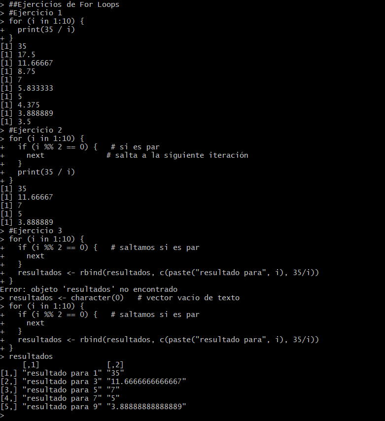
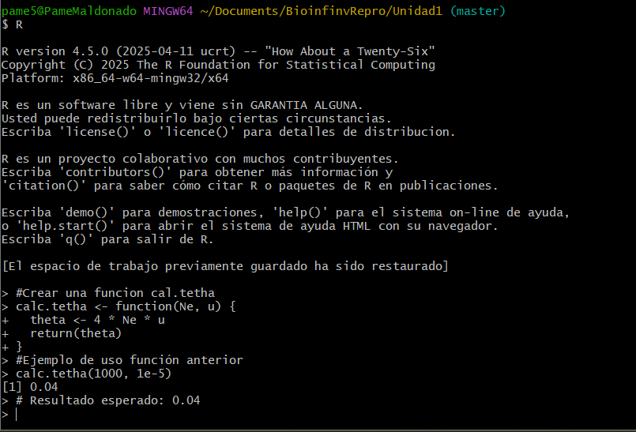
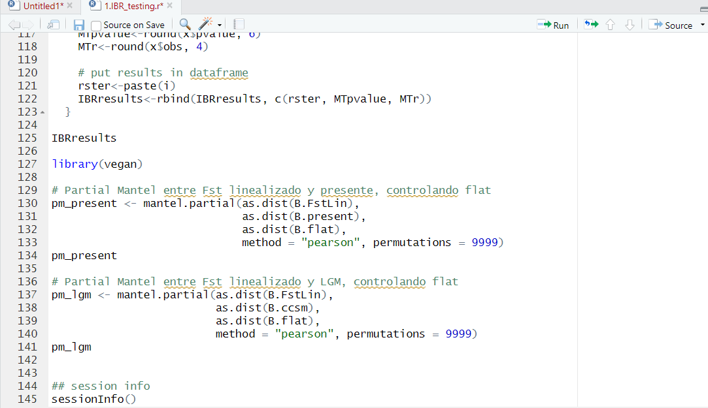
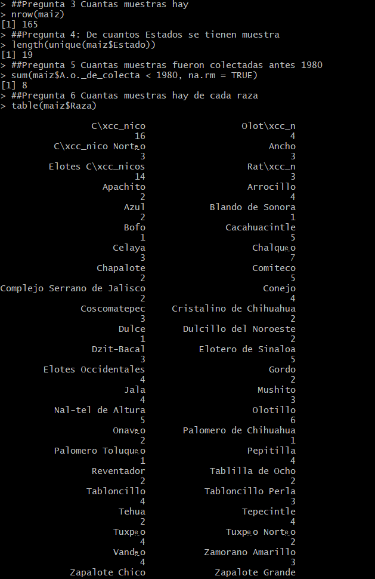
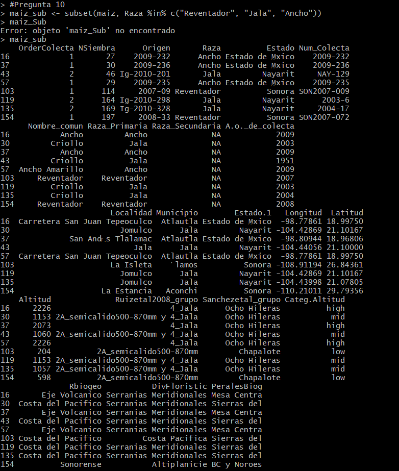

# Unidad 1 Sesion 1.3

En este documento redacto todos los ejercicios con las respectivas respuestas desarrolladas en la sesión 3 del curso de Bioinformática titulado *Unidad 3: Introducción a R con un enfoque bioinformático*.

---

## Ejercicio 1
Crea una variable con el logaritmo base 10 de 50 y súmalo a otra variable cuyo valor sea igual a 5.  
El resultado de este cálculo puede observarse en la **Figura 1**.

---

## Ejercicio 2
- Suma el número 2 a todos los números entre 1 y 150.  
- ¿Cuántos números son mayores a 20 en el vector -13432:234?  

Los resultados obtenidos se presentan en la **Figura 2**.

---

## Ejercicio 3: For Loops
- Escribe un for loop para que divida 35 entre 1:10 e imprima el resultado en la consola.  
- Modifica el loop anterior para que haga las divisiones solo para los números nones.  
- Modifica el loop anterior para que los resultados de correr todo el loop se guarden en un dataframe de dos columnas:  
  - La primera con el texto `"resultado para x"` (donde *x* es cada elemento del loop).  
  - La segunda con el resultado correspondiente.  

La implementación de los tres for loops y sus resultados se muestran en la **Figura 3**.

---

## Ejercicio 4: Script de aislamiento por resistencia

Se abrió en RStudio el script `PracUni1Ses3/mantel/bin/1.IBR_testing.r`.  
Este script realiza un análisis de aislamiento por resistencia con Fst calculadas con ddRAD en *Berberis alpina*.

### Preguntas:
- **¿Qué hacen los dos for loops del script?**  
  - Primer loop: prepara y organiza las matrices de distancias efectivas para cada escenario.  
  - Segundo loop: usa esas matrices y:  
    - Corre un test de Mantel entre cada matriz y la matriz de Fst linealizada (`B.FstLin`).  
    - Genera gráficos comparando distancia efectiva vs. Fst.  
    - Guarda los resultados en un dataframe (`IBRresults`).  

- **¿Qué paquetes se necesitan para correr el script?**  
  - `ade4` → función `mantel.rtest`.  
  - `ggplot2` → graficar (usado en `DistPlot.R`).  
  - `sp` → calcular distancias geográficas (`spDists`).  

- **¿Qué archivos se necesitan para correr el script?**  
  - Scripts auxiliares + archivos de coordenadas, genéticos y resistencias.  

**Datos de entrada**:  
- `../spatial/surveyed_mountains.tsv` → coordenadas.  
- `../genetic/BerSS.sumstats.tsv` → sumarios (orden poblaciones).  
- `../genetic/BerSS.fst_summary.tsv` → matriz Fst.  
- `../spatial/resdist/Balpina_focalpoints.txt` → puntos focales.  
- Archivos de resistencias.  

---

## Ejercicio 5: Función `calc.tetha`

Escribe una función llamada `calc.tetha` que calcule tetha dados **Ne** y **u** como argumentos.  
Recuerda que `tetha = 4 * Ne * u`.  

El código implementado y su resultado se muestran en la **Figura 4**.

---

## Ejercicio 6: Partial Mantel test

Se pidió agregar al script del ejercicio de las pruebas de Mantel el código necesario para realizar un **Partial Mantel test** entre la matriz Fst y las matrices del presente y el LGM, parcializando la matriz *flat*.  

Para ello:  
1. Se cargó el paquete `vegan`.  
2. Se agregó el código mostrado en la **Figura 5**.  

---

## Ejercicio 7: R Markdown

Se pidió realizar la siguiente tarea:  

> Escribe un script que debe estar guardado en `PracUni1Ses3/maices/bin` y llamarse `ExplorandoMaiz.R`, que cargue el archivo  
> `PracUni1Ses3/maices/meta/maizteocintle_SNP50k_meta_extended.txt`  
> y responda lo siguiente:  
> 
> - ¿Qué tipo de objeto creamos al cargar la base?  
> - ¿Cómo se ven las primeras 6 líneas del archivo?  
> - ¿Cuántas muestras hay?  
> - ¿De cuántos estados se tienen muestras?  
> - ¿Cuántas muestras fueron colectadas antes de 1980?  
> - ¿Cuántas muestras hay de cada raza?  
> - En promedio, ¿a qué altitud fueron colectadas las muestras?  
> - ¿Altitud máxima y mínima de colecta?  
> - Crear un dataframe con muestras de la raza Olotillo.  
> - Crear un dataframe con muestras de las razas Reventador, Jala y Ancho.  
> - Guardar la matriz anterior en `/meta/submat.csv`.  

Para este enunciado la consigna era realizarlo en R Markdown y entregar los archivos  **R Markdown** y el archivo **.md** generado, los cuales adjunto a continuación:  

- [Tarea1.3_ExplorandoMaiz.Rmd](Tarea1.3_ExplorandoMaiz.Rmd)  
- [Tarea1.3_ExplorandoMaiz.md](Tarea1.3_ExplorandoMaiz.md)  

### Resultados pregunta en R (consola)
Si bien la consigna era realizar el ejercicio en R Markdown, para practicar el uso de R corri todo el script utilizado para responder las preguntas y adjunte los resultados obtenidos en la consola de R en mi computador personal.

- Los resultados de las **Preguntas 1 y 2** (tipo de objeto y primeras 6 líneas) se muestran en la **Figura 6**.  

- Las **Preguntas 3 a 6** (número de muestras, estados, colectas antes de 1980 y razas) se ilustran en la **Figura 7**.  

- Las **Preguntas 7 a 9** (altitud promedio, mínima, máxima y dataframe con Olotillo) se presentan en la **Figura 8**.  

- La **Pregunta 10** (dataframe con Reventador, Jala y Ancho) se muestra en la **Figura 9**.  

- Finalmente, la **Pregunta 11** (exportación de la matriz a `submat.csv`) se documenta en la **Figura 10**.  

