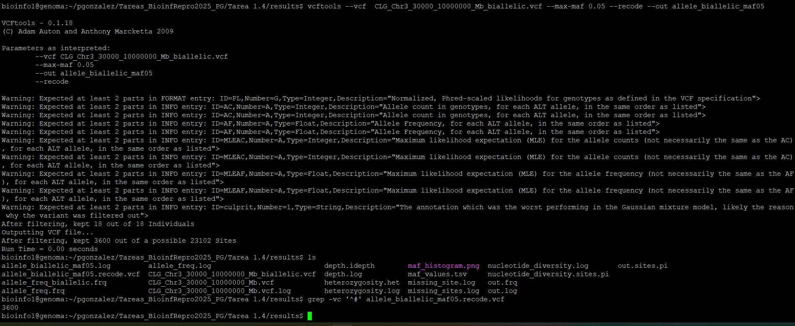

# Unidad 2 Sesion 2.1 — Informe

Este informe corresponde a la Unidad 2 Sesion 1 Titulado Genética de poblaciones con software especializado

Para la misma Tarea genere una carpeta titulada Tarea 1.4 donde a su vez se encuentran 4 carpertas.

## Estructura de carpetas del proyecto


- **data/**: insumos originales y/o preprocesados.
- **code/**: código reproducible usado en la tarea.
- **results/**: todo output que generan los comandos (p. ej., `.sexcheck`, `.hwe`, `.csv`).
- **imagen/**: gráficos y capturas que se referencian en el README.
 
# Ejercicios correspondientes al uso de VCF

Para esta sección el enunciado describe lo siguiente: Consulta el manual de VCFtools y escribe un script que responda los enunciados.

Todas las preguntas de la práctica están resueltas y documentadas en el script:

- **Ruta en el repositorio:** `code/script_ejercicios_vcf_unidad2.sh`
- **Enlace (Markdown) dentro del README:** [code/script_ejercicios_vcf_unidad2.sh](code/script_ejercicios_vcf_unidad2.sh)

**Qué contiene**
- Comandos paso a paso (con comentarios).
- Rutas relativas (`../data`, `../results`) para mantener la reproducibilidad.
- Archivos de salida generados (tablas, logs y, cuando corresponde, figuras en `imagen/`).

**Cómo ejecutarlo**
- Dar permisos y ejecutar desde la raíz del proyecto: `chmod +x code/script_ejercicios_vcf_unidad2.sh && bash code/script_ejercicios_vcf_unidad2.sh`

**Entradas / salidas principales**
- **Entradas:** `data/…` (`.bed/.bim/.fam`, `*_popinfo.csv`, etc.)
- **Salidas:** `results/…` (p. ej., `plink_sexcheck.sexcheck`, `sex_discordant_ids.csv`, `contingency_popSex_ancestry.csv`)

Sin emabrgo, a modo de practica y para tener evidencia del trabajo realizado a continuacion se resume **qué pide cada pregunta de la sección**, **qué hice**, **los comandos exactos que ejecuté** y **las salidas/archivos generados**.  
Incluye referencias a **capturas** que yo ejecute dentro del servidor a modo de ejercicio y para probar los comandos.

- Directorio de trabajo asumido: `Tarea 1.4/`
  - `data/` (insumos)
  - `results/` (salidas)
  - `code/` (scripts auxiliares, si aplica)
- VCF fuente (ruta compartida):
    /datos/compartido/ChileGenomico/GATK_ChGdb_recalibrated.autosomes.12262013.snps.known.vcf.gz
- Herramientas: `vcftools`, `awk`, `grep/zgrep`, `Rscript`, `plink`.

---

## P1 — ¿Cuántos individuos y variantes (SNPs) tiene el archivo?

Qué hice  
• Conté líneas sin encabezado (≈ variantes) y revisé nº de campos por línea para validar estructura.

Comandos  
    zgrep -v '^#' /datos/compartido/ChileGenomico/GATK_ChGdb_recalibrated.autosomes.12262013.snps.known.vcf.gz | wc -l
    zgrep -v '^#' /datos/compartido/ChileGenomico/GATK_ChGdb_recalibrated.autosomes.12262013.snps.known.vcf.gz | wc -w

Salida / Archivos  
• Los resultados fueron de 4450360 y 120159720

Captura  


---

## P2 — ¿Cuántos sitios del archivo no tienen datos perdidos?

Qué hice  
• Filtré sitios completamente tipificados con `--max-missing 1.0`.

Comandos  
    vcftools \
      --gzvcf /datos/compartido/ChileGenomico/GATK_ChGdb_recalibrated.autosomes.12262013.snps.known.vcf.gz \
      --max-missing 1.0 \
      --out results/missing_site

Salida / Archivos  
• `results/missing_site.log` (reporte de conteos)

Captura  


---

## P3 — Genera un archivo `CLG_Chr<X>_<Start>-<End>Mb.vcf` (ventana 2 Mb)


Qué hice  
• Usé `chr3: 30000–10000000` como ventana de ejemplo y recodifiqué a VCF.

Comandos  
    vcftools \
      --gzvcf /datos/compartido/ChileGenomico/GATK_ChGdb_recalibrated.autosomes.12262013.snps.known.vcf.gz \
      --chr 3 --from-bp 30000 --to-bp 10000000 \
      --recode --recode-INFO-all \
      --out results/CLG_Chr3_30000_10000000_Mb.vcf

Salida / Archivos  
• `results/CLG_Chr3_30000_10000000_Mb.vcf.recode.vcf`

Captura  


---

## P4 — Reporta cuántas variantes tiene el archivo generado

Qué hice  
• Conté líneas sin encabezado.

Comandos  
    grep -cv '^#' results/CLG_Chr3_30000_10000000_Mb.vcf.recode.vcf

Salida / Archivos  
• 23128

Captura  


---

## P5 — Reporta la cobertura promedio para todos los individuos

Enunciado  
• Cobertura promedio para todos los individuos del set de datos.

Qué hice  
• Usé `--depth` y revisé `depth.idepth` (mean depth por individuo).

Comandos  
    vcftools \
      --vcf results/CLG_Chr3_30000_10000000_Mb.vcf \
      --depth \
      --out results/depth

    head -n 20 results/depth.idepth

Salida / Archivos  
• `results/depth.idepth`

Captura  


---

## P6 — Calcula la frecuencia de cada alelo (AF) y guarda el resultado

Enunciado  
• Calcular la frecuencia de cada alelo para todos los individuos y guardar el resultado.

Qué hice  
• `--freq` sobre el VCF de la ventana.

Comandos  
    vcftools \
      --vcf results/CLG_Chr3_30000_10000000_Mb.vcf \
      --freq \
      --out results/allele_freq

Salida / Archivos  
• `results/allele_freq.frq`

Captura  


---

## P7 — Filtra el archivo de frecuencias para solo variantes bialélicas

Enunciado  
• Quedarme solo con variantes bialélicas.

Qué hice  
• Filtré por columna de conteo de alelos (`$3==2`).

Comandos  
    awk '$3 == 2' results/allele_freq.frq > results/allele_freq_biallelic.frq

Salida / Archivos  
• `results/allele_freq_biallelic.frq`

Captura  


---

## P8 — Script R: histograma del espectro de MAF (sobre bialélicas)

Enunciado  
• Leer el archivo de frecuencias bialélicas y guardar un histograma del espectro de MAF.

Qué hice  
• Calculé MAF por sitio y generé `maf_values.tsv` y `maf_histogram.png`.

Comandos  
    cat > code/script_R_ejercicio8.R <<'EOF'
    infile  <- "results/allele_freq_biallelic.frq"
    out_tsv <- "results/maf_values.tsv"
    out_png <- "results/maf_histogram.png"

    df <- read.table(infile, header = TRUE, stringsAsFactors = FALSE)
    f1 <- as.numeric(sub(".*:", "", df[[5]]))
    f2 <- as.numeric(sub(".*:", "", df[[6]]))
    maf <- pmin(f1, f2, na.rm = TRUE)

    out <- data.frame(MAF = maf)
    write.table(out, file = out_tsv, sep = "\t", row.names = FALSE, quote = FALSE)

    png(out_png, width = 1200, height = 800, res = 150)
    hist(maf, breaks = 50, main = "MAF spectrum (biallelic)", xlab = "Minor allele frequency")
    dev.off()
    EOF

    Rscript code/script_R_ejercicio8.R

Salida / Archivos  
• `results/maf_values.tsv`, `results/maf_histogram.png`

Captura  


---

## P9 — ¿Cuántos sitios tienen MAF < 0.05?

Enunciado  
• Contar sitios con MAF < 0.05.

Qué hice  
• Conteo sobre `maf_values.tsv` (saltando encabezado).

Comandos  
    awk -F'\t' 'NR>1 && $1 < 0.05 {n++} END{print n+0}' results/maf_values.tsv

Salida / Archivos  
• 3576

Captura  


---

## P10 — Calcula la heterocigosidad de cada individuo

Enunciado  
• Calcular heterocigosidad por individuo.

Qué hice  
• Usé `--het`. (Si se dispone de un VCF bialélico, mejor usarlo.)

Comandos  
    vcftools \
      --vcf results/CLG_Chr3_30000_10000000_Mb_biallelic.vcf \
      --het \
      --out results/heterozygosity

    head -n 10 results/heterozygosity.het

Salida / Archivos  
• `results/heterozygosity.het`

Captura  


---

## P11 — Calcula la diversidad nucleotídica por sitio

Enunciado  
• Diversidad nucleotídica por sitio.

Qué hice  
• `--site-pi` sobre el VCF de ventana.

Comandos  
    vcftools \
      --vcf results/CLG_Chr3_30000_10000000_Mb.vcf \
      --site-pi \
      --out results/nucleotide_diversity

    head -n 10 results/nucleotide_diversity.sites.pi

Salida / Archivos  
• `results/nucleotide_diversity.sites.pi`

Captura  


---

## P12 — Filtra los sitios con MAF < 0.05 (recodificado)

Enunciado  
• Filtrar sitios con MAF < 0.05 y recodificar VCF.

Qué hice  
• Usé `--max-maf 0.05` y exporté VCF recodificado.

Comandos  
    vcftools \
      --vcf results/CLG_Chr3_30000_10000000_Mb_biallelic.vcf \
      --max-maf 0.05 \
      --recode \
      --out results/allele_biallelic_maf05

    grep -vc '^#' results/allele_biallelic_maf05.recode.vcf

Salida / Archivos  
• `results/allele_biallelic_maf05.recode.vcf`

Captura  


---

## P13 — Convierte el VCF filtrado a formato PLINK

Enunciado  
• Convertir el VCF filtrado a PLINK (bed/bim/fam).

Qué hice  
• Usé `plink 1.90` con opciones estándar para VCF ⇒ PLINK.

Comandos  
    /opt/plink/plink-1.90/plink \
      --vcf results/allele_biallelic_maf05.recode.vcf \
      --double-id \
      --allow-extra-chr \
      --snps-only just-acgt \
      --make-bed \
      --out results/allele_biallelic_maf05

Salida / Archivos  
• `results/allele_biallelic_maf05.{bed,bim,fam}`

Captura  


---

# Ejercicios correspondiente al uso de Plink

Copia esos archivos a tu respositorio en una carpeta para la sesión Unididad2/Prac_Uni5/data y contesta lo siguiente asumiendo que tu WD es Unididad2/Sesion1/code (y no data).

## 1) Enlista los archivos plink que hay en `data`. ¿Qué tipos de archivos son cada uno?

**Respuesta breve**
- **`.bed`** → archivo **binario** con los genotipos.  
- **`.bim`** → **mapa de SNPs** (texto): cromosoma, ID, posición genética, posición física y alelos.  
- **`.fam`** → **individuos** (texto): FID, IID, PID, MID, SEX, PHENOTYPE.  
- **`.csv`** (p. ej. `*_popinfo.csv`) → **metainfo poblacional** (sexo, ancestría, etc.; no forma parte del trío BED/BIM/FAM).

---

## 2) Consulta el manual de PLINK 1.9 y responde

### 2a) Transforma de formato BED a formato PED (pista: Data Management). El nombre del output debe ser igual, solo cambiando la carpeta.

**Comando**
```bash
/opt/plink/plink-1.90/plink \
  --bfile ../data/chilean_all48_hg19 \
  --recode \
  --out   ../results/chilean_all48_hg19
```

**Salida esperada**
- `../results/chilean_all48_hg19.ped` y `../results/chilean_all48_hg19.map`.

---

### 2b) Crea otro archivo PED filtrando SNPs con MAF < 0.05 **y** individuos con >10% missing (`--mind 0.1`).  
**¿Cuántos SNPs e individuos fueron removidos?**

**Resultados obtenidos**
- **SNPs removidos:** **347 070**  
- **Individuos removidos:** **2**  
- (De **813 366** SNPs iniciales quedaron **466 296**; de **48** individuos quedaron **46**).

**Comando**
```bash
/opt/plink/plink-1.90/plink \
  --bfile ../data/chilean_all48_hg19 \
  --recode \
  --maf 0.05 \
  --mind 0.1 \
  --out ../results/maicesArtegaetal2015_maf05_missing10
```

**Cómo se calcularon los removidos (desde el `.log`)**
```bash
grep -E 'variants loaded|samples .* loaded|pass filters and QC' ../results/maicesArtegaetal2015_maf05_missing10.log
```
```bash
awk '/variants loaded/ {v=$1} /samples .* loaded/ {s=$1} /pass filters and QC/ {vp=$1; sp=$4} END{print "SNPs_removidos=" v-vp "\nIndividuos_removidos=" s-sp}' ../results/maicesArtegaetal2015_maf05_missing10.log
```

**Salida esperada**
- `../results/maicesArtegaetal2015_maf05_missing10.ped/.map` + `maicesArtegaetal2015_maf05_missing10.log`.

---

### 2c) Realiza un reporte de Hardy–Weinberg (HWE) sobre el archivo filtrado.  
**Observa el output y discute qué es cada columna.**

**Comando**
```bash
/opt/plink/plink-1.90/plink \
  --file ../results/maicesArtegaetal2015_maf05_missing10 \
  --hardy \
  --out  ../results/maicesArtegaetal2015_maf05_missing10
```

**Explicación de columnas del `.hwe`**
- **CHR**: cromosoma del SNP.  
- **SNP**: identificador del SNP (rsID o ID del `.bim`).  
- **TEST**: grupo del test de HWE — `ALL` (todos), `AFF` (casos), `UNAFF` (controles).  
  - Si no hay casos/controles, en `AFF/UNAFF` suele salir `nan`.  
- **A1 / A2**: alelos usados por PLINK; `A1` es el alelo “efecto”.  
- **GENO**: conteos de genotipos `A1A1 / A1A2 / A2A2` (solo no‐missing).  
- **O(HET)**: proporción **observada** de heterocigotos (`A1A2`).  
- **E(HET)**: proporción **esperada** de heterocigotos bajo HWE (según frecuencias alélicas).  
- **P**: valor-p del test de HWE (p muy pequeño, p. ej. `< 1e-6`, indica desviación; `nan` si no hay datos suficientes).

---

### 2d) Observa el archivo `.fam`. Consulta la documentación de PLINK para determinar qué es cada columna. ¿Qué información hay y no hay en este archivo?

**Estructura fija (6 columnas separadas por espacio)**
1. **FID** — Family ID (ID de familia).  
2. **IID** — Individual ID (ID del individuo).  
3. **PID** — Paternal ID (ID del padre; `0` si desconocido).  
4. **MID** — Maternal ID (ID de la madre; `0` si desconocido).  
5. **SEX** — Sexo (`1`=varón, `2`=mujer, `0`=desconocido).  
6. **PHENOTYPE** — Fenotipo (`1`=control, `2`=caso, `-9/0`=faltante).

**Ejemplo de tu salida**
```
CDSJ177 CDSJ177 0 0 1 1
→ FID=CDSJ177, IID=CDSJ177, sin padres, SEX=1 (varón), PHENOTYPE=1 (control).
```

**¿Qué NO hay en el `.fam`?**
- No están los **genotipos** (eso está en `.bed`).  
- No está el **mapa de SNPs** (eso está en `.bim`).  
- No hay **metadatos poblacionales** (eso viene en `*_popinfo.csv`).  
- No hay métricas de **QC** (missingness, HWE, MAF, etc.).

---

## Ejercicio 4

Usar `data/chilean_all48_hg19_popinfo.csv` y el comando `plink --update-ids` para **cambiar el FID** de las muestras del set PLINK `data/chilean_all48_hg19.{bed,bim,fam}`, de manera que el **FID** pase a ser **`Categ.Altitud`** tomado desde el metadato de maíz `data/maizteocintle_SNP50k_meta_extended.txt`.

> Para que esto sea posible debe existir una **llave en común** (columna con valores coincidentes) entre las 48 muestras de `popinfo` y las filas relevantes del meta de maíces; sin una llave, no se puede construir la tabla requerida por `--update-ids`:
> ~~~
> oldFID  oldIID  newFID  newIID
> ~~~

---

## Entradas utilizadas
- `data/chilean_all48_hg19.{bed,bim,fam}`
- `data/chilean_all48_hg19_popinfo.csv`
- `data/maizteocintle_SNP50k_meta_extended.txt`

---

## Pasos realizados

### 1) Extraer IDs del `.fam`

**Script:** `code/step4a_extract_fam_ids.R`  
**Comando:**
~~~bash
/opt/R/R-4.4.3/bin/Rscript code/step4a_extract_fam_ids.R
~~~

**Salida principal**
- `results/fam_ids.tsv` — columnas: `oldFID`, `oldIID`, `IID_STD` (ID estandarizado).

> *Nota:* Este paso se usó para comparar correctamente los IIDs del `.fam` con campos de `popinfo` y asegurar que estamos trabajando sobre las mismas 48 muestras.

---

### 2) Escaneo de llaves entre `popinfo` y el meta

Para **no asumir** cuál es la llave, se escanearon **todas** las columnas de `popinfo` contra **todas** las columnas del archivo `maizteocintle_SNP50k_meta_extended.txt`, contando coincidencias tras una normalización (mayúsculas, `trim`, y eliminación de acentos/ñ).

**Script:** `code/step4z_scan_keys.R`  
**Comando:**
~~~bash
/opt/R/R-4.4.3/bin/Rscript code/step4z_scan_keys.R
~~~

**Salidas**
- `results/key_scan_fam_pop.tsv` — confirma que **`IndID`** de `popinfo` **matchea 48/48** con los IIDs del `.fam`.
- `results/key_scan_pop_meta.tsv` — **todas** las combinaciones `pop_col × meta_col` tienen **`matches = 0`**.

**Interpretación**
- Aunque `IndID` enlaza perfecto `fam ↔ popinfo`, **no existe llave** con el meta de maíces.  
- Columnas candidatas como `Num_Colecta`, `NSiembra`, `OrderColecta`, `Categ.Altitud`, etc., **no presentan intersección de valores** con estas 48 muestras.

---

### 3) Consecuencia sobre `plink --update-ids`

Dado que **no hay llave en común**, **no se puede** construir la tabla de 4 columnas `oldFID oldIID newFID newIID` con `newFID = Categ.Altitud` del meta.  
Por lo tanto, **no se ejecutó** el siguiente comando:

~~~bash
/opt/plink/plink-1.90/plink \
  --bfile data/chilean_all48_hg19 \
  --update-ids results/update_ids.txt \
  --make-bed \
  --out results/chilean_all48_hg19_altfid
~~~

---

## Explicacion detallada

1) **`results/key_scan_fam_pop.tsv`**  
Confirma que `IndID` (en `popinfo`) coincide **48/48** con los IIDs del `.fam`.  
➡️ `popinfo` corresponde a las mismas 48 muestras del `.fam`.

2) **`results/key_scan_pop_meta.tsv`**  
Todas las filas muestran **`matches = 0`** para cualquier par `pop_col × meta_col`.  
➡️ **No existe llave** entre `popinfo` (48 chilenos) y `maizteocintle_SNP50k_meta_extended.txt`.

El cual puede observarse en la figura no_coincendicas_ejercicio4_p2 

---

## Conclusión del Ejercicio 4

Con el escaneo exhaustivo de llaves, se concluye que **no existe una llave común** entre las 48 muestras chilenas y el metadato de maíces. En consecuencia, **no es posible** renombrar el FID a `Categ.Altitud` usando `plink --update-ids` para este conjunto de datos.  
Se documenta el intento, los scripts utilizados y la evidencia generada. Se continúa con los **Ejercicios 5–7**, que solo requieren `fam` y `popinfo`.


## Scripts y salidas (Ejercicio 4)

**Scripts**
- `code/step4a_extract_fam_ids.R`
- `code/step4z_scan_keys.R`

**Salidas**
- `results/fam_ids.tsv`
- `results/key_scan_fam_pop.tsv`
- `results/key_scan_pop_meta.tsv`

**Entradas**
- `data/chilean_all48_hg19.{bed,bim,fam}`
- `data/chilean_all48_hg19_popinfo.csv`
- `data/maizteocintle_SNP50k_meta_extended.txt`

## 5) Comparar sexo reportado en `.fam` vs `popinfo` y calcular proporción de discordancias

**Pregunta**  
> Realiza una comparación entre el sexo en el archivo `.fam` y el `popinfo` y calcula la proporción de discordancias.

**Qué hice y por qué**  
- Extraje el sexo del `.fam` (1=Masculino, 2=Femenino) y lo convertí a **M/F**.  
- Extraje el sexo de `popinfo` (columna **Sex**) y lo normalicé a **M/F**.  
- Uní por **IID** y calculé la proporción de pares con sexos distintos (ignorando NA).  
- Guardé también la lista de IDs discordantes.

**Comandos (ejecutar uno por uno)**

    cd ~/pgonzalez/Tareas_BioinfRepro2025_PG/"Tarea 1.4"/data

    awk 'BEGIN{OFS=","}{print $2,($5==1?"M":($5==2?"F":"NA"))}' chilean_all48_hg19.fam | sort -t, -k1,1 > ../results/sex_fam.csv

    awk -F, 'BEGIN{OFS=","} NR>1{sid=$1;s=$2;gsub(/(^"|"$)/,"",sid);gsub(/(^"|"$)/,"",s);s=toupper(s);if(s~/^M/)s="M";else if(s~/^F/)s="F";else s="NA";print sid,s}' chilean_all48_hg19_popinfo.csv | sort -t, -k1,1 > ../results/sex_popinfo.csv

    join -t, -1 1 -2 1 ../results/sex_fam.csv ../results/sex_popinfo.csv > ../results/sex_join.csv

    awk -F, '{tot++; if($2!="NA" && $3!="NA" && $2!=$3) d++} END{printf "Discordant=%d; Total_joined=%d; Proportion=%.4f\n",d,tot,(tot?d/tot:0)}' ../results/sex_join.csv | tee ../results/sex_discordance.txt

    awk -F, '$2!="NA" && $3!="NA" && $2!=$3{print $1","$2","$3}' ../results/sex_join.csv > ../results/sex_discordant_ids.csv

**Archivos generados**
- `../results/sex_discordance.txt` — resumen con proporción de discordancias.  
- `../results/sex_discordant_ids.csv` — tabla **IID,Sex_fam,Sex_popinfo** de discordantes.  
- (Intermedios: `sex_fam.csv`, `sex_popinfo.csv`, `sex_join.csv`).


## 6) Estimación de sexo con PLINK y reporte de discordancias `.fam` vs PLINK

**Pregunta**  
> Realiza un test de estimación de sexo usando PLINK y reporta los resultados en formato de tabla para todos los individuos con discordancia entre el sexo reportado en `.fam` y el calculado con PLINK.

**Qué hice y por qué**  
- Corrí `plink --check-sex` para estimar sexo a partir de marcadores en cromosomas sexuales.  
- Filtré las filas con `STATUS=PROBLEM` (discordancia entre **PEDSEX** y **SNPSEX**).  
- Entregué una tabla en CSV con las columnas clave.

**Comandos**

    /opt/plink/plink-1.90/plink --bfile chilean_all48_hg19 --check-sex --out ../results/plink_sexcheck

    awk 'BEGIN{OFS=","} NR==1{print "FID,IID,PEDSEX,SNPSEX,F,STATUS";next} $5=="PROBLEM"{print $1,$2,$3,$4,$6,$5}' ../results/plink_sexcheck.sexcheck > ../results/plink_sexcheck_problems.csv

**Archivos generados**
- `../results/plink_sexcheck.sexcheck` — salida completa de PLINK.  
- `../results/plink_sexcheck_problems.csv` — **tabla solicitada** con solo discordantes.

Los resultados ya ejecutados en el servidor pueden observase en la Figura ejercicio6_p2  

## 7) Tabla de contingencia de individuos por **sexo** y **ancestría** (desde `popinfo`)

**Pregunta**  
> Genera una tabla de contingencia de individuos por sexo y ancestría (columna **Ancestry** en `popinfo`).

**Qué hice y por qué**  
- Tomé **Sex** (columna 2) y **Ancestry** (columna 6) de `chilean_all48_hg19_popinfo.csv`.  
- Normalicé Sex a **M/F** y conté las combinaciones **(Sex, Ancestry)**.  
- Exporté una tabla en formato largo con conteos.

**Comando**

    awk -F, 'NR>1{sx=$2; an=$6; gsub(/(^"|"$)/,"",sx); gsub(/(^"|"$)/,"",an); sx=toupper(sx); if(sx~/^M/||sx=="MALE"||sx=="1") s="M"; else if(sx~/^F/||sx=="FEMALE"||sx=="2") s="F"; else next; gsub(/^[ \t]+|[ \t]+$/,"",an); if(an=="") next; k[s","an]++} END{print "Sex,Ancestry,N"; for(i in k) print i","k[i]}' chilean_all48_hg19_popinfo.csv | sort -t, -k1,1 -k2,2 > ../results/contingency_popSex_ancestry.csv

**Archivo generado**
- `../results/contingency_popSex_ancestry.csv` — columnas **Sex, Ancestry, N**.

*(Opcional: porcentajes por sexo)*

    awk -F, 'NR==1{next}{k[$1","$2]=$3;sx[$1]+=$3} END{print "Sex,Ancestry,N,Percent_of_sex";for(i in k){split(i,a,",");s=a[1];an=a[2];n=k[i];p=(sx[s]?100*n/sx[s]:0);printf "%s,%s,%d,%.2f%%\n",s,an,n,p}}' ../results/contingency_popSex_ancestry.csv | sort -t, -k1,1 -k2,2 > ../results/contingency_popSex_ancestry_pct.csv

    column -s, -t ../results/contingency_popSex_ancestry_pct.csv

El resultado puede observarse en la Figura 
---

## Notas de reproducibilidad
- Ejecutar todo desde `..."Tarea 1.4"/data`.  
- Versiones utilizadas: PLINK 1.90 (`/opt/plink/plink-1.90/plink`), `awk`, `join`, `sort`, `column`.  
- Las salidas se guardan en `..."Tarea 1.4"/results/`.  


