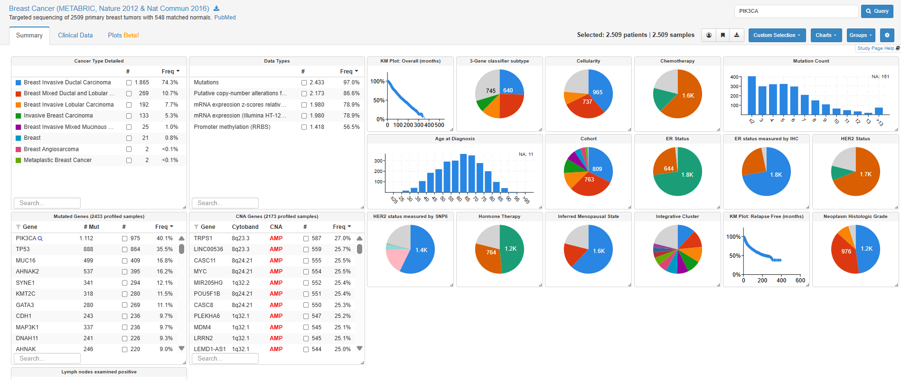
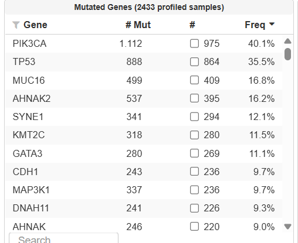
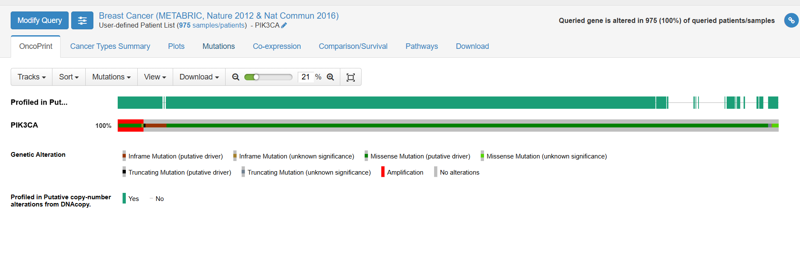
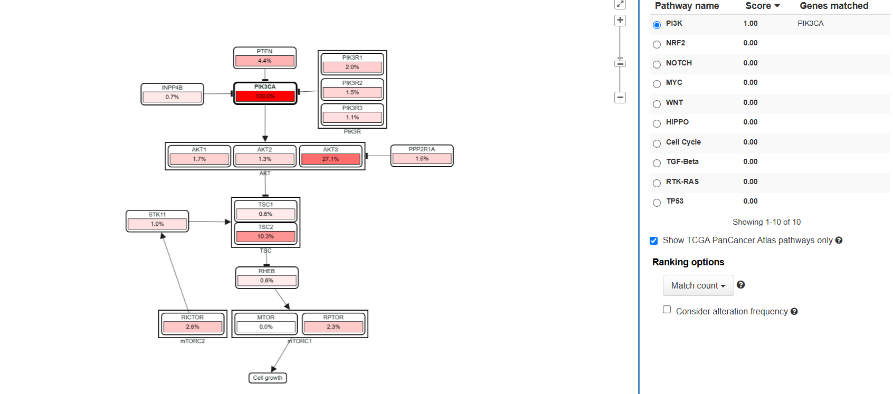
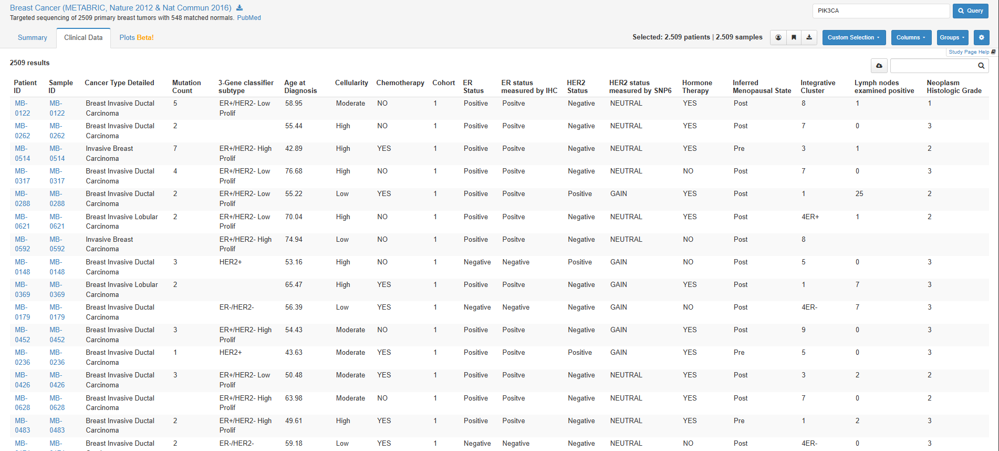
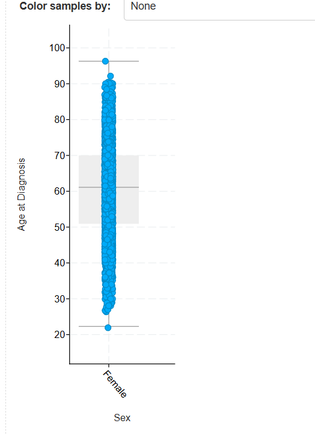

# Tarea Unidad 3 Sesión 2

Esta tarea corresponde a la clase de cBioPortal para analizar datos genómicos de cáncer

---

## **Parte 1: Selección del estudio**

### **Completa la siguiente información**

- **Nombre del estudio:** Breast Cancer (METABRIC, Nature 2012 & Nat Commun 2016)  
- **Número total de pacientes:** 2509 muestras en total.  
- **Institución responsable:** The METABRIC project was funded by Cancer Research UK, the British Columbia Cancer Foundation and Canadian Breast Cancer Foundation BC/Yukon.  
- **Paper asociado a la publicación:**  
  Pereira B, Chin SF, Rueda OM, Vollan HK, Provenzano E, Bardwell HA, Pugh M, Jones L, Russell R, Sammut SJ, Tsui DW, Liu B, Dawson SJ, Abraham J, Northen H, Peden JF, Mukherjee A, Turashvili G, Green AR, McKinney S, Oloumi A, Shah S, Rosenfeld N, Murphy L, Bentley DR, Ellis IO, Purushotham A, Pinder SE, Børresen-Dale AL, Earl HM, Pharoah PD, Ross MT, Aparicio S, Caldas C. *The somatic mutation profiles of 2,433 breast cancers refines their genomic and transcriptomic landscapes.* **Nat Commun.** 2016 May 10;7:11479. doi: 10.1038/ncomms11479. PMID: 27161491; PMCID: PMC4866047.

   

---

### **Justificación de la elección del estudio a analizar**

El cáncer de mama es uno de los tipos de cáncer más prevalentes en mujeres y representa un importante desafío por su frecuencia, su diversidad biológica y su gran tasa de mortalidad.  
Dentro de esto, las alteraciones genéticas juegan un papel clave al afectar rutas de señalización que controlan el crecimiento y la supervivencia celular.  

En este contexto, el gen **PIK3CA** resulta especialmente interesante, ya que participa en la vía **PI3K/AKT**, una de las más implicadas en los procesos de proliferación y resistencia a tratamientos.  

Analizar las mutaciones presentes en este gen permite comprender mejor los mecanismos moleculares que podrían contribuir a la formación y comportamiento del tumor, así como identificar posibles implicancias terapéuticas.  

Es por ello que este estudio, que abarca una gran cantidad de pacientes y con datos clínicos completos, puede resultar de gran utilidad.

---

## **Parte 2: Análisis genómico**

Se visualizan los **5 genes con mayor frecuencia de mutación**.

- El **gen seleccionado** fue el de mayor frecuencia en la población: **PIK3CA**.  

### **Responde:**

- **¿Cuántos pacientes presentan esa mutación?**  
  → 975 pacientes tenían esa mutación.

- **¿Qué tipo de mutación es más frecuente (missense, nonsense, frameshift)?**  
  Para la mutación más frecuente tenemos lo siguiente:

  

  Siendo la mutación más abundante la **Missense Mutation**.

- **¿Qué vías de señalización aparecen alteradas en la pestaña Pathways?**  
  La vía de señalización más alterada es la de **PI3K**, como se puede observar en la siguiente imagen:

  

  También aparecen otras vías que podrían verse afectadas, que se muestran en la imagen anterior.

---

## **Parte 3: Análisis clínico**

### **Examina las variables demográficas:**

- **Distribución por sexo:**  
  El estudio fue realizado netamente en mujeres por la naturaleza del estudio.

- **Distribución por edad:**  
  Para la distribución por edad generé el siguiente gráfico:

  

  Donde se muestra que los pacientes estuvieron entre **21 y 90 años**.

- **Distribución por raza (si está disponible):**  
  No aparece en la base METABRIC (es un estudio británico-canadiense, y no incluyó esta variable).

---

### **Cálculos**

- **Rango de edad (edad máxima − edad mínima):**  
  - Edad mínima: 21 años  
  - Edad máxima: 96 años  

- **Mediana de edad (usando “Compare Groups → Median”):**  
  → **Mediana: 61 años**

---

### **Interpreta los resultados**

**¿Existe una predominancia por sexo o edad?**  
Sí, la cohorte es prácticamente **100% femenina**, lo que refleja la biología del cáncer de mama.  
En cuanto a la edad, la distribución se concentra en mujeres de edad media–avanzada, con mediana de 61.1 años (rango aprox. 21.9–96.3).  
Es decir, hay predominio de pacientes **postmenopáusicas**.

---

**¿Qué implicancias podría tener esa distribución para el estudio del cáncer elegido?**  
La **predominancia de mujeres postmenopáusicas** sugiere que los factores hormonales tienen un papel importante en el desarrollo de este cáncer.  

En el grupo analizado, el gen **PIK3CA** presenta principalmente mutaciones tipo missense, que se asocian con una mayor activación de la vía PI3K/AKT, relacionada con el crecimiento y la supervivencia de las células tumorales.  

Esto puede tener implicancias terapéuticas, ya que existen tratamientos dirigidos a bloquear esa vía y mejorar la respuesta al tratamiento.  

Además, la **edad avanzada** puede influir en la **tolerancia a la terapia** y en la **presencia de otras enfermedades**, por lo que es importante considerar estos factores al analizar los resultados.

---

