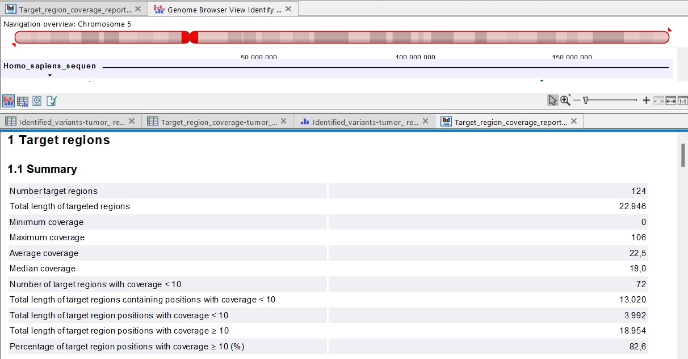
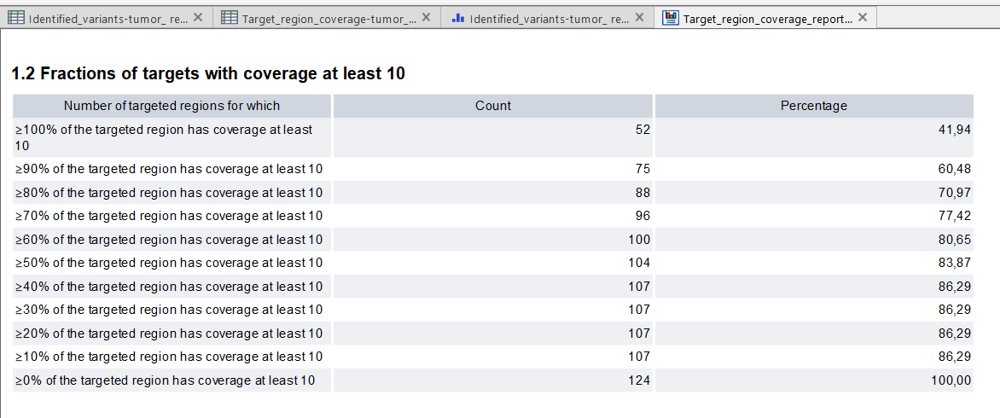
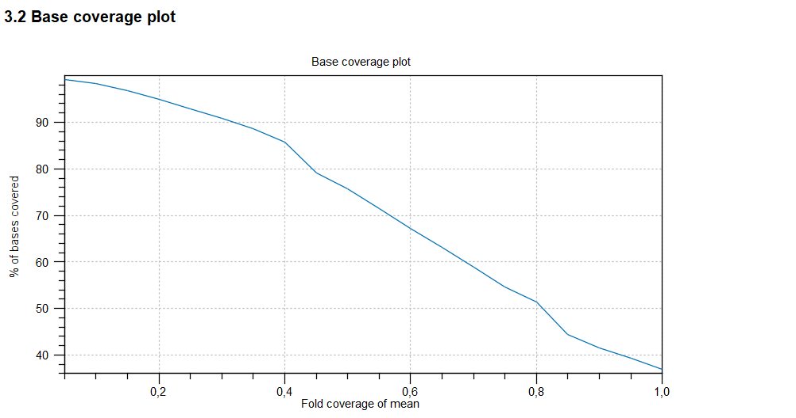
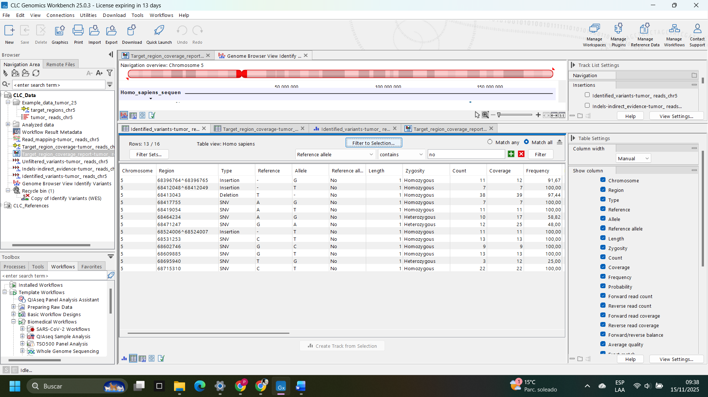
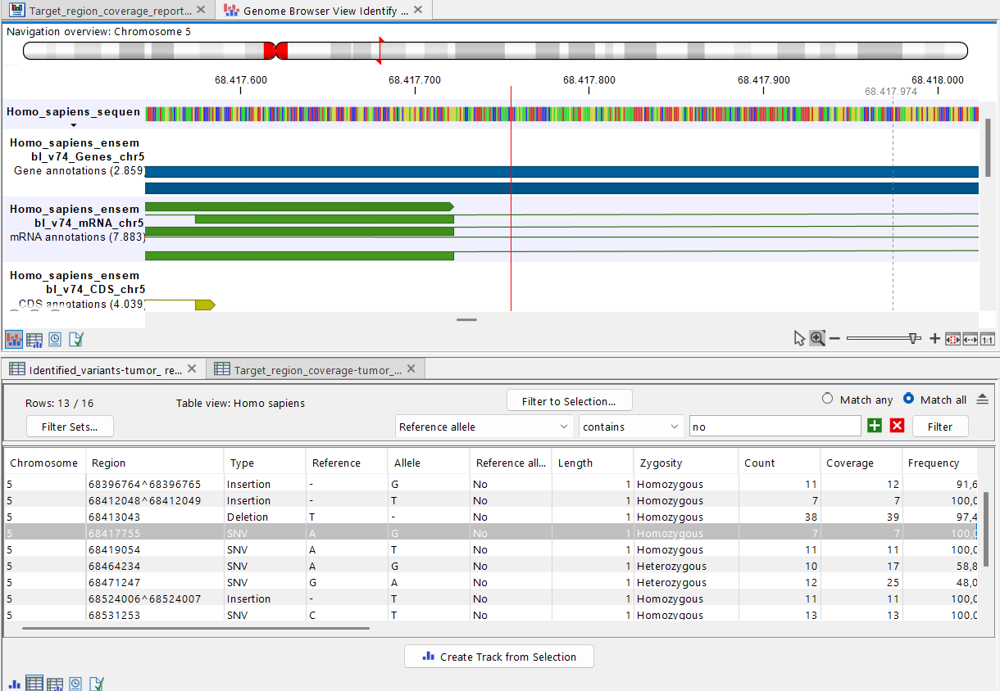
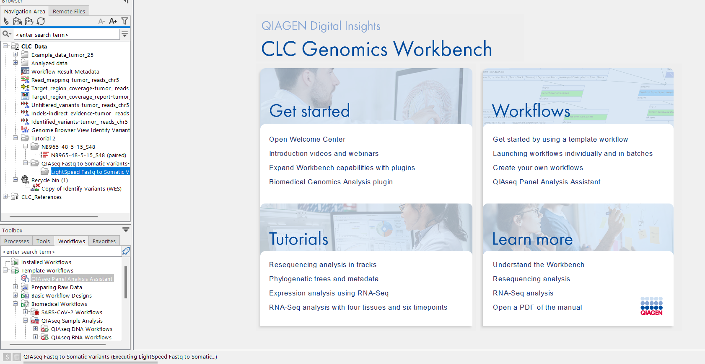

# Reporte de Tarea Análisis de ADN con CLC – Sesion 3.5 
## Tutorial 1: Identificación de variantes en una muestra de tumor

En este análisis utilicé el tutorial de identificación de variantes tumorales provisto por QIAGEN para evaluar lecturas secuenciadas sobre un subconjunto del cromosoma 5. Antes de interpretar cualquier variante, es necesario revisar la calidad de la secuenciación y verificar que las regiones objetivo realmente estén cubiertas con suficiente profundidad.

Por esa razón, seleccioné tres figuras que representan los aspectos más importantes del control de calidad (QC): el resumen de cobertura, la proporción de regiones con cobertura mínima aceptable y la distribución del coverage a nivel de bases.

Estas métricas permiten evaluar si el enriquecimiento fue adecuado y si los resultados generados son confiables para posterior interpretación biológica o clínica.
Comencé revisando el resumen de cobertura, porque esta tabla entrega una visión global de la profundidad alcanzada en todas las regiones analizadas. Este tipo de información es esencial para verificar si la secuenciación tiene la calidad mínima necesaria: muestra el número de regiones objetivo, la cobertura promedio, el mínimo, el máximo y cuántas regiones están por debajo del umbral de 10X.

### **Figura 1. Resumen de cobertura de las regiones objetivo.**

El resumen general muestra que las regiones objetivo presentan una cobertura promedio de 22,5X, lo cual supera el umbral mínimo recomendado para análisis de paneles dirigidos. La mediana de 18X es consistente con el promedio, lo que indica una distribución relativamente homogénea. Sin embargo, se observan 72 regiones con cobertura menor a 10X, lo que sugiere que parte del panel presenta enriquecimiento insuficiente y que algunos loci podrían requerir mayor profundidad en estudios futuros. Aun así, la mayor parte del panel cumple estándares aceptables para análisis de variantes somáticas.

Luego revisé el porcentaje de regiones que alcanzan al menos 10X, que es un umbral habitual para poder llamar variantes con suficiente confianza. Elegí esta figura porque permite evaluar la uniformidad del enriquecimiento: no basta con tener un buen promedio, sino que las regiones deben estar cubiertas de forma relativamente homogénea.

### **Figura 2. Porcentaje de regiones con cobertura mínima de 10X.**

La tabla muestra que el 41,94% de las regiones alcanza cobertura ≥10X en el 100% de su extensión. Este número es menor al ideal para paneles clínicos, pero la proporción aumenta progresivamente, alcanzando un 60,48% cuando se exige al menos un 90% de bases con cobertura ≥10X. A partir del 70%, prácticamente todas las regiones superan el umbral requerido. Esto indica que, aunque el enriquecimiento no fue completamente uniforme, la mayor parte del panel presenta cobertura suficiente para la detección de variantes, y las regiones más críticas pueden interpretarse con confianza razonable.

Finalmente seleccioné la curva de base coverage, porque ilustra cómo se distribuye la cobertura dentro de cada región. Esta figura es útil para identificar si hay zonas subcubiertas incluso dentro de regiones que parecen “bien cubiertas” en promedio.

### **Figura 3. Base coverage plot.**

El gráfico de distribución de cobertura permite visualizar cuán uniformemente se distribuye la profundidad dentro de las regiones objetivo. La curva muestra que aproximadamente el 95% de las bases se encuentra cubierta a niveles iguales o superiores a la mitad del coverage promedio. A medida que el coverage disminuye respecto al promedio, la proporción de bases cubiertas decrece de forma suave, sin caídas abruptas, lo que indica un comportamiento técnico estable del enriquecimiento. No obstante, se observan colas hacia valores bajos, lo cual coincide con las regiones subcubiertas identificadas en las tablas previas.

Antes de profundizar en la interpretación clínica, incluí una figura con todas las variantes detectadas por el pipeline. Esta tabla resume de forma clara cuántas variantes encontramos, qué tipo de cambios representan (SNV, inserciones o deleciones) y la cobertura de cada una. Es un paso necesario para visualizar el universo completo de alteraciones antes de seleccionar una variante relevante para un análisis más profundo.

### **Figura 4. Variantes identificadas en el análisis.**

La tabla muestra todas las variantes detectadas en el cromosoma 5 de la muestra analizada. Cada fila representa una variante con información sobre su posición genómica (Región), tipo de variante (SNV, inserción, deleción), alelo de referencia, alelo alternativo, zigosidad, número de lecturas que soportan la variante (Count), cobertura total y frecuencia alélica.

En esta tabla se observan variantes de diferentes tipos, siendo la mayoría SNVs, junto a algunas inserciones y deleciones.
La mayoría de las variantes se encuentran en estado homocigoto, lo cual puede deberse a la naturaleza del dataset del tutorial (simulado o altamente filtrado). Las frecuencias observadas son cercanas al 100%, y los valores de cobertura son adecuados para considerar cada variante como confiable.

Esta figura me permite entender cuántas variantes están presentes y cuáles podrían ser potencialmente relevantes para la interpretación clínica. A partir de esta tabla seleccionaré una variante específica para realizar la anotación y análisis clínico según guías AMP/ASCO/CAP.

Para explorar con más detalle una de las variantes detectadas, seleccioné en la tabla de Identified_variants-tumor_reads_chr5 una SNV homocigota con cambio A>G en el cromosoma 5. Al hacer clic sobre esta fila, CLC abrió automáticamente la vista del Genome Browser y utilicé el zoom para alejarme lo suficiente como para ver las anotaciones de exones y transcritos. De esta forma pude ubicar la variante dentro del contexto genómico y comprobar que se encontraba en la región codificante del gen CCNB1 (Cyclin B1).

### **Figura 5. Visualización genómica de la variante A>G en el gen CCNB1.**

En esta figura se muestra el locus del cromosoma 5 alrededor de la posición ~68,4 Mb. La línea roja vertical marca la posición exacta de la variante seleccionada. Sobre la secuencia de referencia se observan las anotaciones de los transcritos y exones de CCNB1, mientras que en las pistas inferiores se visualizan la cobertura de lectura y las variantes detectadas en la misma región. Esta vista permite confirmar que la SNV A>G se encuentra dentro de un exón del gen CCNB1 y que la región está adecuadamente cubierta por las lecturas del panel dirigido.

A partir de esta variante, realicé una búsqueda en bases de datos clínicas que siguen las guías AMP/ASCO/CAP (por ejemplo, ClinVar, CIViC, OncoKB y la plataforma VarSome). En ninguna de estas fuentes encontré reportes previos de la misma variante ni evidencia clara de patogenicidad o acción terapéutica. Tampoco aparece descrita como hotspot tumoral ni asociada a respuesta a fármacos. 

---

## Tutorial 2 – Encontrar variantes accionables con los paneles QIAseq

*(No se pudo completar por el problema de licencia.)*

Siguiendo las recomendaciones del proveedor trate de correr el programa pero lastimosamente me genero un archivo que no tenia contenido que se observan en la siguiente imagen:

Sin embargo, de igual manera incluyo una interpretación de lo que se esperaba obtener en base al documento que nos facilitaron en el tutorial.

En el caso del Panel QIAseq BRCA1/BRCA2 (DHS-102Z), el análisis habría incluido:

1. **Identificación automática de variantes**  
   El pipeline debía detectar variantes germinales o somáticas presentes en los genes **BRCA1** y **BRCA2**, incluyendo SNVs, indels y posibles variantes accionables clínicamente. El archivo esperado habría mostrado una lista tabulada con la información esencial de cada variante: posición genómica, tipo de variante, cambio de nucleótido, profundidad de lectura, frecuencia alélica y zigosidad.

2. **Anotación funcional y clínica**  
   Cada variante debía ser anotada mediante herramientas que integran bases de datos como:
   - **ClinVar**
   - **COSMIC**
   - **dbSNP**
   - **gnomAD**
   - Predictores funcionales computacionales (SIFT, PolyPhen, etc.)

   Esto habría permitido clasificar las variantes según las guías **AMP/ASCO/CAP**, por ejemplo:
   - Patogénica  
   - Probablemente patogénica  
   - De significado incierto (VUS)  
   - Benigna o probablemente benigna  

3. **Reporte de variantes accionables**  
   El workflow debía destacar específicamente:
   - Variantes conocidas asociadas con riesgo hereditario de cáncer de mama/ovario.  
   - Variantes que podrían influir en decisiones clínicas como vigilancia, prevención o terapias dirigidas (por ejemplo, sensibilidad a inhibidores PARP).

4. **Visualización en Genome Browser**  
   El tutorial indicaba que el resultado debía incluir una carpeta con:
   - Archivos "Read Mapping"  
   - Tracks de cobertura  
   - Tracks de variantes identificadas  
   - Visualización alineada contra el genoma de referencia para verificar manualmente la calidad de las variantes.

5. **Generación del Reporte QIAseq**  
   Finalmente, el asistente debía producir un reporte resumido con:
   - Número total de variantes detectadas  
   - Variantes relevantes clínica o funcionalmente  
   - Estadísticas de rendimiento (profundidad, cobertura uniforme, regiones con baja cobertura)  

En conjunto, el análisis habría permitido no solo identificar variantes sino también evaluar su posible impacto biológico y clínico, entregando un reporte listo para la interpretación biomédica según estándares actuales.

