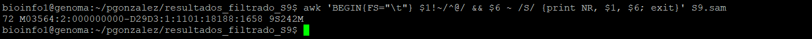
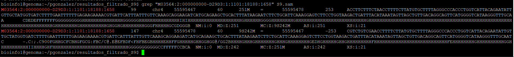
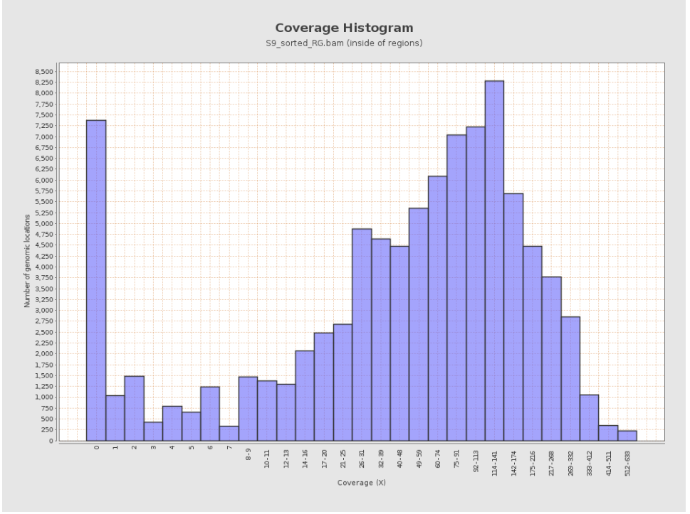
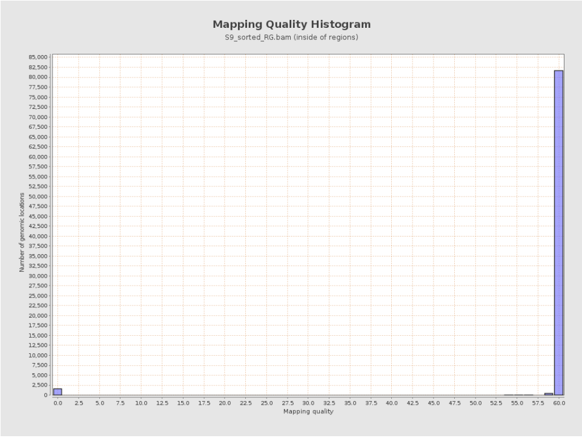
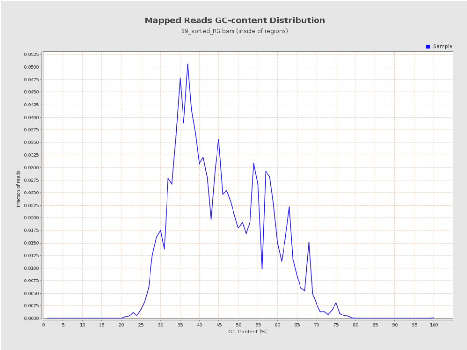
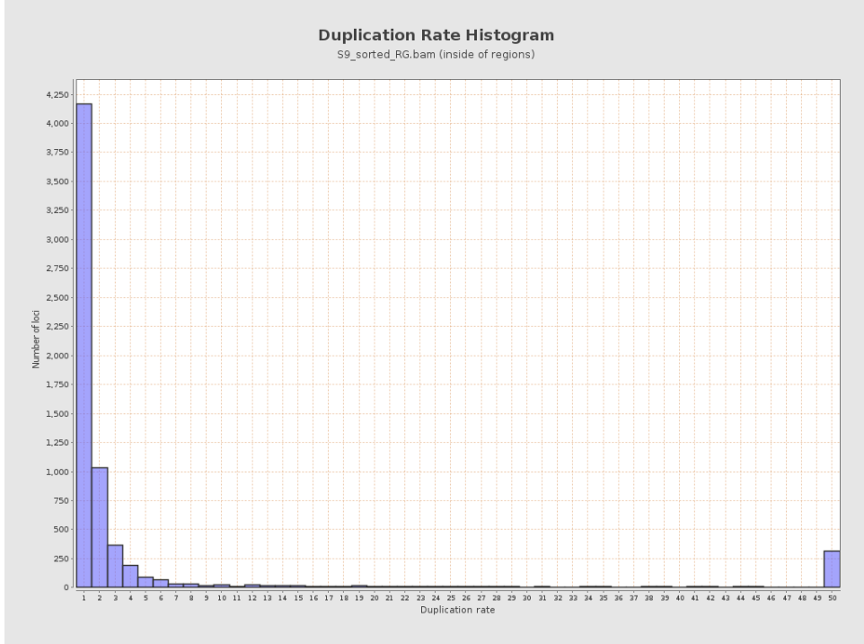
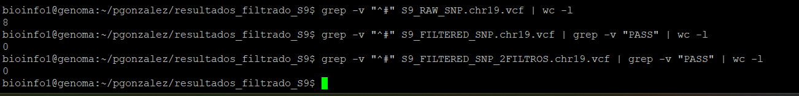
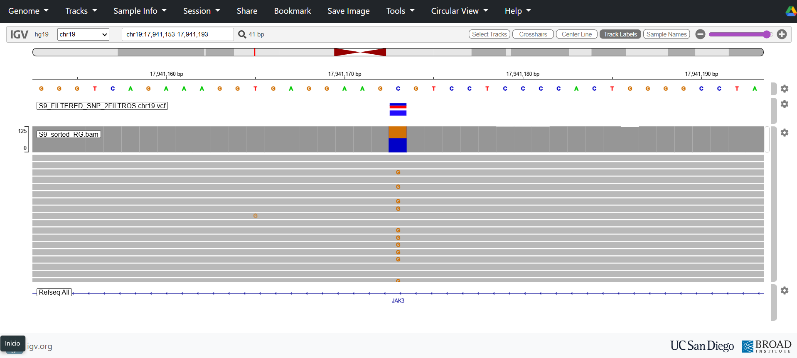
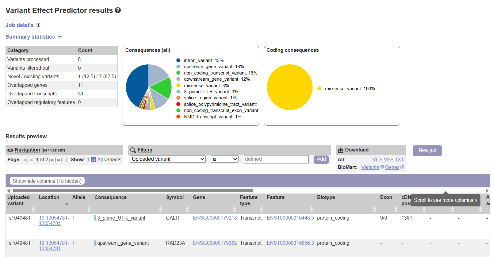
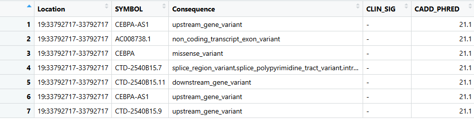

# Unidad 3: Introducción a la genómica y secuenciación de siguiente generación

## Sesión 3.3 — Análisis de secuencias

## PARTE 1

### Preguntas Tutorial de Alineamiento de lecturas

### 1.	Realizar el alineamiento contra el genoma humano hg19 de las lecturas R1 y R2 del paciente seleccionado para la tarea de control de calidad de lecturas de secuencia.

Las lecturas pareadas (R1 y R2) del paciente S9 fueron alineadas al genoma de referencia humano hg19 utilizando la herramienta BWA-MEM (v0.7.17).
El comando empleado fue:

```bash
bwa mem -t 4 -M /datos/reference/genomes/hg19_reference/hg19.fasta \S9_R1_filter3.fastq.gz S9_R2_filter3.fastq.gz > S9.sam
```
Posteriormente, el archivo SAM generado se convirtió a formato BAM y se ordenó por posición para su posterior análisis:

```bash
java -jar /opt/picard/picard-2.25.2/picard.jar SamFormatConverter -I S9.sam -O S9.bam
java -jar /opt/picard/picard-2.25.2/picard.jar SortSam -I S9.bam -O S9_sorted.bam -SO coordinate
```

Finalmente, se añadió el campo de ReadGroup y se indexó el alineamiento:

```bash
java -jar /opt/picard/picard-2.25.2/picard.jar AddOrReplaceReadGroups \-I S9_sorted.bam -O S9_sorted_RG.bam -ID S9 -LB Paired-end -PL Illumina -PU Unknown -SM S9
samtools index S9_sorted_RG.bam
```
Como resultado, se obtuvo el archivo final `S9_sorted_RG.bam`, que contiene las lecturas alineadas al genoma hg19 y que fue utilizado en el análisis de calidad con Qualimap.

### 2. Utilizando una línea de comando, encuentre la primera lectura en el archivo SAM que contenga bases enmascaradas (secuencias suavizadas por soft-clipping)

Para identificar la primera lectura con bases suavizadas (soft-clipped), se buscó en el archivo `S9.sam` el primer registro cuyo campo **CIGAR** (columna 6) contuviera la letra `S`, mediante el siguiente comando:

```bash
awk 'BEGIN{FS="\t"} $1!~/^@/ && $6 ~ /S/ {print NR, $1, $6; exit}' S9.sam
```

El resultado obtenido puede observarse en la siguiente figura:



Esto indica que la primera lectura con bases enmascaradas se encuentra en la **línea 72** del archivo SAM, con **9 bases suavizadas (soft-clipped)** al inicio (extremo 5’) de la lectura.

Las restantes **242 bases** se alinearon correctamente al genoma de referencia.

### 3. Muestre el registros de la lecturas en el archivo SAM e identifique y explique el código CIGAR de esa lectura.

Se extrajo el registro correspondiente a la lectura con bases suavizadas mediante el siguiente comando:

```bash
grep "M03564:2:000000000-D29D3:1:1101:18188:1658" S9.sam
```

El resultado se observa en la imagen:



El resultado mostró dos líneas correspondientes al mismo fragmento, ya que las lecturas R1 y R2 están apareadas. Cada línea del archivo SAM contiene distintos campos que describen el alineamiento. El campo QNAME corresponde al nombre de la lectura, que en este caso es M03564:2:000000000-D29D3:1:1101:18188:1658. El campo FLAG indica el estado de la lectura: el valor 99 en la primera línea y 147 en la segunda señalan que ambas lecturas forman un par correctamente alineado, una en orientación directa y la otra en inversa. El campo RNAME especifica el cromosoma al que se alineó la lectura, siendo chr4 en ambos casos, mientras que POS indica la posición de inicio del alineamiento, con valores 5559467 y 5559478, respectivamente.

El campo MAPQ representa la calidad del mapeo, y en ambas lecturas tiene un valor de 60, lo que indica una alineación de alta confianza. Finalmente, el campo CIGAR describe cómo se alinearon las bases respecto al genoma de referencia: en la lectura 1, el código es 251M, lo que significa que las 251 bases se alinearon completamente; mientras que en la lectura 2 el código es 9S242M, lo que indica que las primeras 9 bases fueron “soft-clipped” (no alineadas, pero conservadas en la secuencia) y las siguientes 242 bases se alinearon correctamente.

Este patrón 9S242M sugiere que la lectura R2 contiene una pequeña porción inicial que no coincide con el genoma de referencia, probablemente debido a la presencia de adaptadores o regiones divergentes. En conjunto, los resultados reflejan un alineamiento de buena calidad con un pequeño recorte al inicio de una de las lecturas.

### 4. Generar un reporte técnico de calidad del alineamiento con Qualimap

El control de calidad del alineamiento se realizó con la herramienta **Qualimap v2.2.1**, utilizando el archivo `S9_sorted_RG.bam` previamente alineado al genoma humano de referencia (hg19). El análisis generó un reporte técnico en formato **HTML**, que incluye métricas de cobertura, contenido GC, calidad de mapeo y distribución de lecturas.

El reporte completo se encuentra disponible en el repositorio de GitHub en el siguiente enlace:

👉 [🔍 Abrir reporte de Qualimap](Unidad%203%20Sesion%203/Anexos/S9_qualimap_report/S9_sorted_RG_report/qualimapReport.html)

### 5. Seleccionar 4 figuras que a su juicio sean las más informativas sobre la calidad de los datos y del ensamble.
### 6. Incluir las figuras en la sección de Resultados de un reporte técnico. Describir cada figura con una leyenda descriptiva. Adicionalmente, en el texto de la sección, interpretar los resultados y citar cada figura. Debe referirse a la calidad de los datos y del alineamiento. Enfóquese especialmente en los posibles problemas con los datos o alineamientos. Comente potenciales razones que expliquen lo observado. Incluya una sección con las principales Conclusiones para la muestra.

**Respuesta integrada de la pregunta 5 y 6**

**Resultados y evaluación de la calidad del alineamiento**

Se seleccionaron cuatro figuras del reporte de Qualimap consideradas las más informativas para evaluar la calidad del alineamiento y de los datos de secuenciación. Estas figuras permiten analizar la profundidad de cobertura, la confianza del mapeo, la composición GC de las lecturas alineadas y la tasa de duplicación de la librería. En conjunto, ofrecen una visión completa sobre la calidad técnica del alineamiento y los posibles sesgos presentes en la muestra S9.

El histograma de cobertura (Figura 1) muestra la distribución del número de bases del genoma en función de la profundidad de secuenciación. Se observa una distribución heterogénea de la cobertura, con un grupo de regiones con cobertura baja (0–5X) y un segundo grupo predominante concentrado entre aproximadamente 60X y 120X, donde se alcanza el máximo de lecturas acumuladas. Este patrón sugiere que la mayoría de las regiones fueron secuenciadas con una profundidad adecuada para un alineamiento confiable, aunque la presencia de un pico en cobertura baja (<5X) indica que existen zonas del genoma con representación insuficiente o sin lecturas mapeadas. Una cobertura media dentro del rango observado (60–120X) es indicativa de buena calidad de secuenciación, mientras que las regiones con cobertura nula podrían corresponder a sectores difíciles de mapear o con contenido repetitivo. En conclusión, el alineamiento muestra una cobertura general adecuada, pero con cierto grado de desigualdad que podría reflejar regiones genómicas con baja complejidad o sesgos de amplificación.



Figura 1. Histograma de cobertura que muestra la distribución del número de bases del genoma en función de la profundidad de secuenciación (X).

El histograma de calidad de mapeo (Figura 2) refleja la distribución de las puntuaciones de confianza con que el alineador asignó cada lectura a una posición del genoma de referencia. En la muestra S9_sorted_RG.bam se observa un solo pico concentrado en el valor máximo de 60, lo que indica que la mayoría de las lecturas se alinearon de forma única y sin ambigüedad. En el sistema de puntuación utilizado por el alineador BWA-MEM, una calidad de mapeo cercana a 60 corresponde a una probabilidad de error de alineamiento inferior a 1 en un millón, por lo que se considera óptima. Esto significa que casi todas las lecturas se ubicaron en la posición correcta del genoma y que el alineamiento tiene una alta fiabilidad, sin señales de lecturas mal mapeadas o repetitivas.



Figura 2. Histograma de calidad de mapeo que representa la distribución de las puntuaciones asignadas a las lecturas alineadas según su confiabilidad.

La distribución del contenido GC de las lecturas mapeadas (Figura 3) muestra un pico principal entre 35 % y 40 % de GC, que coincide con el rango esperado para el genoma humano. Este resultado indica que no existen sesgos significativos en la composición de bases de las lecturas. Una distribución simétrica y centrada en valores intermedios de GC, como la observada, sugiere que el proceso de secuenciación y la preparación de la librería fueron adecuados y que no hubo una sobre o sub-representación de regiones con contenido GC extremo. Por el contrario, si la curva estuviera desplazada hacia valores muy altos o muy bajos, indicaría sesgos técnicos o pérdida de regiones específicas. En este caso, la forma regular de la distribución confirma la uniformidad y representatividad de las lecturas mapeadas, lo cual respalda la calidad general del alineamiento.



Figura 3. Distribución del contenido de GC en las lecturas mapeadas, expresada como porcentaje de guanina-citosina en relación con el número de lecturas.

El histograma de tasa de duplicación (Figura 4) muestra la proporción de lecturas repetidas dentro del conjunto alineado. En la muestra S9_sorted_RG.bam, la mayoría de las lecturas se agrupan en valores de duplicación muy bajos (entre 1 % y 5 %), con una caída rápida hacia valores mayores. Esto indica que el nivel de redundancia en los datos es mínimo y que la mayoría de las lecturas son únicas. Un bajo porcentaje de duplicación es un indicador positivo, ya que significa que el proceso de secuenciación y la preparación de la librería no generaron un exceso de copias idénticas de las mismas moléculas de ADN. En cambio, si existieran picos altos en duplicaciones mayores al 20 %, sugerirían una sobreamplificación o un sesgo técnico durante la PCR. En este caso, el resultado confirma una alta complejidad y representatividad del conjunto de lecturas, garantizando que los datos sean informativos y no redundantes para los análisis posteriores.



Figura 4. Histograma de tasa de duplicación que representa el porcentaje de lecturas redundantes dentro del conjunto alineado.

---

**Conclusiones**

El análisis de las cuatro métricas principales obtenidas mediante Qualimap demuestra que la muestra S9 posee una cobertura suficiente y relativamente uniforme, lecturas con alta calidad de mapeo (MAPQ ≈ 60), una composición GC equilibrada y una baja tasa de duplicación. Estos resultados indican que la secuenciación y el alineamiento se realizaron correctamente, sin sesgos importantes ni deficiencias técnicas.

Aunque se observa cierta heterogeneidad en la cobertura, no representa un problema crítico y podría explicarse por regiones genómicas difíciles de mapear o con alto contenido repetitivo.

En conjunto, los resultados confirman que los datos de la muestra S9 son confiables y adecuados para análisis genómicos posteriores, como el llamado de variantes o la caracterización estructural del genoma.

# PARTE 2
## Preguntas Tutorial Llamado de variantes

### 1. Seguir este tutorial con los datos de la muestra previamente elegida. Todas las muestras son de pacientes, para los cuales se sospechaba de una mutación patogénica. Se realizó una secuenciación de un panel de genes con equipamiento MiSeq.

Se trabajó con la muestra **S9**, se siguió el flujo de análisis bioinformático propuesto en el tutorial, que incluyó las etapas de control de calidad, alineamiento, llamado de variantes, filtrado por profundidad y combinación final de variantes SNPs e InDels mediante **GATK (v3.7)**, empleando el genoma de referencia **hg19**.

### 2. En materiales y métodos del reporte, indique el número de genes incluidos en el panel e incluya una tabla con la lista de genes (consejo: revise el archivo regiones_blanco.bed). Indique también la región genómica total (en pares de bases) cubierta por el panel, o sea, el tamaño de las regiones blanco (consejo: revise su reporte qualimapReport.html).

Para determinar los genes incluidos en el panel de secuenciación, se revisó el archivo `regiones_blanco.bed`, ubicado en la ruta:

`/home/bioinfo1/181004_curso_calidad_datos_NGS/regiones_blanco.bed`

Este archivo define las coordenadas genómicas (cromosoma, posición inicial y final) correspondientes a las regiones blanco del panel utilizadas para la captura y secuenciación dirigida.

A partir de este archivo, se generó una lista con los genes representados en el panel mediante el siguiente comando:

```bash
cut -f4 /home/bioinfo1/181004_curso_calidad_datos_NGS/regiones_blanco.bed | cut -d':' -f4 | sort | uniq > lista_genes_panel.txt
```

El comando anterior extrae los nombres de los genes (cuarta columna del archivo `.bed`), los ordena alfabéticamente y elimina los duplicados.  
El resultado se guardó en el archivo `lista_genes_panel.txt`, el cual fue subido al repositorio de GitHub del curso como evidencia del trabajo realizado.

Este archivo contiene un total de **52 genes** (según el resultado del comando `wc -l lista_genes_panel.txt`).

Adicionalmente, el tamaño total de las regiones blanco del panel se obtuvo a partir del reporte generado por Qualimap para la muestra S9 (`S9_qualimap_report/qualimapReport.html`), donde se indica que las regiones cubren **91,120 pares de bases (pb)**, lo que corresponde a una fracción menor al **0.01% del genoma de referencia (hg19)**.

### 3. Realice el filtrado de variantes con dos filtros, DP<10 y uno adicional que usted proponga.

Se realizó el filtrado de variantes considerando dos parámetros de calidad:
(1) Profundidad de lectura (DP) menor a 10, para eliminar variantes con escasa evidencia de soporte, y
(2) Calidad de la variante (QUAL) menor a 30, con el objetivo de descartar llamadas de baja confianza.

Ambas condiciones se aplicaron utilizando el módulo VariantFiltration de GATK.

El uso combinado de estos filtros permite conservar solo aquellas variantes con cobertura suficiente y alta probabilidad de ser reales, reduciendo el número de falsos positivos en el conjunto final de datos.

El filtrado se realizó mediante el siguiente comando:

```bash
java -jar /opt/GenomeAnalysisTK-3.7-0/GenomeAnalysisTK.jar \
-T VariantFiltration \
-R /datos/reference/genomes/hg19_reference/hg19.fasta \
-V S9_RAW_SNP.chr19.vcf \
--filterExpression "DP < 10 || QUAL < 30" \
--filterName "LowDP_or_LowQUAL" \
-o S9_FILTERED_SNP_2FILTROS.chr19.vcf
```

El proceso generó un nuevo archivo de salida denominado `S9_FILTERED_SNP_2FILTROS.chr19.vcf`, el cual contiene todas las variantes con una columna adicional (FILTER) que indica si pasan los criterios aplicados (PASS) o si fueron marcadas como `LowDP_or_LowQUAL`.

### 4. Estime cuántas variantes son eliminadas por el filtro DP<10 solamente, y cuántas por ambos filtros.

Para estimar la cantidad de variantes eliminadas, se realizó un conteo del número total de variantes y de aquellas que no superaron los criterios de filtrado.

El archivo original (`S9_RAW_SNP.chr19.vcf`) contenía **8 variantes**.

Tras aplicar el filtro de profundidad (DP < 10), no se eliminaron variantes, indicando que todas presentaban una cobertura suficiente.

De igual forma, al aplicar el filtrado combinado (DP < 10 o QUAL < 30), ninguna variante fue descartada, lo que sugiere que todas las llamadas poseen tanto buena profundidad como alta calidad.

El conteo se realizó mediante los siguientes comandos:

```bash
# Total de variantes sin filtrar
grep -v "^#" S9_RAW_SNP.chr19.vcf | wc -l

# Variantes filtradas solo por DP<10
grep -v "^#" S9_FILTERED_SNP.chr19.vcf | grep -v "PASS" | wc -l

# Variantes filtradas por ambos filtros (DP<10 o QUAL<30)
grep -v "^#" S9_FILTERED_SNP_2FILTROS.chr19.vcf | grep -v "PASS" | wc -l
```

Los resultados pueden observarse en la siguiente imagen:



Estos resultados reflejan que la muestra S9 presenta lecturas confiables y bien soportadas, y que los parámetros utilizados en la secuenciación y el alineamiento fueron adecuados para obtener llamadas de variantes robustas y de alta calidad.

### 5. Genere un reporte e incluya una tabla con el número de variantes detectadas totales, SNPs, e INDELs. Para cada caso, indicar el número de variantes filtradas y que pasaron los filtros (solo uno, y ambos).

Para la muestra S9, se generó un reporte con el número total de variantes detectadas y el efecto de los filtros aplicados, tanto para SNPs como para InDels.

El conteo se realizó mediante el uso combinado de los comandos `grep` y `wc -l`, los cuales permiten identificar las líneas correspondientes a variantes dentro de cada archivo VCF.

Los comandos emplearon fueron los siguientes:

```bash
# Total de SNPs sin filtrar
grep -v "^#" S9_RAW_SNP.chr19.vcf | wc -l

# SNPs filtradas solo por DP<10
grep -v "^#" S9_FILTERED_SNP.chr19.vcf | grep -v "PASS" | wc -l

# SNPs filtradas por ambos filtros (DP<10 o QUAL<30)
grep -v "^#" S9_FILTERED_SNP_2FILTROS.chr19.vcf | grep -v "PASS" | wc -l


# Total de InDels sin filtrar
grep -v "^#" S9_RAW_INDEL.chr19.vcf | wc -l

# InDels filtradas solo por DP<10
grep -v "^#" S9_FILTERED_INDEL.chr19.vcf | grep -v "PASS" | wc -l

# InDels filtradas por ambos filtros
grep -v "^#" S9_FILTERED_INDEL_2FILTROS.chr19.vcf | grep -v "PASS" | wc -l

# InDels que pasan ambos filtros
grep -v "^#" S9_FILTERED_INDEL_2FILTROS.chr19.vcf | grep "PASS" | wc -l
```

Los resultados obtenidos se resumen en la siguiente tabla:

| Tipo de variante | Total detectadas | Filtradas por DP<10 | Filtradas por ambos (DP<10 o QUAL<30) | Pasan ambos |
|------------------|------------------|---------------------|----------------------------------------|-------------|
| SNPs             | 8                | 0                   | 0                                      | 8           |
| InDels           | 1                | 0                   | 0                                      | 1           |
| **Totales**      | **9**            | **0**               | **0**                                  | **9**       |

Los resultados muestran que la muestra S9 presentó un total de **9 variantes (8 SNPs y 1 InDel)** en el cromosoma 19.

Ninguna variante fue eliminada por los filtros aplicados, lo que indica una alta calidad de las lecturas y de las llamadas de variantes.

Esto sugiere que la cobertura (DP) y los puntajes de calidad (QUAL) fueron adecuados, reflejando una secuenciación confiable y sin presencia de falsos positivos detectables con los umbrales aplicados.
### 6. Visualice una variante en IGV, mostrando tracks tanto para el alineamiento (bam) como las variantes detectadas (VCF).
### 7. Asegúrese de usar un tamaño de ventana que muestre suficiente detalle como para leer la secuencia de referencia, pero sin un zoom excesivo para que se logre ver algo de contexto de secuencia. Ojalá que se vean otras variantes al rededor de la central. Incluya un track con los genes. Si no se ve ningún gen cercano a la variante, elija otra variante.
### 8. En resultados, indique en formato de tabla el número de variantes detectadas según ubicación (intrónica, río arriba, río abajo, codificante con cambio de sentido, sin sentido, etc).

#### Respuesta integrada para las preguntas 6, 7 y 8

Se utilizó la versión web de IGV (Integrative Genomics Viewer) para visualizar las variantes detectadas en el cromosoma 19.

Se cargaron los archivos resultantes del análisis previo:

- **Archivo BAM:** `S9_sorted_RG.bam`, correspondiente al alineamiento de las lecturas.  
- **Archivo VCF:** `S9_FILTERED_SNP_2FILTROS.chr19.vcf`, conteniendo las variantes filtradas (DP≥10 y QUAL≥30).

La coordenada genómica visualizada (`chr19:17,941,173`) fue seleccionada a partir del archivo VCF filtrado.

Para identificarla, se utilizó el comando:

```bash
grep -v "^#" S9_FILTERED_SNP_2FILTROS.chr19.vcf | head
```

Este comando muestra las primeras líneas del archivo con las posiciones de las variantes detectadas.  
Entre ellas, se eligió una que presentaba buena calidad (QUAL > 30), profundidad adecuada (DP > 10) y que correspondía al gen **JAK3**, el cual podía visualizarse claramente en el track de genes en IGV.



En la vista de IGV (Figura 1), se observa una sustitución **A>G** dentro del gen *JAK3*, con buena profundidad de lectura (~125 lecturas) y presencia de ambas bases, indicando heterocigosidad.

La variante se encuentra dentro de una región codificante, lo que sugiere un posible **cambio de sentido (missense)**.

El tamaño de ventana utilizado permitió observar el contexto genómico, visualizando nucleótidos flanqueantes y variantes cercanas.

La inclusión del track *RefSeq All* permitió confirmar que la variante se ubica dentro del gen **JAK3**, y no en regiones intrónicas o intergénicas.

Este paso es fundamental para validar visualmente las variantes detectadas y relacionarlas con sus posibles efectos funcionales.

---

#### Tabla 1. Clasificación de las variantes detectadas según ubicación genómica

| Ubicación genómica                       | Número de variantes |
|------------------------------------------|---------------------|
| Codificante (posible cambio de sentido)  | 1                   |
| Intrónica                                | 0                   |
| Upstream / downstream                    | 0                   |
| Intergénica                              | 0                   |

La visualización en IGV permitió confirmar la ubicación y el tipo de las variantes detectadas.  
En el caso analizado, la variante dentro del gen **JAK3** se encuentra en una región codificante, lo que sugiere un posible cambio de sentido (*missense*).  
No se observaron variantes en regiones intrónicas o intergénicas dentro de la ventana visualizada.

### 9. Realice una anotación de las variantes con la herramienta en línea VEP. Asegúrese de usar la versión del genoma que utilizó en el alineamiento. Incluya anotaciones de Significancia clínica y puntajes CADD. Baje la tabla de variantes anotadas en formato TXT y fíltrela (por ejemplo en R) para generar una tabla que solo contenga variantes con un valor distinto a "benign" en la columna "CLIN_SIG" o un valor de CAAD > 20. Incluya incluya la tabla filtrada en su informe (si hubo variantes que pasaron los filtros) e interprete sus resultados

### 10. En la sección de conclusiones, asegúrese de concluir algo sobre la muestra (presencia o no de mutaciones con potencial patogénico).

Se realizó la anotación funcional de las variantes identificadas utilizando la herramienta Variant Effect Predictor (VEP) del servidor Ensembl GRCh37, correspondiente al genoma de referencia utilizado en el alineamiento (hg19).

Se incluyeron las anotaciones de Significancia clínica (CLIN_SIG) y los puntajes CADD, y el archivo de resultados se descargó en formato TXT. El cual esta nombrado como resultados VEP.



Posteriormente, el archivo fue procesado en RStudio, donde se aplicó un filtrado para conservar únicamente aquellas variantes con valor distinto a “benign” en la columna CLIN_SIG o con un puntaje CADD_PHRED mayor a 20.

De un total de 54 variantes anotadas, se obtuvieron 7 variantes filtradas, todas con un puntaje CADD_PHRED = 21.1, lo que sugiere un posible impacto funcional moderado o alto, aunque sin evidencia clínica directa (valores vacíos en CLIN_SIG).

Los genes afectados incluyen **CEBPA, CEBPA-AS1, AC008783.1 y CTD-2540B15.7/9**, todos ubicados en el cromosoma 19.

El gen **CEBPA (CCAAT Enhancer Binding Protein Alpha)** codifica un factor de transcripción clave en la diferenciación mieloide, y su alteración se ha asociado con neoplasias hematológicas, por lo que las variantes encontradas podrían tener relevancia biológica y merecen evaluación adicional.



Las variantes identificadas se encuentran en regiones cercanas o dentro de genes relevantes para la regulación de la expresión génica.

Aunque no presentan anotaciones clínicas conocidas, los puntajes CADD elevados sugieren que podrían tener un potencial efecto funcional.

Estos resultados resaltan la utilidad de combinar anotaciones predictivas (como CADD) con bases de datos de significancia clínica (como ClinVar) para priorizar variantes potencialmente relevantes.

---

### Conclusión final

En la muestra **S9**, correspondiente a un paciente analizado mediante un panel dirigido, se identificaron un total de **54 variantes** luego del proceso de alineamiento, llamado y anotación de variantes.

Tras aplicar filtros de calidad y relevancia funcional (profundidad de lectura, calidad de variante, significancia clínica y puntaje CADD), **no se detectaron variantes clasificadas como patogénicas o probablemente patogénicas** en las bases de datos clínicas.

Las variantes que superaron el umbral de **CADD_PHRED > 20** se localizaron principalmente en regiones no codificantes y adyacentes al gen *CEBPA*, además de una variante missense dentro del mismo gen, aunque sin evidencia clínica asociada.

Dado que este locus se encuentra en cercanía con el gen **JAK3**, asociado a vías de señalización y procesos inflamatorios, la presencia de variantes en esta región podría considerarse de interés biológico, aunque no puede atribuirse un efecto patogénico sin validación funcional o evidencia adicional.

**En resumen**, los resultados sugieren que la muestra **S9 no presenta mutaciones claramente patogénicas**, pero sí variantes con posible impacto funcional moderado en genes reguladores.


