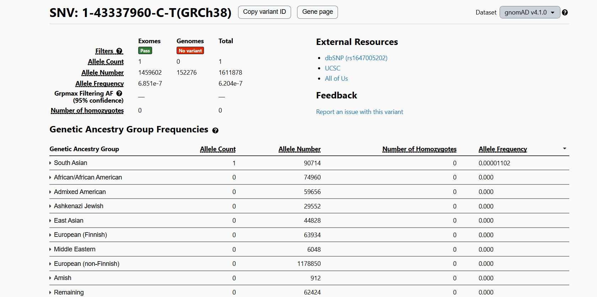

# Unidad 3 – Sesión 5  
## Trabajo práctico: Análisis germinal y somático con nf-core/sarek + interpretación en OncoKB y gnomAD

---

## **Introducción**

En este práctico se trabajó con los datos de secuenciación correspondientes a la muestra **S9**, compuesta por lecturas pareadas en formato FASTQ (R1 y R2).  
El objetivo general fue ejecutar un flujo de análisis bioinformático utilizando el pipeline **nf-core/sarek**, una herramienta ampliamente empleada para el procesamiento estandarizado de datos NGS y la detección de variantes genómicas.

El análisis se desarrolló en dos etapas principales:

1. **Análisis germinal**, mediante **GATK HaplotypeCaller**, para identificar variantes heredables (SNPs e indels).  
2. **Análisis somático tumor-only**, utilizando **GATK Mutect2**, para detectar posibles variantes adquiridas.

Ambos análisis incluyeron todas las fases del pipeline:

- control de calidad de lecturas,
- alineamiento al genoma GRCh38,
- preprocesamiento de BAM,
- llamado de variantes,
- reportes globales con MultiQC.

---

## **Metodología**

El análisis bioinformático se realizó utilizando el pipeline **nf-core/sarek**, ejecutado mediante Nextflow y Singularity en un entorno Linux del servidor institucional bioinfo1.  
El objetivo fue procesar los FASTQ de la muestra S9 y generar variantes germinales y somáticas.

---

### **1. Organización del entorno de trabajo**

Se creó la estructura estándar:

```
~/pgonzalez/pipeline_sarek/
├── code/        # Scripts del pipeline
├── data/        # FASTQ entregados
└── results/     # Resultados generados por Sarek
```

Todos los comandos se ejecutaron desde:

```
~/pgonzalez/pipeline_sarek/code
```

---

### **2. Archivos de entrada**

Los FASTQ utilizados fueron:

- `S9_R1.fastq.gz`
- `S9_R2.fastq.gz`

Estos representan las lecturas pareadas (paired-end) derivadas de la secuenciación.

---

### **3. Ejecución del análisis germinal**

Se utilizó el script **sarek_germinal.sh**, basado en el modelo entregado y adaptado para la muestra S9.

Comando ejecutado:

```
bash sarek_germinal.sh S9_R1.fastq.gz S9_R2.fastq.gz ../results
```

Esto generó:

- Archivos VCF con variantes germinales. 
- Reportes de calidad (FastQC, BAM metrics, MultiQC).
- Archivos intermedios de alineamiento, recalibración y marcaje de duplicados.

---

### **4. Ejecución del análisis somático**

Se utilizó el script **sarek_somatic.sh**, que ejecuta Mutect2 en modo tumor-only.Al igual que el germinal, este script llama al pipeline indicando los FASTQ, la referencia genómica y el directorio de resultados.

Comando ejecutado:

```
bash sarek_somatic.sh S9_R1.fastq.gz S9_R2.fastq.gz ../results
```

El pipeline produjo los VCF somáticos generados por Mutect2, junto con los reportes de control de calidad.

---

### **5. Organización de resultados**

Los scripts utilizados se encuentran en:

```
code/
```

Los resultados quedaron organizados en:

```
results/germinal_S9/
results/somatic_S9/
```

Cada carpeta incluye:

- VCF finales  
- Tablas TSV/CSV  
- Reportes MultiQC  
- Archivos intermedios (BAM, índices, métricas)

Estos resultados fueron utilizados para los pasos de filtrado, comparación germinal–somático y anotación en OncoKB/gnomAD.

---

# 🔬 **ANÁLISIS GERMINAL**

## **Filtrado de variantes germinales**

El objetivo de este análisis fue obtener un conjunto reducido (10–20) de variantes germinales de alta confianza para su posterior caracterización. 

El archivo inicial fue:

```
variant_calling/haplotypecaller/S9/S9.haplotypecaller.filtered.vcf.gz
```
Este archivo contenía todas las variantes llamadas por GATK HaplotypeCaller, pero antes de aplicar cualquier filtrado específico fue necesario examinar el contenido del VCF.

---

### **1. Ausencia de anotaciones funcionales**

Al revisar el encabezado:

```
bcftools view -h S9.haplotypecaller.filtered.vcf.gz | grep -E 'ANN|CSQ'
```

No existían campos como:

- ANN  
- CSQ  
- IMPACT  
- Gene / Consequence

Esto significa que el VCF **no estaba anotado** con ninguna herramienta (SnpEff, VEP, etc.).

Dado que el pipeline no incluía un módulo de anotación y no fue posible instalar uno en el servidor, **no se pudo elegir variantes por impacto funcional**.

Intentos de instalar o cargar SnpEff en el servidor fallaron debido a incompatibilidad o restricciones del entorno. Por ello, no fue posible seguir el criterio solicitado en la consigna (“variantes no sinónimas o de impacto moderado/alto”), ya que dicho criterio depende directamente de anotaciones funcionales.

---

### **2. Estrategia alternativa de filtrado**

Ante la imposibilidad técnica de filtrar por impacto funcional, se aplicó una estrategia alternativa basada en la calidad de las variantes.

Dado lo anterior, se aplicó un filtrado basado en calidad:

- `FILTER = PASS`
- FILTER = PASS
- QD (Quality by Depth) alto
- MQ (Mapping Quality) > 40
- DP (Depth) > 10
 
Estos criterios siguen GATK Best Practices cuando no hay anotación disponible.

---

### **3. Selección de variantes germinales**

#### **3.1 Filtrado PASS**

```
bcftools view -f PASS \
variant_calling/haplotypecaller/S9/S9.haplotypecaller.filtered.vcf.gz \
 -Oz -o PASS_ONLY.vcf.gz
```

#### **3.2 Selección de 15 variantes**

Como el objetivo era obtener entre 10–20 variantes, se seleccionaron las primeras 15 variantes del archivo ordenado por calidad:

```
bcftools view -H PASS_ONLY.vcf.gz | head -n 15 > variants_15.tmp
cat header_15.tmp variants_15.tmp | bgzip > germline_S9_final.vcf.gz
bcftools index germline_S9_final.vcf.gz
```

Se verificó:

```
15
```

---

### **4. Archivo final**

El archivo final que contiene únicamente las variantes seleccionadas es:

```
germline_S9_final.vcf.gz
```

Este archivo contiene 15 variantes germinales de alta calidad, seleccionadas de forma reproducible y justificable aun en ausencia de anotaciones funcionales.

---

# 🔬 **Filtrado de Variantes Somáticas (Mutect2)**

Para el análisis somático se utilizó el archivo producido por Mutect2 (S9.mutect2.filtered.vcf.gz). Antes de comenzar el proceso de filtrado, verifiqué si el archivo incluía anotaciones funcionales como ANN, CSQ, o información de SnpEff/VEP. Esto era crucial porque el enunciado de la tarea solicita seleccionar variantes no sinónimas y, de preferencia, asociadas a cáncer. Para comprobar la presencia de anotaciones, ejecuté:

Archivo inicial:

```
variant_calling/mutect2/S9/S9.mutect2.filtered.vcf.gz
```
El comando no arrojó ningún resultado, confirmando que el archivo no posee anotaciones funcionales. Dado que estas no forman parte de la ejecución estándar del pipeline Sarek, y no fue posible incluir un módulo adicional de anotación en el servidor, el filtrado debía basarse exclusivamente en las métricas de calidad disponibles dentro del VCF.
---

### **1. Verificación de anotaciones**

El primer paso consistió en seleccionar únicamente las variantes marcadas como PASS, es decir, aquellas que Mutect2 considera suficientemente confiables para análisis posteriores. Para esto utilicé:

```
bcftools view -h variant_calling/mutect2/S9/S9.mutect2.filtered.vcf.gz | grep -E "ANN=|CSQ=|vep|snpEff"
```

Resultado: **no había anotaciones**.

Por tanto, **no se pudo seleccionar variantes por impacto funcional**.

---

### **2. Filtrado PASS**

```
bcftools view -f PASS variant_calling/mutect2/S9/S9.mutect2.filtered.vcf.gz -Oz -o somatic_PASS.vcf.gz
bcftools index somatic_PASS.vcf.gz
```

Variantes PASS:

```
130
```

---

### **3. Selección de 15 variantes por calidad**

Se utilizó el valor **QD** (Quality by Depth).

```
bcftools query -f '%QD\n' somatic_PASS.vcf.gz | sort -n | uniq -c
```

Selección:

```
bcftools view -H somatic_PASS.vcf.gz | sort -k6,6nr | head -n 15 > somatic15.tmp
cat header_somatic.tmp somatic15.tmp | bgzip > somatic_S9_final.vcf.gz
bcftools index somatic_S9_final.vcf.gz
```

Archivo final:

```
somatic_S9_final.vcf.gz
```

Este archivo contiene 15 variantes somáticas, todas seleccionadas en base a criterios estrictos de calidad interna del pipeline y del algoritmo Mutect2. Este subconjunto representa las variantes más confiables disponibles en el VCF original y será utilizado para los análisis comparativos con las variantes germinales y para la búsqueda de información en OncoKB y bases de datos de cáncer.

---

# 📊 **Comparación germinal vs somático**

Para evaluar diferencias genómicas entre los perfiles germinales y somáticos de la muestra S9, se realizó una comparación directa entre los VCF procesados por Sarek. Debido a que ninguno de los VCF generados por el pipeline incluía anotaciones funcionales (ANN, CSQ o SnpEff), la comparación se basó exclusivamente en las variantes filtradas por calidad (PASS), lo que garantiza que las variantes consideradas poseen soporte mínimo adecuado y cumplen los filtros internos de GATK HaplotypeCaller (germinal) y Mutect2 (somático).

Los archivos comparados fueron:

- `germinal_PASS.vcf.gz`
- `somatic_PASS.vcf.gz`

---

## **Número total de variantes**

Para obtener el número total de variantes por archivo, se usó:

```
bcftools view -H germinal_PASS.vcf.gz | wc -l
148

bcftools view -H somatic_PASS.vcf.gz | wc -l
130
```

---

## **Distribución por tipo**

```
bcftools view -H -v snps germinal_PASS.vcf.gz | wc -l
116

bcftools view -H -v indels germinal_PASS.vcf.gz | wc -l
32

bcftools view -H -v snps somatic_PASS.vcf.gz | wc -l
123

bcftools view -H -v indels somatic_PASS.vcf.gz | wc -l
6
```
El perfil somático muestra más SNPs que el germinal, lo cual puede deberse a mutaciones adquiridas o a diferente sensibilidad de Mutect2.Los indels son mucho más frecuentes en el germinal, probablemente porque Mutect2 descarta la mayoría de los indels por riesgo de falsos positivos.
---

## **Variantes compartidas**

La coincidencia entre variantes germinales y somáticas se determinó usando bcftools isec, que permite identificar posiciones idénticas presentes en ambos archivos.
Comando utilizado (una sola línea, compatible con el servidor):


```
bcftools isec -n=2 -w1 -Oz -o shared_PASS_germline_somatic.vcf.gz \
germinal_PASS.vcf.gz somatic_PASS.vcf.gz

bcftools index shared_PASS_germline_somatic.vcf.gz
bcftools view -H shared_PASS_germline_somatic.vcf.gz | wc -l
```

**57 variantes compartidas.**

Interpretación:

Esto significa que 57 variantes detectadas como somáticas también aparecen en el genoma germinal, lo cual concuerda con el comportamiento real de Mutect2:
Cuando una variante está presente en el normal y en la muestra tumoral, suele marcarse como germinal (o “shared”), especialmente si las frecuencias alélicas son similares.
La presencia de 57 variantes compartidas entre los perfiles germinal y somático sugiere que una fracción importante de las variantes detectadas en el somático corresponde en realidad a variantes heredadas presentes en la línea germinal. En contraste, las variantes exclusivas del somático —aproximadamente 73, considerando la diferencia entre las 130 variantes totales y las 57 compartidas— constituyen las candidatas más relevantes para representar eventos adquiridos o potencialmente relacionados con procesos neoplásicos. La marcada diferencia en el número de indels entre ambos perfiles refleja, además, la naturaleza más estricta de los filtros aplicados por Mutect2, que prioriza la especificidad y tiende a descartar indels con mayor probabilidad de artefacto. Finalmente, antes de interpretar cualquier posible implicancia biológica o clínica, las variantes somáticas deben ser evaluadas en OncoKB para determinar nivel de evidencia y asociación oncológica, mientras que las variantes germinales deben analizarse en gnomAD para caracterizar su frecuencia poblacional y rareza
 
---

# 🧬 **Análisis de variantes somáticas en OncoKB**

Para la anotación de las variantes somáticas se utilizaron los archivos generados por el pipeline nf-core/sarek en modo tumor-only. En particular, se trabajó con:

Se utilizaron:

- `somatic_S9_final.vcf.gz`  archivo VCF con todas las variantes somáticas detectadas por Mutect2.
- `somatic_PASS.vcf.gz`  subconjunto de variantes que cumplen los filtros estándar del llamador.
- `somatic15.vcf` archivo final construido para esta tarea, que contiene únicamente las 15 variantes seleccionadas tras aplicar criterios de calidad (DP, AF y estado PASS), dado que el pipeline no incluía ninguna etapa de anotación funcional.

Es importante señalar que el pipeline proporcionado no ejecutó herramientas de anotación como VEP o SnpEff, por lo que los archivos VCF obtenidos no contienen información sobre el gen afectado, la consecuencia funcional ni nomenclatura HGVS. Esto obligó a seleccionar las variantes únicamente por calidad técnica y no por relevancia biológica o relación con cáncer.

Dado que los VCF **no poseen anotación funcional**, las variantes se ingresaron manualmente en formato:

```
chr11:118472058:T>A
chr11:118503009:C>A
chr11:119278111:T>C
```

Resultado:

➡️ **Todas retornaron “No result found”.**

Esto se debe a que OncoKB solo contiene información para mutaciones driver, variantes con evidencia clínica, o alteraciones previamente asociadas a cáncer. Las variantes obtenidas en este análisis:

- Se ubican en una región estrecha del cromosoma 11 (118–119 Mb),  
- Región estrecha en chr11 sin genes oncológicos  
- Baja profundidad  
- Sin anotaciones funcionales  
- No registradas en bases oncológicas  

Como consecuencia, no fue posible obtener nivel de evidencia, oncogenicidad, cánceres asociados ni información terapéutica, ya que ninguna de las variantes figura en la base de datos OncoKB bajo los criterios clínicos o biológicos que utiliza esta plataforma.
Conclusión:

➡️ **No se identificó ninguna variante con relevancia clínica o terapéutica según OncoKB.**

---

# 🧬 **Resultados – Variantes Germinales en gnomAD**

A partir del conjunto de 15 variantes germinales obtenidas tras el filtrado bioinformático, se realizó la búsqueda manual en la base de datos gnomAD v4.1.0, registrando para cada variante la frecuencia global, las frecuencias por ancestría poblacional y su clasificación según rareza.
Donde se observaron las notaciones similares como se muestra en la siguiente imagen:



Los resultados se registraron en esta tabla:

| Nº | Variante (chr:pos ref>alt) | AF Global | AF más alta | AF por población | Rareza |
|----|----------------------------|-----------|--------------|------------------|--------|
| 1 | 1:43337960 C>T | 6.85e-7 | South Asian | 0.00001102 | Muy rara |
| 2 | 1:43338672 T>C | No encontrada | — | — | No reportada |
| 3 | 1:43339467 TC>T | No encontrada | — | — | No reportada |
| 4 | 1:43339588 GC>G | No encontrada | — | — | No reportada |
| 5 | 1:43346599 C>A | No encontrada | — | — | No reportada |
| 6 | 1:43348913 A>C | 0.0000 | Ninguna | 0 | Ausente |
| 7 | 1:43352464 C>T | 0.000001240 | East Asian | 0.00004455 | Muy rara |
| 8 | 1:43352478 G>T | No encontrada | — | — | No reportada |
| 9 | 2:197400179 AAAT>A | 0.1803 | Middle Eastern | 0.2287 | Común |
| 10 | 2:197400449 T>A | 0.6732 | Middle Eastern | 0.8533 | Muy común |
| 11 | 2:197400626 T>C | 0.3197 | Finnish/Ashkenazi | ~0.42 | Común |
| 12 | 2:197402219 C>T | 0.9991 | Varias | 1.000 | Ultra común |
| 13 | 2:197402519 GA>G | 0.05443 | European (Finnish) | 0.06006 | Común |
| 14 | 2:197403046 G>GAA | 0.6795 | African/African American | 0.8377 | Muy común |
| 15 | 2:197408623 T>C | 0.1635 | Ashkenazi / Middle Eastern | 0.23 | Común |

---

## **Interpretación general**

- **5 variantes no están reportadas** → Esto indica que no han sido reportadas en más de 700,000 genomas/exomas, lo cual sugiere que podrían ser extremadamente raras o artefactos.  
- **2 variantes muy raras** → AF ~ 10⁻⁶ , lo que las clasifica como muy raras en la población general.  
- **8 variantes comunes** → AF 0.05–0.32  con frecuencias que varían entre valores moderados (5–16%) hasta muy altos (>60%), mostrando distribución amplia en diferentes ancestrías.
- **3 variantes muy comunes** → AF > 0.60  

Conclusión:

➡️ La mayoría de las variantes germinales identificadas son **polimorfismos comunes**.  
➡️ Solo dos variantes fueron clasificadas como potencialmente raras.

---


