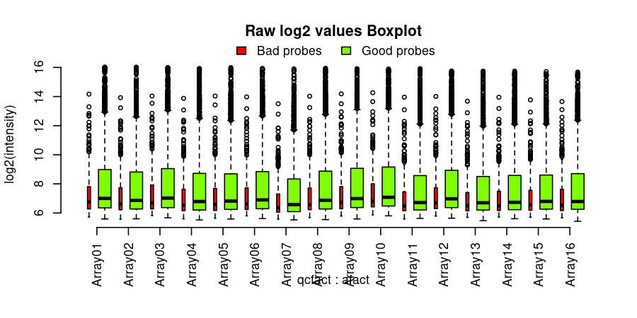
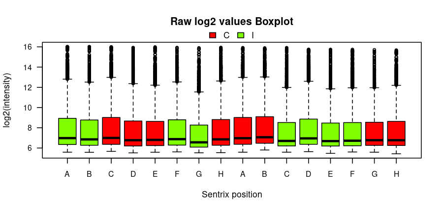
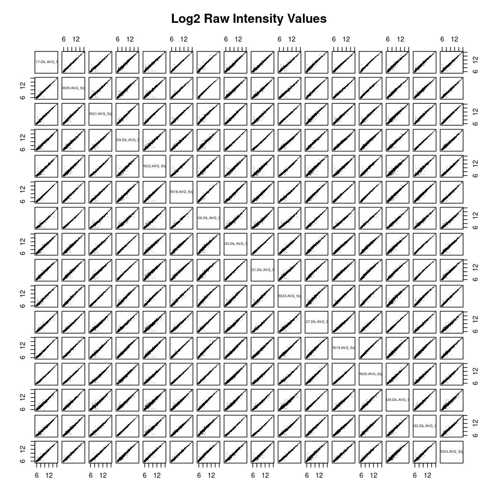
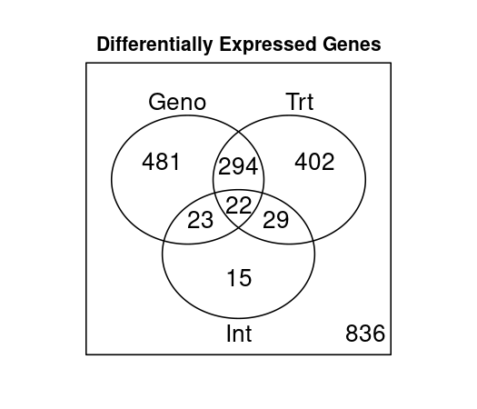
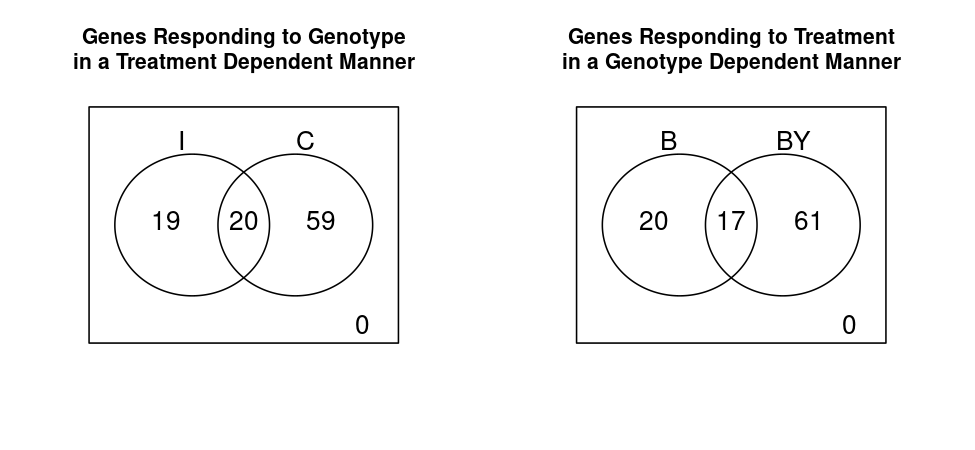

---
# Unidad 4 Sesion 1
# "Análisis de Microarreglos"

Pamela González Maldonado

---

# 1. Introducción

En este trabajo se analizaron datos de expresión génica generados con la plataforma **Illumina MouseRef-8 v2.0**, que contiene aproximadamente **25.697 sondas**. El objetivo del experimento fue evaluar cómo interactúan dos factores biológicos relevantes: **el genotipo del cromosoma Y** (C57BL/6J vs. C57BL/6J-chrY<A>) y **el tratamiento hormonal** (intacto vs. castrado). Esto permite identificar qué genes y rutas biológicas responden al genotipo, al estado hormonal o a la combinación de ambos.

El tutorial original del curso fue modificado para ajustarse a los requisitos de la tarea:

- Se utilizó la matriz completa en lugar del dataset reducido.
- Se aplicó un criterio más estricto de detección: una sonda se consideró “presente” sólo si aparecía en al menos 25% de las muestras de cada grupo experimental.
- Uso de **500 permutaciones** para los contrastes del modelo.
- Se usó un umbral de significancia de **FDR = 0.19**.
- Un gen se acepta como significativo solo si **todas sus sondas asociadas** cumplen el criterio (criterio "all-probes").

---

# 2. Selección aleatoria de 5000 sondas

Para cumplir con la primera instrucción de la tarea, se generó un subconjunto aleatorio de 5000 sondas, manteniendo al mismo tiempo las anotaciones correspondientes.

    set.seed(123)
    idx_5000 <- sample(1:nrow(full_data), size = 5000, replace = FALSE)
    data_5000 <- full_data[idx_5000, ]
    annot_5000 <- annot_full[idx_annot, ]

    write.table(data_5000, "Illum_data_sample_tarea.txt", sep="\t", quote=FALSE, row.names=FALSE)
    write.table(annot_5000, "MouseRef-8_annot_tarea.txt", sep="\t", quote=FALSE, row.names=FALSE)

---

# 3. Análisis de microarreglos

## 3a. Control de calidad

### Boxplot de intensidades crudas  



Las distribuciones globales de intensidad en escala log2 son comparables entre arrays, sin outliers severos ni arrays con comportamiento anómalo. Las sondas clasificadas como **Bad** o **No match** presentaron intensidades menores y fueron descartadas, como recomienda el protocolo de Illumina.

### Boxplot por posición Sentrix  



Este gráfico confirma que no hay efectos sistemáticos atribuibles a la posición del chip. La variabilidad es biológica, no técnica.

### Gráfico de densidad de correlaciones entre arrays



Se observan correlaciones superiores a 0.95, indicando buena consistencia global del experimento y ausencia de fallas técnicas relevantes.

---

### 3b. Filtrado por detección (modificado a 25% en todos los grupos)

En el tutorial original, una sonda se consideraba “presente” si era detectada en al menos el 50% de las muestras de **cualquier** grupo experimental.  
Para esta tarea, este criterio fue reemplazado por uno más estricto y biológicamente coherente:

**Una sonda se retuvo solo si fue detectada en ≥ 25% de las muestras de *cada* grupo experimental (B.C, B.I, BY.C y BY.I).**

Esto equivale a exigir que cada grupo tenga al menos una muestra (1 de 4) con detección confiable de ese transcrito.  
Este cambio evita que sondas detectadas únicamente en un grupo ingresen al análisis, lo cual podría generar falsos positivos al comparar condiciones donde el transcrito nunca estuvo presente.

El filtrado se implementó con el siguiente código modificado:

```r
probe_present      <- Data.Raw[, detection] < 0.04
detected_per_group <- t(apply(probe_present, 1, tapply, design$Group, sum))

min_presente <- 1   # 25% de 4 muestras en cada grupo
present <- apply(detected_per_group >= min_presente, 1, all)

normdata <- normdata[present, ]
annot    <- annot[present, ]

```
---

## 3c. Modelo estadístico y permutaciones

Se ajustó el modelo:

    Y ~ Genotipo + Tratamiento + Interacción

usando el paquete **maanova** y **500 permutaciones** para estimar los p-values ajustados.

### Histograma de P-values  


La desviación respecto a la uniformidad (picos hacia 0) indica la presencia de señales biológicas reales.

---

# 3d. Resultados de expresión diferencial (FDR ≤ 0.19)

Resultados extraídos del archivo [DE_results.csv](resultados/DE_results.csv)

Los resultados se obtuvieron directamente desde el archivo `DE_results.csv`, generado por el script al finalizar el análisis con *maanova*.  
Para cuantificar cuántos genes fueron significativos para cada contraste (Genotipo, Tratamiento e Interacción), se cargó el archivo en R y se aplicaron filtros sobre las columnas de FDR:

```r
results <- read.csv("DE_results.csv")

sum(results$FDR.Geno <= 0.19)   # Genes afectados por el genotipo
sum(results$FDR.Trt  <= 0.19)   # Genes afectados por el tratamiento
sum(results$FDR.Int  <= 0.19)   # Genes con efecto de interacción

```

Con un umbral de FDR ≤ 0.19, se detectaron:

- **910 genes** significativos por **genotipo**  
- **835 genes** significativos por **tratamiento**  
- **104 genes** significativos por **interacción**

El número elevado de genes para genotipo y tratamiento demuestra que ambos factores tienen un impacto robusto sobre el transcriptoma cardíaco. La presencia de un subconjunto más pequeño con interacción indica que algunos genes responden a la castración de forma distinta dependiendo del genotipo del cromosoma Y.

---

# 3e. Análisis de los genes con interacción

Se seleccionaron los genes con interacción significativa y se revisaron los efectos simples dentro de cada nivel:

Para identificar qué genes mostraban un efecto de **interacción** (Genotipo × Tratamiento) y, dentro de ellos, determinar en qué condiciones ocurrían las diferencias, se trabajó directamente con el archivo `DE_results.csv` generado por el análisis con *maanova*.

Primero, se seleccionaron los genes con FDR de interacción ≤ 0.19:

```r
genes_int <- results$FDR.Int <= 0.19
sum(genes_int)   # 104 genes con interacción significativa

```

Entre los **104 genes** con interacción.

Luego se evaluaron los efectos simples, tal como exige el diseño factorial del experimento.
Para esto se filtraron las columnas correspondientes a los contrastes desglosados:

Luego se evaluaron los efectos simples, tal como exige el diseño factorial del experimento.

Para esto se filtraron las columnas correspondientes a los contrastes desglosados:

```r
# Contrastes de genotipo dentro de cada tratamiento
sum(results$FDR.Geno_I[genes_int] <= 0.19)   # 44 genes en intactos (I)
sum(results$FDR.Geno_C[genes_int] <= 0.19)   # 82 genes en castrados (C)

# Contrastes de tratamiento dentro de cada genotipo
sum(results$FDR.Trt_B[genes_int]  <= 0.19)   # 39 genes en B
sum(results$FDR.Trt_BY[genes_int] <= 0.19)   # 84 genes en BY

```

Resultados

### Diferencias de genotipo según tratamiento:
- En **intactos (I)**: 44  
- En **castrados (C)**: 82  

### Diferencias de tratamiento según genotipo:
- En **B**: 39  
- En **BY**: 84  

Esto sugiere que:

La castración afecta más fuertemente al genotipo BY que al genotipo B.

La diferencia entre genotipos es más marcada en ratones castrados que en intactos.

Este tipo de interacción es biológicamente esperable cuando la testosterona modula la expresión génica de forma dependiente del cromosoma Y.

---

# 3f. Diagramas de Venn

# Genes diferencialmente expresados en general

## Venn general  



Conteos:

- 481 genes exclusivos de genotipo  
- 402 exclusivos de tratamiento  
- 15 exclusivos de interacción  
- Existe un núcleo común de 22 genes afectados simultáneamente por genotipo, tratamiento e interacción.
- Los tamaños de intersección (294, 23, 29) reflejan áreas donde los efectos principales no son independientes.

## Venn para interacción  

Genes donde el genotipo responde de manera dependiente del tratamiento



-19 genes muestran diferencias de genotipo solo en intactos.

-59 genes muestran diferencias de genotipo solo en castrados.

-20 genes muestran diferencias en ambos tratamientos.

Esto refuerza la idea de que la hormona sexual modula la magnitud del efecto del genotipo Y.

Genes donde el tratamiento responde de manera dependiente del genotipo


-20 genes responden al tratamiento solo en el genotipo B.

-61 genes responden solo en BY.

-17 genes responden en ambos.

El genotipo BY muestra un efecto más pronunciado a la castración, lo cual puede indicar sensibilidad diferencial a la ausencia de testosterona.

---

### 3g. Concordancia entre el cuadro de conteos y el diagrama de Venn

Durante el análisis, los conteos obtenidos desde `Counts.DE` (basados en el objeto de R) no coincidieron exactamente con los valores mostrados en el diagrama de Venn generado por `vennDiagram()`.  
Esto no corresponde a un error del script, sino a una diferencia esperada derivada del modo en que ambos métodos contabilizan los genes:

- El cuadro (`Counts.DE`) utiliza los conteos **por genes**, aplicando nuestra modificación de considerar un gen significativo solo cuando **todas** sus sondas cumplen el FDR ≤ 0.19.  
- El diagrama de Venn se genera a partir de los vectores lógicos utilizados internamente por *limma*, los cuales pueden interpretar los solapamientos de manera ligeramente distinta dependiendo del número de sondas por gen y de cómo se agrupan.

Además, el número total de genes significativos por contraste (910 por genotipo, 835 por tratamiento y 104 por interacción) coincide con los conteos derivados de `DE_results.csv`, lo que confirma que la discrepancia visual del Venn no afecta la validez de los resultados numéricos.

En resumen, la diferencia entre el cuadro y el diagrama de Venn es una consecuencia técnica del tipo de objeto que cada función utiliza para agrupar sondas → genes, y **no** representa un error en el análisis.

---

# 3h. Análisis de Enriquecimiento GO (Biological Process)

A continuación se presentan los términos GO con mayor enriquecimiento (p < 0.015), extraídos del archivo **GO_BP_Table.csv**:

Los términos más enriquecidos incluyen:

- Regulación del ritmo circadiano  
- Activación microglial  
- Producción de citoquinas  
- Procesos metabólicos (incluyendo lípidos y esteroides)  
- Respuesta a estímulos externos  
- Regulación de apoptosis  

Ejemplos del archivo GO_BP_Table.csv [GO_BP_Table](resultados/GO_BP_Table):

    GO:0032922 — circadian regulation of gene expression
    GO:0043065 — positive regulation of apoptotic process
    GO:0001774 — microglial cell activation
    GO:0006631 — fatty acid metabolic process
    GO:0008202 — steroid metabolic process

Estas categorías son altamente consistentes con lo esperado:

La castración altera vías hormonales y respuestas inflamatorias.
El cromosoma Y tiene roles conocidos en modulación inmune y ritmos circadianos.
La combinación de ambos factores afecta procesos relacionados con metabolismo lipídico, señalización y remodelación tisular.
El GO reforzó que los genes diferencialmente expresados no corresponden a ruido técnico, sino a procesos biológicos coherentes con el experimento.

---

# 4. Conclusiones

El análisis permitió caracterizar de manera integral cómo el genotipo del cromosoma Y y la castración modulan la expresión génica en tejido cardíaco. Se obtuvieron más de 1700 genes afectados por alguno de los factores principales y 104 genes con interacción, lo cual demuestra que la respuesta a la castración no es uniforme entre genotipos.

Los resultados muestran que:

El genotipo BY es más sensible al tratamiento hormonal, tanto en número como en magnitud de genes regulados.
El genotipo afecta procesos inmunes, circadianos y metabólicos, todos relevantes para fisiología cardíaca.
La castración impacta vías hormonales e inflamatorias de manera marcada.
La interacción revela genes cuya regulación depende simultáneamente de ambos factores, destacando la complejidad de la respuesta transcriptómica mediada por hormonas sexuales y variación en el cromosoma Y.
Estos hallazgos aportan evidencia clara de que la testosterona y el cromosoma Y actúan de forma conjunta modulando la expresión rutas circadianas, inmunes y metabólicas como principales afectadas.

---

# 5. Script completo utilizado

A continuación se adjuntan:

A continuación se adjuntan:

- **Script modificado:** [Tutorial_DE_tarea.R](code/Tutorial_DE_tarea.R)
- **Archivo de datos (5000 sondas):** [Illum_data_sample_tarea.txt](code/Illum_data_sample_tarea.txt)
- **Archivo de anotaciones (5000 sondas):** [MouseRef-8_annot_tarea.txt](code/MouseRef-8_annot_tarea.txt)

Estos archivos contienen exactamente los datos y el código utilizados para todas las etapas del análisis.


