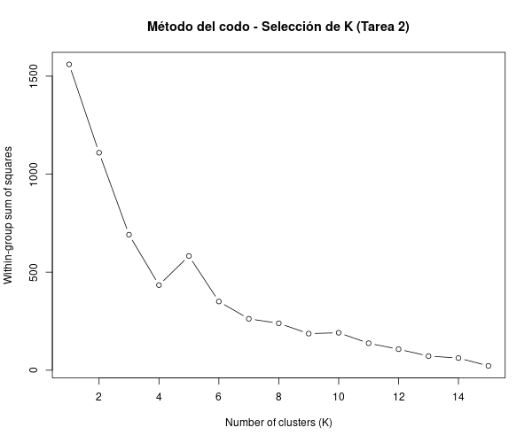
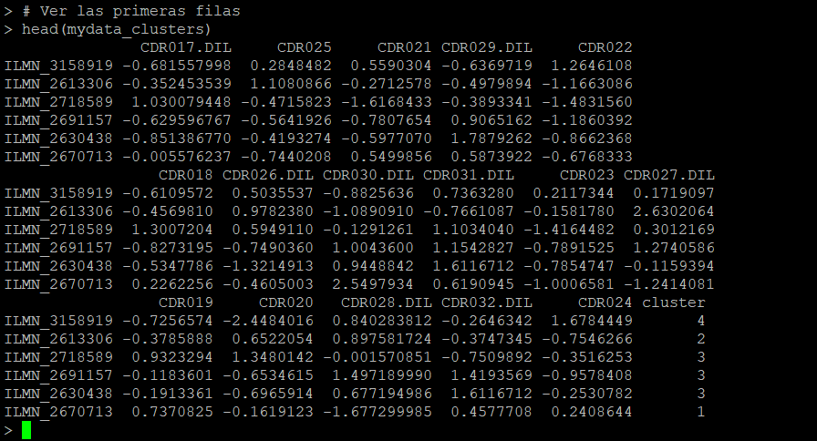
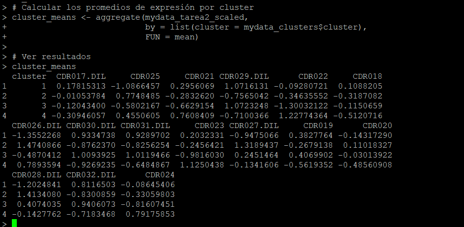
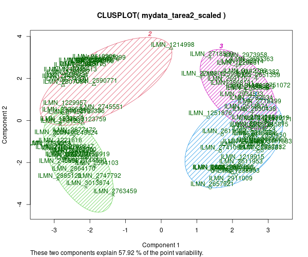
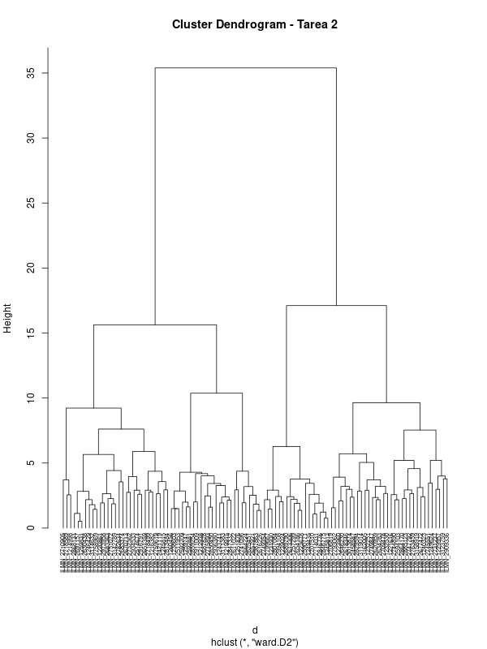
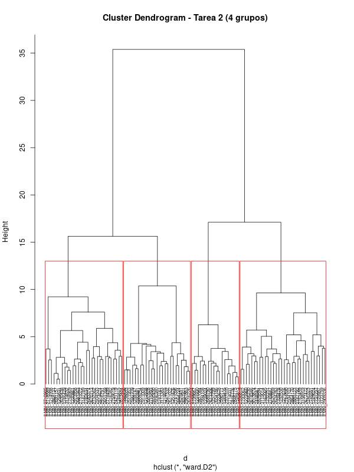
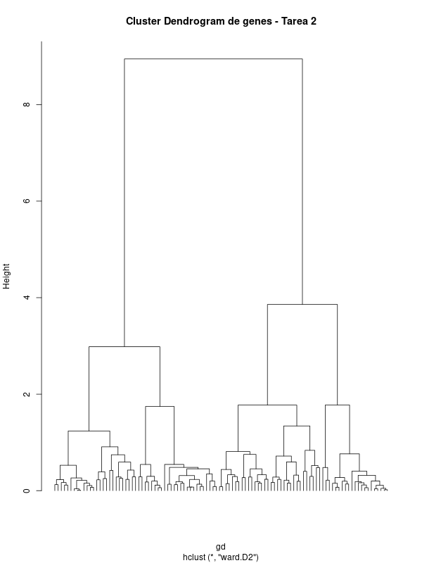

# Unidad 4 Sesion 2

# Análisis clustering

Pamela González Maldonado

---

En esta sección se seleccionaron los genes que presentan un efecto significativo en el  
**contraste de interacción** (genotipo × tratamiento), utilizando el archivo de resultados  
`DE_results.csv` generado en el tutorial de expresión diferencial previo.  
A partir de estos genes se construyó la matriz de expresión que será utilizada para los análisis
de clustering de esta tarea.

---

#### 1. Cargar datos necesarios

Se cargó la matriz normalizada correspondiente a esta tarea (`normdata_tarea.txt`)
y la tabla de resultados de expresión diferencial (`DE_results.csv`):

```r
outdir <- "output"

# Matriz normalizada real de la tarea (2250 sondas × 16 muestras)
norm_tarea <- read.delim(file.path(outdir, "normdata_tarea.txt"),
                         as.is = TRUE, row.names = 1)

# Resultados de expresión diferencial del tutorial previo
de <- read.csv(file.path(outdir, "DE_results.csv"),
               as.is = TRUE)
```

---

#### 2. Selección de genes con interacción significativa

Se utilizó como umbral de significancia el valor aplicado en el tutorial de la tarea anterior:

`FDR.Int ≤ 0.19`.

```r
# Umbral de FDR utilizado en la tarea
fdr_th <- 0.19

# Identificar la columna de FDR de interacción
fdr_int_col <- grep("FDR.Int", names(de), value = TRUE)

# Filtrar sondas con efecto significativo de interacción
de_int <- de[de[[fdr_int_col]] <= fdr_th, ]

# Número de sondas seleccionadas (esperado: 104)
nrow(de_int)
```

---

#### 3. Extracción de IDs de sonda y construcción de la matriz filtrada

```r
# Columna que contiene los IDs de sonda
id_col <- "ProbeID"

# IDs de las 104 sondas seleccionadas
ids_int <- unique(de_int[[id_col]])
length(ids_int)   # esperado: 104

# Filtrar la matriz normalizada para quedarse solo con esas sondas
mydata_tarea2 <- norm_tarea[rownames(norm_tarea) %in% ids_int, ]

# Dimensiones de la matriz final: genes × muestras
dim(mydata_tarea2)   # esperado: 104 16
```

#### 4. Guardado de la matriz filtrada para el análisis de clustering

La matriz final (`mydata_tarea2`) se guardó en el directorio de salida con el nombre:

**`mydata_tarea2_interaction.txt`**

Este archivo será utilizado como entrada para la transformación y los análisis de clustering.

```r
write.table(mydata_tarea2,
            file = file.path(outdir, "mydata_tarea2_interaction.txt"),
            sep = "\t",
            row.names = TRUE,
            col.names = NA,
            quote = FALSE)
```
La matriz `mydata_tarea2_interaction.txt` contiene 104 genes (filas) y 16 muestras (columnas), y constituye la base para los análisis posteriores.

---

## 2. Selección de genes diferencialmente expresados por interacción y preparación de la matriz

En esta sección filtramos los genes obtenidos en el análisis de expresión diferencial para quedarnos únicamente con aquellos que presentan un efecto significativo de **interacción (Genotipo × Tratamiento)**, según el criterio FDR ≤ 0.19 especificado en la práctica. A partir de ellos construimos la matriz final que será utilizada para los análisis de clustering.

### 2.1 Cargar resultados de expresión diferencial

    de <- read.csv("output/DE_results.csv", as.is = TRUE)

### 2.2 Identificar la columna de FDR correspondiente a la interacción

Primero inspeccionamos las columnas que contienen valores de FDR y luego seleccionamos la correspondiente a la interacción.

    grep("FDR", names(de), value = TRUE)
    fdr_int_col <- grep("FDR.Int", names(de), value = TRUE)
    fdr_int_col

### 2.3 Filtrar genes significativos por interacción (FDR ≤ 0.19)

Aplicamos el umbral de FDR definido  (0.19) para seleccionar los genes diferencialmente expresados por interacción.

    de_int <- de[de[[fdr_int_col]] <= 0.19, ]
    nrow(de_int)     # Cantidad de genes DE por interacción

### 2.4 Extraer los IDs de sonda correspondientes a los genes filtrados

En el archivo de resultados, los IDs de sonda se encuentran en la columna `ProbeID`. Obtenemos los IDs únicos de las sondas seleccionadas.

    id_col  <- "ProbeID"
    ids_int <- unique(de_int[[id_col]])
    length(ids_int)  # Debe ser 104

---

## 3. Filtrar la matriz normalizada para quedarnos solo con los 104 genes 

Primero cargamos la matriz normalizada generada en el análisis de expresión diferencial (tarea anterior). Esta matriz contiene todas las sondas presentes después de la normalización y el filtrado por detección.

    norm_tarea <- read.delim("output/normdata_tarea.txt",
                             as.is = TRUE,
                             row.names = 1)
    dim(norm_tarea)  # Dimensiones de la matriz completa

Luego seleccionamos solo las filas que corresponden a los 104 genes con interacción significativa.

    mydata_tarea2 <- norm_tarea[rownames(norm_tarea) %in% ids_int, ]
    dim(mydata_tarea2)         # 104 x 16
    head(mydata_tarea2[, 1:3]) # Vista de las primeras columnas

---

## 4. Conversión a matriz numérica y estandarización (Z-score por gen)

Antes de realizar el clustering, es importante trabajar con datos en una escala comparable. Para ello:

1. Verificamos que todas las columnas sean numéricas.  
2. Eliminamos posibles filas con valores faltantes.  
3. Convertimos el objeto a matriz numérica.  
4. Estandarizamos cada gen (fila) usando Z-score: media = 0, desviación estándar = 1.

### 4.1 Verificar clases de las columnas

    sapply(mydata_tarea2, class)

### 4.2 Eliminar posibles filas con NA

    mydata_tarea2 <- na.omit(mydata_tarea2)

### 4.3 Convertir a matriz numérica

    mydata_tarea2 <- as.matrix(mydata_tarea2)
    dim(mydata_tarea2)  # Confirmar que mantiene 104 x 16

### 4.4 Estandarización Z-score por gen

La función `scale()` estandariza por columnas, por lo que se aplica la transposición doble `t(scale(t(...)))` para estandarizar por filas (genes).

    mydata_tarea2_scaled <- t(scale(t(mydata_tarea2)))

    # Revisar el rango de los valores transformados
    range(mydata_tarea2_scaled)
    # Valores típicos entre ~ -3 y 3 indican que la estandarización se aplicó correctamente.

## 5. Guardar la matriz transformada

Finalmente, guardamos la matriz estandarizada que será utilizada en todos los análisis de clustering de la tarea.

    write.table(mydata_tarea2_scaled,
                file = "output/mydata_tarea2_scaled.txt",
                sep  = "\t",
                row.names = TRUE)

Esta matriz (`mydata_tarea2_scaled.txt`) corresponde a 104 genes con interacción significativa, normalizados y estandarizados, listos para los análisis de particionamiento (K-means) y clustering jerárquico que se desarrollan en las secciones siguientes.

---

## Selección del número de clusters

Para determinar el número óptimo de clusters a partir de los 104 genes diferencialmente expresados por interacción, se aplicó el método del codo utilizando la matriz estandarizada `mydata_tarea2_scaled`. Este método evalúa cómo disminuye la suma de cuadrados intra-grupo (*within-group sum of squares*, WSS) al aumentar el número de clusters \(K\).

### Script utilizado

    # Calcular la suma de cuadrados intra-grupo (WSS) para K = 1 a 15
    wss <- (nrow(mydata_tarea2_scaled) - 1) *
           sum(apply(mydata_tarea2_scaled, 2, var))

    for (i in 2:15) {
      wss[i] <- sum(kmeans(mydata_tarea2_scaled, centers = i)$withinss)
    }

    # Guardar gráfico del método del codo
    png("output/SSQ_by_K_using_kmeans_tarea2.png", width = 600, height = 500)
    plot(1:15, wss,
         type = "b",
         xlab = "Number of clusters (K)",
         ylab = "Within-group sum of squares",
         main = "Método del codo - Selección de K (Tarea 2)")
    dev.off()

La figura obtenida despues de ejecutar este script en eR se puede observar a continuación: 



### Se seleccionó K = 4 para los sigueintes análisis

A partir del gráfico del método del codo, la disminución de la suma de cuadrados dentro de grupos (WSS) es inicialmente muy pronunciada entre **K = 1 y K = 3**, y posteriormente se observa un segundo descenso claro hasta **K = 4**. A partir de ese punto, la curva comienza a aplanarse, indicando **rendimientos marginales decrecientes** al aumentar el número de clusters.

Aunque en **K = 5** aparece un valor de WSS ligeramente mayor al de K = 4, este comportamiento no es consistente con la tendencia general y refleja **ruido numérico propio del algoritmo k-means**, que puede variar por la inicialización aleatoria de los centroides. Este incremento no representa una mejora estructural real en la separación de los datos y no genera un “nuevo codo” interpretable.

**Por lo tanto:**

- **K = 4** es el último punto donde se observa una reducción sustancial y estable de la WSS.  
- A partir de **K = 5**, la curva pierde pendiente y entra en una zona de estabilización.  
- **K = 5** no ofrece una ganancia significativa en compactación de los clusters y presenta inestabilidad por artefactos del algoritmo.  
- Elegir **K = 4** permite un balance óptimo entre simplicidad del modelo y capacidad de capturar la estructura subyacente de los datos.

**En conclusión**, **K = 4** representa el número más adecuado de clusters, ya que corresponde al último cambio significativo en la pendiente de la curva antes de la estabilización, y evita sobresegmentar los datos sin fundamento estadístico.


### Asignación de clusters mediante K-means (K = 4)

Luego de determinar que **K = 4** era el número óptimo de clusters, se procedió a ejecutar el algoritmo K-means utilizando la matriz estandarizada `mydata_tarea2_scaled`.

```r
# Ejecutar K-means con K = 4
set.seed(123)
fit_k4 <- kmeans(mydata_tarea2_scaled, centers = 4)

# Adjuntar la asignación de clusters a la matriz
mydata_clusters <- data.frame(mydata_tarea2_scaled,
                              cluster = fit_k4$cluster)

# Ver las primeras filas
head(mydata_clusters)

```


Este procedimiento asignó cada uno de los 104 genes a uno de los cuatro clusters definidos por el patrón de expresión observado en las 16 muestras.

### Cálculo de promedios de expresión por cluster

Una vez asignado cada gen a uno de los cuatro clusters determinados mediante K-means, se calculó el valor promedio de expresión dentro de cada cluster. Esto permite caracterizar el patrón general de expresión de los genes agrupados, facilitando la identificación de perfiles diferenciados entre clusters.

```r
# Calcular los promedios de expresión por cluster
cluster_means <- aggregate(mydata_tarea2_scaled,
                           by = list(cluster = mydata_clusters$cluster),
                           FUN = mean)

# Visualizar la tabla resultante
cluster_means
```



Estos promedios representan el nivel de expresión típico de cada cluster en cada una de las muestras. Esta información es útil para interpretar el comportamiento biológico de los grupos de genes seleccionados y para generar visualizaciones posteriores como mapas de calor o gráficos de perfiles.


## Gráfico de clústeres usando los dos primeros componentes principales

Para visualizar cómo se distribuyen los genes según sus perfiles de expresión, se generó un gráfico tipo *clusplot*, que proyecta los datos en los dos primeros componentes principales (PCA). Esto permite observar la separación entre los clústeres obtenidos por **K-means (k = 4)**.

### Código utilizado

    library(cluster)

    png("output/Clusplot_kmeans_tarea2.png", width = 600, height = 500)
    clusplot(
      mydata_tarea2_scaled,
      fit_k4$cluster,
      color = TRUE,
      shade = TRUE,
      labels = 2,
      lines = 0,
      main = "CLUSPLOT( mydata_tarea2_scaled )"
    )
    dev.off()

Se obtuvo la sifuiente figura luego de aplciar el script en R: 




El gráfico muestra la distribución de los **104 genes diferencialmente expresados por interacción** en un espacio reducido a dos dimensiones mediante PCA:

Los cuatro clústeres identificados con K-means se representan mediante distintos colores y elipses, cada una delimitando la región donde se concentran los genes con patrones de expresión similares.

Los genes agrupados en estos clústeres reflejan **perfiles de expresión coordinados**, lo que sugiere que cada grupo puede estar regulado por mecanismos diferentes o participar en procesos biológicos específicos. En este contexto:

- El **Clúster 1** incluye genes cuyo cambio de expresión difiere fuertemente entre castrados y no castrados dentro de un mismo genotipo. Estos genes suelen estar asociados a vías sensibles a hormonas androgénicas, mostrando respuestas amplificadas o reprimidas cuando los niveles hormonales cambian tras la castración.

- El **Clúster 2** agrupa genes con diferencias marcadas entre genotipos, independientemente del estado reproductivo. Esto indica posibles efectos genéticos directos o regulaciones específicas del fondo BY o B, que no dependen de la acción hormonal.

- El **Clúster 3** contiene genes cuya expresión varía especialmente en animales **no castrados tratados**, lo que sugiere una interacción entre señales hormonales endógenas y el tratamiento experimental. Estos genes pueden estar involucrados en rutas metabólicas o regulatorias activadas solo bajo condiciones hormonales completas.

- El **Clúster 4** representa genes con variaciones más sutiles pero consistentes, reflejando patrones intermedios que podrían corresponder a modulaciones finas dentro de un mismo eje biológico, posiblemente genes regulados de manera combinada pero con efectos menos pronunciados.

En conjunto, la estructura observada respalda que los genes seleccionados no responden simplemente a una condición aislada, sino a la **combinación específica de ambas variables experimentales**, lo que otorga relevancia biológica a los grupos detectados.

### Interpretación del PCA y la variabilidad explicada

Los Componentes 1 y 2 explican el **57.92% de la variabilidad total**.  
Aunque este valor podría considerarse moderado fuera del contexto, en transcriptómica es **completamente normal**, debido a que:

- La expresión génica es altamente multidimensional (**104 genes ≫ 2 componentes**).
- El PCA solo captura las direcciones de **máxima variación lineal**, no toda la complejidad biológica.
- Los clústeres **NO se forman en el espacio reducido del PCA**, sino en el espacio completo de los 104 genes. La visualización es solo un apoyo interpretativo.


En conjunto, este análisis evidencia que los genes responden de manera diferenciada a la interacción entre tratamiento y genotipo, agrupándose según patrones comunes de expresión.

---

## Clustering jerárquico

Para complementar el análisis de K-means, se realizó un agrupamiento jerárquico utilizando la matriz de expresión filtrada y estandarizada (`mydata_tarea2_scaled`). Se empleó la distancia euclidiana y el método de Ward.D2, ampliamente usado en análisis transcriptómico por su capacidad de minimizar la varianza dentro de cada clúster.

### Script utilizado

```r
# Matriz de distancias
d <- dist(mydata_tarea2_scaled, method = "euclidean")

# Clustering jerárquico con método Ward
fit_hc <- hclust(d, method = "ward.D2")

# Guardar el dendrograma
png("output/hclust_tarea2.png", width = 600, height = 800)
plot(fit_hc, hang = -1, cex = 0.6, main = "Cluster Dendrogram - Tarea 2")
dev.off()
```


El dendrograma muestra la estructura jerárquica de agrupamiento entre los 104 genes seleccionados por interacción (FDR < 0.19). El eje Y representa la distancia a la que los grupos se fusionan, lo cual refleja similitud o disimilitud entre patrones de expresión.

Se observan dos grandes macrogrupos principales, indicando diferencias amplias en los perfiles de expresión.

En niveles inferiores, el dendrograma revela subdivisiones coherentes con la estructura obtenida previamente mediante K-means con K = 4, mostrando consistencia entre métodos.

Fusiones a mayor altura representan clústeres más diferentes entre sí, mientras que fusiones más bajas representan genes con patrones muy similares.

Este análisis complementa el clustering previo y permite visualizar relaciones jerárquicas entre los genes estudiados.

---

## Dendrograma jerárquico con 4 grupos y delimitación mediante rectángulos

Para complementar el análisis de K-means, se realizó un agrupamiento jerárquico utilizando la distancia euclidiana y el método de enlace de Ward (ward.D2), que es adecuado para datos continuos y permite generar particiones compactas y bien definidas.

### Script utilizado

```r
# Calcular matriz de distancias
d <- dist(mydata_tarea2_scaled, method = "euclidean")

# Ajustar el modelo jerárquico usando el método de Ward
fit_hc <- hclust(d, method = "ward.D2")

# Generar el dendrograma con rectángulos para k = 4 grupos
png("output/hclust_tarea2_rect.png", width = 600, height = 800)
plot(fit_hc, hang = -1, cex = 0.6,
     main = "Cluster Dendrogram - Tarea 2 (4 grupos)")
rect.hclust(fit_hc, k = 4, border = "red")
dev.off()
```


El dendrograma muestra cómo las muestras se agrupan de acuerdo con su similitud basada en la expresión génica normalizada.
Al cortar el árbol en 4 grupos, se identifican cuatro clústeres bien diferenciados, representados por los rectángulos rojos.

Los grupos están formados por ramas que se unen a menor altura, lo que indica mayor similitud interna.

Las alturas más grandes corresponden a fusiones entre grupos más diferentes entre sí, lo que justifica la elección de cuatro clústeres como un punto razonable.

Este análisis permite visualizar la estructura jerárquica de las relaciones entre las muestras.

---

## Clustering jerárquico de genes basado en correlación de Pearson

Para evaluar la estructura interna de los 104 genes diferencialmente expresados seleccionados por interacción, se realizó un análisis de clustering jerárquico utilizando una métrica basada en correlación de Pearson. Este enfoque permite agrupar genes que presentan patrones similares de coexpresión a lo largo de las muestras.

### Script utilizado

```r
# 1. Matriz de correlación entre genes
cor_genes <- cor(t(mydata_tarea2_scaled), method = "pearson")

# 2. Convertir correlación en distancia: d_ij = 1 - cor_ij
gd <- as.dist(1 - cor_genes)

# 3. Ajustar el clustering jerárquico con Ward.D2
fitg <- hclust(gd, method = "ward.D2")

# 4. Guardar dendrograma de genes
png("output/hclust_genes_tarea2.png", width = 600, height = 800)
plot(
  fitg,
  hang   = -1,
  cex    = 0.5,
  labels = FALSE,
  main   = "Cluster Dendrogram de genes - Tarea 2"
)
dev.off()
```


El dendrograma muestra la relación jerárquica entre los genes seleccionados según sus patrones de coexpresión.
El uso de correlación de Pearson permite identificar genes que varían de forma similar entre las muestras, lo que es especialmente útil en datos transcriptómicos.

Se observan varios patrones relevantes:

La estructura del dendrograma es robusta y consistente con los agrupamientos previos, lo que indica estabilidad en los patrones de expresión.

Genes con perfiles similares se fusionan a alturas bajas, indicando fuerte coexpresión.

Fusiones a mayor altura indican grupos de genes más distintos entre sí.

La similitud visual con el dendrograma basado en distancia euclidiana sugiere que los patrones biológicos subyacentes son fuertes y consistentes, independientemente de la métrica utilizada.

Este análisis permite identificar clústeres que podrían compartir funciones biológicas, rutas moleculares o regulación común, y sirve como base para análisis posteriores como enriquecimiento funcional (GO/KEGG).


